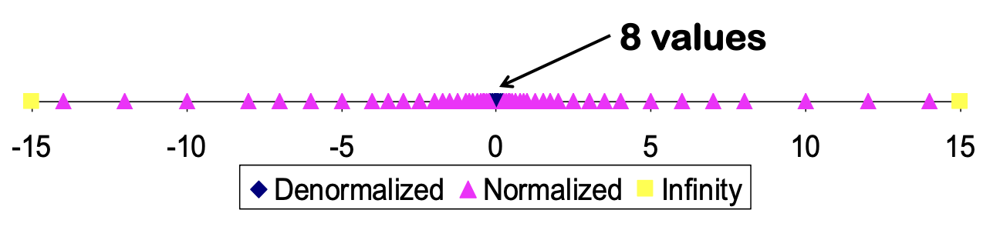

# 12 · 정보 표현: 정수, 실수

## 정보, 비트, 인코딩

### 정보란 무엇인가

정보(information)는 **불확실성을 얼마나 줄여주는가**로 정의됩니다. 잘 섞인 52장 카드에서 한 장을 뽑았다고 합시다. 다음 중 어느 데이터가 더 많은 정보를 담고 있을까요?

| 데이터 | 남는 후보 수 | 확률 $p$ | 정보량 $\log_2(1/p)$ |
|---|---|---|---|
| "하트다" | 13 | 13/52 | 2 비트 |
| "스페이드 에이스가 아니다" | 51 | 51/52 | 0.028 비트 |
| "그림 카드(J, Q, K)다" | 12 | 12/52 | 2.115 비트 |
| "하트 퀸이다" | 1 | 1/52 | 5.70 비트 |

일반적으로 확률 $p_i$인 사건 $x_i$가 일어났음을 알았을 때 얻는 정보량은

$$I(x_i) = \log_2 \frac{1}{p_i} \quad \text{[bits]}$$

입니다. $N$개의 동일 확률 후보가 $M$개로 좁혀졌다면 정보량은 $\log_2(N/M)$ 비트입니다.


### 컴퓨터에서 정보를 어떻게 표현할까

**인코딩(encoding)** 은 비트 문자열과 표현하려는 데이터 집합 사이의 **모호하지 않은(unambiguous) 대응**입니다. 아래 세 인코딩으로 "ABBA"를 표현해 봅시다.

| | A | B | C | D | "ABBA" | 판정 |
|---|---|---|---|---|---|---|
| 인코딩 1 | `00` | `01` | `10` | `11` | `00 01 01 00` | 고정 길이, 모호성 없음 |
| 인코딩 2 | `01` | `1` | `000` | `001` | `01 1 1 01` | 가변 길이, 접두사 조건 만족 |
| 인코딩 3 | `0` | `1` | `10` | `11` | `0110` | **모호함**. `0110`은 "ABBA"인가 "ABC"인가? |

인코딩 3은 `10`이 C이면서 동시에 "B 다음 A"로도 읽히므로 인코딩이 아닙니다.

모든 선택지가 동일 확률이면 보통 **고정 길이 코드**를 씁니다. 필요한 비트 수는 정보량 이상이어야 합니다.

- BCD(2진화 10진수): $N=10 \Rightarrow \log_2 10 = 3.32 \rightarrow$ **4비트**
- 출력 가능 ASCII 문자: $N=94 \Rightarrow \log_2 94 = 6.55 \rightarrow$ **7비트**

### 2진법으로 표현하는 이유

컴퓨터는 전압으로 값을 표현합니다. 아래와 같은 조건들을 만족하면 좋은 비트 표현이라고 할 수 있습니다. 

- **작고 저렴할 것**
- **안정적일 것** : 재현 가능하고 잡음에 강할 것
- **다루기 쉽고 빠를 것** : 접근·변환·결합·전송·저장

전압 구간을 두 개(예: 0.0–0.2V는 `0`, 0.9–1.1V는 `1`)로만 나누면, 중간의 잡음 여유 구간(noise margin) 덕분에 신호가 흔들려도 값이 보존됩니다. 10진법을 쓰려면 전압을 10구간으로 쪼개야 하고, 잡음 여유가 1/5로 줄어듭니다. **2진법은 신뢰성을 위해 표현 밀도를 포기한 공학적 타협**입니다.

이렇게 컴퓨터가 다루는 모든 것은 결국 0과 1의 나열입니다. 정수도, 실수도, 문자열도, 이미지도, 심지어 CPU가 실행할 명령어조차 비트열입니다. 이들을 구분하는 것은 비트 자체가 아니라 **그 비트열을 어떤 인코딩으로 해석하기로 약속했는가**입니다. 똑같은 32비트가 정수 `1078530011`일 수도, 실수 `3.14159`일 수도 있습니다.

그렇다면 비트를 몇 개씩 묶어서 표현해야할까요? 비트 하나가 담는 정보는 너무 적어서 하나씩 주소를 붙여 관리하면 낭비가 큽니다. 그렇다고 너무 크게 묶으면 문자 하나를 저장하려고 수십 비트를 쓰게 됩니다. 역사적으로 여러 크기가 시도된 끝에 **8비트**가 사실상의 표준으로 자리 잡았습니다. 7비트 ASCII 문자 하나를 담기에 충분하면서, 2의 거듭제곱이라 주소 계산이 단순하기 때문입니다.

---

## 바이트, 16진수, 그리고 데이터 타입

### 바이트(byte)

**1 바이트(1 byte) = 8비트**. 오늘날 거의 모든 시스템에서 바이트는 **메모리에 개별 주소를 붙일 수 있는 최소 단위**입니다. 즉 컴퓨터는 "메모리의 3번째 비트"를 직접 가리킬 수 없고, "3번째 바이트"까지만 가리킬 수 있습니다.
```text
번호(주소):   0        1        2        3        4        5
           ┌────────┬────────┬────────┬────────┬────────┬─────
메모리:      │01101101│00111011│00000000│00000000│01001000│ ...
           └────────┴────────┴────────┴────────┴────────┴─────
             1바이트   1바이트   1바이트   1바이트   1바이트
```

한 바이트의 표현 범위는 다음과 같습니다: 

- 2진수 `00000000` ~ `11111111`
- 10진수 0 ~ 255
- 16진수 `0x00` ~ `0xFF`

### 16진수 

`00111011 01101101` 같은 비트열을 사람이 눈으로 읽고 옮겨 적기는 매우 번거롭습니다. 그렇다고 10진수로 바꾸면(`15213`) 원래 비트 패턴이 어땠는지 알 수 없게 됩니다. **비트 패턴을 그대로 보존하면서 짧게 쓰는 표기법**이 필요합니다.
16진수는 **한 자리가 정확히 4비트**에 대응하기 때문에, 비트열을 4개씩 끊어 기계적으로 변환할 수 있어 비트 패턴을 그대로 보존하면서 간결히 표현할 수 있습니다. 

| 16진수 | 10진수 | 2진수 | 16진수 | 10진수 | 2진수 |
|---|---|---|---|---|---|
| 0 | 0 | 0000 | 8 | 8 | 1000 |
| 1 | 1 | 0001 | 9 | 9 | 1001 |
| 2 | 2 | 0010 | A | 10 | 1010 |
| 3 | 3 | 0011 | B | 11 | 1011 |
| 4 | 4 | 0100 | C | 12 | 1100 |
| 5 | 5 | 0101 | D | 13 | 1101 |
| 6 | 6 | 0110 | E | 14 | 1110 |
| 7 | 7 | 0111 | F | 15 | 1111 |

### C 데이터 타입의 크기

| C 자료형 | 32비트 (전형) | 64비트 (전형) | x86-64 |
|---|---|---|---|
| `char` | 1 | 1 | 1 |
| `short` | 2 | 2 | 2 |
| `int` | 4 | 4 | 4 |
| `long` | 4 | **8** | 8 |
| `float` | 4 | 4 | 4 |
| `double` | 8 | 8 | 8 |
| `long double` | — | — | 8/10/16 |
| **포인터** | 4 | **8** | 8 |


---

## 정수 표현

### 부호 없는 정수 (Unsigned)

$w$비트 벡터 $\vec{x} = [x_{w-1}, \dots, x_0]$에 대해

$$B2U(\vec{x}) = \sum_{i=0}^{w-1} x_i \cdot 2^i$$

```text
short unsigned int x = 15213;

  0 0 1 1  1 0 1 1  0 1 1 0  1 1 0 1
  \___/    \___/    \___/    \___/
    3        B        6        D        → 0x3B6D
```

`short`(2바이트)의 범위: 0 ~ $2^{16}-1$ = 65535 (`0xFFFF`)

### 시도 1: 부호-크기 표현 (Sign-Magnitude)

최상위 비트(MSB, Most Significant Bit)를 부호로, 나머지를 크기로 쓰는 직관적으로 표현한다면, 범위는 $-(2^{15}-1)$ ~ $2^{15}-1$. 가 될 수 있습니다. 

```text
 15213    0  0111011 01101101
-15213    1  0111011 01101101
```
그러나 이 방법은 **0이 두 개** 존재하는 문제를 일으킵니다(`+0` = `0000...0`, `-0` = `1000...0`). 이는 비교 연산 시 특수 처리를 요구하며, 덧셈 회로를 복잡하게 합니다(부호를 먼저 검사하고 -> 크기를 비교하고 -> 뺄셈으로 분기).

### 정답: 2의 보수 (Two's Complement)

대신, **최상위 비트에 음수 가중치를 부여**합니다.

$$B2T(\vec{x}) = -x_{w-1} \cdot 2^{w-1} + \sum_{i=0}^{w-2} x_i \cdot 2^i$$

즉 MSB가 0이면 가중치 없음, 1이면 $-2^{w-1}$의 가중치입니다.

```text
 15213    0 0111011 01101101      =  15213
-17555    1 0111011 01101101      =  15213 - 32768 = -17555
-15213    1 1000100 10010011      =  17555 - 32768 = -15213
```

$w=16$일 때 `-15213`은 `0xC493`입니다.

2의 보수를 채택함으로써, 

- **0이 유일**해집니다. 
- **덧셈 회로가 부호 없는 정수와 완전히 동일**합니다. 자리올림을 버리기만 하면 됩니다. 
- 부호 반전은 `~x + 1`로 단순해집니다. 

### 수 범위

| | 부호 없음 | 2의 보수 |
|---|---|---|
| 최솟값 | `UMin` = 0 (`000…0`) | `TMin` = $-2^{w-1}$ (`100…0`) |
| 최댓값 | `UMax` = $2^w - 1$ (`111…1`) | `TMax` = $2^{w-1}-1$ (`011…1`) |
| `111…1` | `UMax` | `-1` |

16 bit일 때($w=16$):

| | 10진수 | 16진수 | 2진수 |
|---|---|---|---|
| `UMax` | 65535 | `FF FF` | `11111111 11111111` |
| `TMax` | 32767 | `7F FF` | `01111111 11111111` |
| `TMin` | −32768 | `80 00` | `10000000 00000000` |
| −1 | −1 | `FF FF` | `11111111 11111111` |
| 0 | 0 | `00 00` | `00000000 00000000` |

워드 크기별 값:

| | 8비트 | 16비트 | 32비트 | 64비트 |
|---|---|---|---|---|
| `UMax` | 255 | 65,535 | 4,294,967,295 | 18,446,744,073,709,551,615 |
| `TMax` | 127 | 32,767 | 2,147,483,647 | 9,223,372,036,854,775,807 |
| `TMin` | −128 | −32,768 | −2,147,483,648 | −9,223,372,036,854,775,808 |


핵심 관찰: 

- $|TMin| = TMax + 1$ 
- $UMax = 2 \times TMax + 1$

---

## 부호 있음 ↔ 부호 없음 변환

### 비트는 그대로, 해석만 바뀐다

C의 캐스팅은 **비트 패턴을 유지한 채 해석 방식만 바꿉니다**.

```text
비트    부호 있음   부호 없음
0000       0    ═══    0
0011       3    ═══    3
0111       7    ═══    7        ← 음이 아닌 값은 동일
1000      -8   ↔+16    8
1011      -5   ↔+16   11        ← MSB가 1이면 2^w 차이
1111      -1   ↔+16   15
```

$$T2U(x) = \begin{cases} x & x \geq 0 \\ x + 2^w & x < 0 \end{cases}$$

큰 음수 가중치가 큰 양수 가중치로 바뀌면서 **순서가 뒤집힙니다**. `TMin`이 `TMax+1`로, `-1`이 `UMax`로가 됩니다.

### C의 캐스팅 규칙

```c
int tx, ty;
unsigned ux, uy;

tx = (int) ux;        // 명시적 캐스팅
uy = (unsigned) ty;   // 명시적 캐스팅

tx = ux;              // 암묵적 캐스팅 (대입)
uy = ty;              // 함수 호출 시에도 발생
```

상수는 기본적으로 **signed**이며, `U` 접미사를 붙이면 unsigned가 됩니다 (`0U`, `4294967259U`).

### 캐스팅의 함정

!!! danger "혼합 표현식에서는 signed가 unsigned로 강제 변환됩니다"

    비교 연산자 `<`, `>`, `==`, `<=`, `>=`도 포함입니다.

$w = 32$, `TMIN = -2147483648`, `TMAX = 2147483647`일 때:

| 상수 1 | 상수 2 | 관계 | 평가 방식 |
|---|---|---|---|
| `0` | `0U` | `==` | unsigned |
| `-1` | `0` | `<` | signed |
| `-1` | `0U` | **`>`** | unsigned ← `-1`이 4294967295가 됨 |
| `2147483647` | `2147483648U` | `<` | unsigned |
| `2147483647` | `(int) 2147483648U` | **`>`** | signed ← 캐스팅 결과가 `TMin` |


---

## 확장과 절단 (Extension and Truncation)

### 부호 확장 (Sign Extension)

$w$비트 부호 있는 정수를 $w+k$비트로 **값을 보존한 채** 확장하려면, **부호 비트를 $k$번 복제**해서 앞에 붙입니다.

$$\vec{x'} = [\underbrace{x_{w-1}, \dots, x_{w-1}}_{k\text{개}}, x_{w-1}, x_{w-2}, \dots, x_0]$$

```c
short int x  = 15213;    int ix = (int) x;
short int y  = -15213;   int iy = (int) y;
```

| | 10진수 | 16진수 | 2진수 |
|---|---|---|---|
| `x` | 15213 | `3B 6D` | `00111011 01101101` |
| `ix` | 15213 | `00 00 3B 6D` | `00000000 00000000 00111011 01101101` |
| `y` | −15213 | `C4 93` | `11000100 10010011` |
| `iy` | −15213 | `FF FF C4 93` | `11111111 11111111 11000100 10010011` |

C는 작은 정수형에서 큰 정수형으로 변환할 때 **자동으로 부호 확장을 수행**합니다.

### 부호 절단 (Sign Truncation)

반대로 큰 정수형을 작은 정수형으로 변환하면, **상위 비트를 그냥 버리고 남은 비트를 새 타입으로 재해석**합니다. 확장과 달리 **값이 보존된다는 보장이 없습니다.**

```c
int       x  = 53191;
short int sx = (short) x;    // 32비트 → 16비트
int       y  = sx;           // 다시 32비트로
```

| | 10진수 | 16진수 | 2진수 |
|---|---|---|---|
| `x` | 53191 | `00 00 CF C7` | `00000000 00000000 11001111 11000111` |
| `sx` | **−12345** | `CF C7` | `11001111 11000111` |
| `y` | **−12345** | `FF FF CF C7` | `11111111 11111111 11001111 11000111` |

상위 16비트를 버렸더니 `1`로 시작하는 비트열이 남았고, `short`는 이를 2의 보수로 해석하므로 음수가 되었습니다. 다시 `int`로 확장해도 이미 잃어버린 정보는 돌아오지 않습니다. `y == x`가 될 수 없습니다. 

---

## 정수 연산

### 부호 없는 덧셈

$w$비트 두 수를 더하면 참값은 $w+1$비트가 필요합니다. 하드웨어는 **자리올림을 그냥 버립니다**.

$$UAdd_w(u, v) = (u + v) \bmod 2^w$$

이것은 **모듈러 산술**입니다. 참값이 $2^w$ 이상이면 결과가 한 바퀴 돌아(wrap around) $2^w$만큼 작아집니다. 오버플로는 **최대 한 번**만 발생합니다.

### 2의 보수 덧셈

$$TAdd_w(u, v)$$

TAdd와 UAdd는 비트 수준에서 완전히 동일하기 때문에, CPU에 정수 덧셈 회로는 하나만 존재해도 충분하게 됩니다. 

```c
int s, t, u, v;
s = (int) ((unsigned) u + (unsigned) v);
t = u + v;
// 항상 s == t
```

TAdd와 UAdd의 차이는 결과의 **해석**에 있습니다.

| 참값 | 결과 |
|---|---|
| $\geq 2^{w-1}$ | **양수 오버플로(PosOver)** → 음수가 됨 |
| $[-2^{w-1}, 2^{w-1})$ | 정상 |
| $< -2^{w-1}$ | **음수 오버플로(NegOver)** → 양수가 됨 |

두 양수를 더했는데 음수가 나올 수 있습니다. 

### 곱셈

$w$비트 두 수의 곱은 최대 $2w$비트가 필요합니다.

- unsigned: $0 \leq x \cdot y \leq (2^w-1)^2$ → 최대 $2w$비트
- 2의 보수 음수 최소: $x \cdot y \geq -2^{w-1}(2^{w-1}-1)$ → 최대 $2w-1$비트
- 2의 보수 양수 최대: $x \cdot y \leq (-2^{w-1})^2 = 2^{2w-2}$ (오직 $TMin^2$일 때)

정확한 값을 계속 유지하려면 곱할 때마다 저장 공간을 두 배로 늘려야 합니다. 64비트 값을 세 번만 곱해도 512비트가 되니 저장 공간 측면에서 비효율적입니다. 따라서 하드웨어는 덧셈과 똑같은 선택을 합니다. **하위 $w$비트만 남기고 나머지를 버립니다.**

$$UMult_w(u,v) = (u \cdot v) \bmod 2^w$$

**남은 하위 $w$비트는 signed든 unsigned든 완전히 동일합니다.** 버려지는 상위 부분만 다릅니다. 덕분에 CPU는 정수 곱셈기도 하나만 갖추면 됩니다.

### 시프트로 곱셈·나눗셈 하기

- **`u << k` == `u * `$2^k$** (signed, unsigned 모두)
    - `u << 3` == `u * 8`
    - `(u << 5) - (u << 3)` == `u * 24`
    - 대부분의 기계에서 시프트+덧셈이 곱셈보다 빠릅니다. **컴파일러가 자동으로 이 코드를 생성**합니다.

- **`u >> k` == $\lfloor u / 2^k \rfloor$** (unsigned, 논리 시프트)

```text
                  값        16진수   2진수
x         15213           3B 6D   00111011 01101101
x >> 1     7606.5 → 7606  1D B6   00011101 10110110
x >> 4      950.8 → 950   03 B6   00000011 10110110
x >> 8       59.4 → 59    00 3B   00000000 00111011
```

밀려나간 비트가 그냥 사라지므로 결과는 항상 **내림(floor)** 입니다. 양수에서는 이것이 우리가 기대하는 나눗셈과 같습니다.

그런데 음수에서는 어긋납니다. 산술 우시프트도 내림이므로 `-1 >> 1`은 −0.5를 내림한 **−1**입니다. 반면 C의 정수 나눗셈 `/`는 **0 방향 절단**이라 `-1 / 2`는 **0**입니다.

```c
-1 >> 1    // -1   (내림)
-1 /  2    //  0   (0 방향 절단)
```

"`>> k`는 `/ 2^k`와 같다"는 양수에서만 성립하는 규칙입니다. 컴파일러가 음수 나눗셈을 시프트로 최적화할 때 보정 코드를 덧붙이는 것도 이 차이 때문입니다.

정수 산술 전체를 관통하는 원칙은 두 가지입니다.

1. **덧셈이든 곱셈이든, 하드웨어는 정확히 계산한 뒤 하위 $w$비트만 남깁니다.** 결과가 범위를 벗어나면 조용히 한 바퀴 돌 뿐, 오류는 발생하지 않습니다.
2. **비트 수준 연산은 signed와 unsigned가 동일합니다.** 다른 것은 결과를 읽는 방식뿐입니다.

| | unsigned | signed |
|---|---|---|
| 덧셈 | $\bmod\ 2^w$ | $\bmod\ 2^w$ 후 범위 조정 |
| 곱셈 | $\bmod\ 2^w$ | $\bmod\ 2^w$ 후 범위 조정 |


### unsigned, 언제 쓰고 언제 피할까

여기까지 보면 unsigned가 signed보다 단순해 보입니다. 그러나 unsigned는 신중히 사용해야 합니다. 

예를 들어, 배열을 뒤에서부터 훑는 흔한 코드를 봅시다.

```c
unsigned i;
for (i = cnt-2; i >= 0; i--)
    a[i] += a[i+1];
```

`i`가 0에 도달하면 루프가 끝날 것 같지만 끝나지 않습니다. unsigned는 정의상 음수가 될 수 없으므로 `i >= 0`은 언제나 참입니다. `i`가 0에서 하나 더 줄면 `UMax`로 돌아가고, 프로그램은 배열 바깥 더미값을 읽게 됩니다.  

더 알아차리기 어려운 경우도 있습니다.

```c
#define DELTA sizeof(int)

int i;
for (i = CNT; i-DELTA >= 0; i -= DELTA)
    ...
```

`i`를 `int`로 선언했으니 안전해 보입니다. 하지만 `sizeof`가 돌려주는 타입은 `size_t`, 즉 unsigned입니다. 앞 절에서 본 규칙대로 `i - DELTA` 표현식 전체가 unsigned로 승격되고, 다시 무한 루프가 됩니다. 선언부만 봐서는 보이지 않는 버그입니다.

---

## 메모리 속의 데이터

### 바이트 단위 메모리 조직

프로그램은 데이터를 **주소(address)** 로 참조합니다. 개념적으로 메모리는 `0x00...0`부터 `0xFF...F`까지의 **거대한 바이트 배열**이고, 주소는 그 배열의 인덱스이며, **포인터 변수는 주소를 저장**합니다.


### 워드 크기

모든 컴퓨터는 **워드 크기(word size)** 를 갖습니다. 정수 데이터와 **주소**의 명목 크기입니다.

- 최근까지 대부분 **32비트(4바이트)** → 주소 공간 4GB ($2^{32}$)로 제한
- 현재는 **64비트** → 이론상 18EB(엑사바이트, $1.84 \times 10^{19}$) 주소 가능

기계는 워드 크기의 배수/약수인 여러 데이터 포맷을 지원하되, **항상 바이트의 정수배**입니다. 주소는 워드의 **첫 바이트 주소**를 가리키고, 연속한 워드의 주소는 4(32비트) 또는 8(64비트)씩 차이납니다.

### Endian: 바이트 순서

`int` 하나는 4바이트를 차지하므로 메모리 칸 네 개를 연속으로 씁니다. 그런데 어느 바이트를 앞 칸에 놓을지는 아직 정하지 않았습니다. 값의 앞쪽부터 순서대로 놓을 수도 있고, 뒤쪽부터 거꾸로 놓을 수도 있습니다. 둘 다 나름의 근거가 있었고, 실제로 두 방식 모두 채택되었습니다. 이 바이트 배치 규칙을 **엔디언(endianness)** 이라고 합니다.

| 방식 | 규칙 | 사용처 |
|---|---|---|
| **빅 엔디언 (Big Endian)** | 최하위 바이트가 **가장 높은** 주소 | Sun SPARC, PowerPC Mac, 인터넷 프로토콜 |
| **리틀 엔디언 (Little Endian)** | 최하위 바이트가 **가장 낮은** 주소 | **x86**, Android/iOS/Windows의 ARM |

변수 `x`의 4바이트 값이 `0x01234567`이고 `&x == 0x100`이라면 메모리에는 이렇게 놓입니다.

```text
             0x100  0x101  0x102  0x103
Big Endian     01     23     45     67
Little Endian  67     45     23     01
```

빅 엔디언은 우리가 숫자를 읽고 쓰는 순서와 같아서 메모리 덤프를 눈으로 읽기 편합니다. 리틀 엔디언은 낮은 주소에 항상 최하위 바이트가 오므로, 4바이트 값을 2바이트로 줄여 읽을 때 주소를 그대로 쓸 수 있다는 이점이 있습니다.

문제는 두 방식이 공존한다는 데 있습니다. 한 기계에서 만든 이진 파일을 다른 기계에서 읽으면 같은 네 바이트가 전혀 다른 값으로 해석됩니다. 위 예에서 `0x01234567`을 저장한 파일을 반대 엔디언 기계가 읽으면 `0x67452301`, 10진수로 약 17억이 됩니다. 오류도 경고도 없이 조용히 틀린 값이 나옵니다. 그래서 기계 경계를 넘는 데이터는 바이트 순서를 반드시 약속해야 합니다.


### 실제 데이터 살펴보기

```c
int A = 15213;      // 10진수 15213 = 0x3B6D
```

| IA32 / x86-64 (리틀) | Sun (빅) |
|---|---|
| `6D 3B 00 00` | `00 00 3B 6D` |

```c
int B = -15213;     // 2의 보수 = 0xFFFFC493
```

| IA32 / x86-64 | Sun |
|---|---|
| `93 C4 FF FF` | `FF FF C4 93` |

```c
long int C = 15213;
```

| IA32 (4바이트) | x86-64 (8바이트) | Sun (4바이트) |
|---|---|---|
| `6D 3B 00 00` | `6D 3B 00 00 00 00 00 00` | `00 00 3B 6D` |


### 문자열

```c
char S[6] = "18213";
```

| IA32 | Sun |
|---|---|
| `31 38 32 31 33 00` | `31 38 32 31 33 00` |

- 문자 배열로 표현되고, 각 문자는 **ASCII**(7비트 표준 인코딩)로 부호화됩니다.
- 문자 `'0'`은 `0x30`, 숫자 $i$는 `0x30 + i`입니다.
- 마지막 문자는 `0x00`입니다. 이를 **널 종료(null-terminated)**라고 합니다. 
- **바이트 순서가 문제되지 않습니다.** 문자 배열은 이미 바이트 단위이기 때문입니다. 

---

## 부동소수점

### 소수 이진수

2.3, 1.9와 같은 소수는 2진수로 어떻게 표현할까요?

10진수에서 `123.45`를 읽는 방식을 떠올려 봅시다. 소수점 왼쪽으로 가면 자릿값이 $10^0, 10^1, 10^2$로 커지고, 오른쪽으로 가면 $10^{-1}, 10^{-2}$로 작아집니다. 소수점은 **자릿값이 1인 자리가 어디인지 표시하는 기준점**일 뿐입니다.

2진수도 똑같습니다. 밑을 10에서 2로 바꾸기만 하면, 소수점 오른쪽 비트들은 $1/2, 1/4, 1/8, \dots$의 자릿값을 갖습니다.

```text
      2ⁱ  ...  4   2   1     1/2  1/4  1/8  ...  2⁻ʲ
      ┌───────────────────┬─────────────────────────┐
       bᵢ  ...  b₂  b₁  b₀ . b₋₁  b₋₂  b₋₃  ...  b₋ⱼ
      └───────────────────┴─────────────────────────┘
                     이진 소수점(binary point)
```

$$\sum_{i=-j}^{k} b_i \cdot 2^i$$

예를 들어 `1011.101`$_2$은 $8 + 2 + 1 + 1/2 + 1/8 = 11.625$입니다.

| 값 | 표현 |
|---|---|
| 5 3/4 | `101.11`$_2$ |
| 2 7/8 | `010.111`$_2$ |
| 1 7/16 | `001.0111`$_2$ |

여기서 두 가지를 관찰할 수 있습니다. 첫째, 정수에서와 마찬가지로 **우시프트는 2로 나누기, 좌시프트는 2로 곱하기**입니다. 소수점 위치는 그대로 두고 비트만 밀면 되기 때문입니다. 둘째, `0.111111…`$_2$ 형태의 수는 1.0에 한없이 가까워지지만 결코 도달하지 못합니다. $1/2 + 1/4 + 1/8 + \cdots \to 1.0$이므로, 이런 값을 $1.0 - \epsilon$으로 표기합니다.

### 이 방식의 두 가지 한계

그런데 처음 질문으로 돌아가 2.3을 실제로 변환해 보면 문제가 드러납니다.

```text
2.3 = 10.0100110011001100110011...₂
              └─ 0011이 무한 반복
```

끝나지 않습니다. **소수점 오른쪽 비트로 만들 수 있는 값은 $1/2, 1/4, 1/8$처럼 분모가 2의 거듭제곱인 분수의 합뿐이기 때문**입니다. 즉 $x/2^k$ 꼴로 쓸 수 있는 수만 정확히 표현됩니다.

| 값 | 표현 |
|---|---|
| 1/3 | `0.0101010101[01]…`$_2$ |
| 1/5 | `0.001100110011[0011]…`$_2$ |
| **1/10** | `0.0001100110011[0011]…`$_2$ |

10진수에서 1/3이 `0.333…`으로 끝나지 않는 것과 같은 현상입니다. 다만 밑이 2라서 **10진수로는 딱 떨어지는 0.1조차 무한 반복**이 됩니다. 유한한 비트로 자르는 순간 근삿값이 되고, 여기서 `0.1 + 0.2 != 0.3` 같은 결과가 나옵니다. 

두 번째 한계는 소수점의 위치입니다. 지금까지는 이진 소수점이 정해진 자리에 **고정**되어 있다고 가정했습니다. 32비트 중 16비트를 정수부, 16비트를 소수부에 배정하는 식입니다. 이러면 표현 범위가 한 번에 정해져 버립니다. 정수부 16비트로는 65536 이상을 다룰 수 없고, 소수부 16비트로는 $2^{-16}$보다 작은 값을 구분할 수 없습니다.

하지만 실제로 다뤄야 하는 값의 범위는 훨씬 넓습니다. 아보가드로 수 $6.02 \times 10^{23}$과 전자의 질량 $9.11 \times 10^{-31}$을 같은 형식으로 담아야 한다면, 고정된 소수점으로는 불가능합니다. 그렇다면 어떻게 표현해야할까요? 

두 수를 다시 보면 힌트가 있습니다. $6.02 \times 10^{23}$에서 `6.02`는 **이 수가 어떤 숫자인가**를 말하고, $10^{23}$은 **그 숫자가 얼마나 큰 자리에 있는가**를 말합니다. 두 정보는 성격이 완전히 다릅니다. 앞의 것은 자릿수가 몇 개 안 되고, 뒤의 것은 숫자 하나(23)면 충분합니다.

그렇다면 이 둘을 따로 저장하면 됩니다. 소수점을 어느 자리에 고정하는 대신, **숫자 부분과 소수점 위치를 각각 기록해서 소수점이 값에 따라 움직이게(floating)** 할 수 있습니다. 

### 표현 형식

IEEE 754 기준으로, 다음과 같이 표현합니다. 

$$v = (-1)^s \times M \times 2^E$$

| 구성 요소 | 역할 |
|---|---|
| **부호 $s$** | 0이면 양수, 1이면 음수 |
| **가수 $M$** (significand, mantissa) | 숫자 부분. 보통 $[1.0, 2.0)$ 범위의 소수 |
| **지수 $E$** | 소수점을 몇 칸 옮길지. 2의 거듭제곱으로 크기를 조정 |

$6.02 \times 10^{23}$에서 `6.02`가 $M$, `23`이 $E$에 해당한다고 보면 됩니다. $M$의 범위를 $[1.0, 2.0)$으로 제한하는 것도 과학적 표기법에서 `60.2`나 `0.602`가 아니라 `6.02`로 쓰기로 약속하는 것과 같습니다. 이렇게 해야 같은 수에 대한 표현이 하나로 정해집니다.

이 세 값을 비트에 나누어 담습니다.

```text
┌───┬─────────────┬─────────────────────────┐
│ s │     exp     │          frac           │
└───┴─────────────┴─────────────────────────┘
  1비트   지수 필드           가수 필드
```

여기서 주의할 점이 하나 있습니다. **`exp` 필드에 $E$가 그대로 들어가지 않고, `frac` 필드에 $M$이 그대로 들어가지도 않습니다.** 둘 다 약간의 변환을 거칩니다. 왜 그런지는 곧 보게 됩니다.

### 정밀도 옵션

비트를 몇 개 쓰고 어떻게 배분할지에 따라 여러 형식이 있습니다.

| 형식 | 전체 | s | exp | frac |
|---|---|---|---|---|
| **단정밀도 (`float`)** | 32비트 | 1 | 8 | 23 |
| **배정밀도 (`double`)** | 64비트 | 1 | 11 | 52 |
| 확장 정밀도 (Intel 전용) | 80비트 | 1 | 15 | 63 또는 64 |
| **반정밀도 (FP16)** | 16비트 | 1 | 5 | 10 |
| **BF16 (Brain Float)** | 16비트 | 1 | 8 | 7 |

배분의 의미는 명확합니다. **`exp`를 늘리면 다룰 수 있는 수의 범위가 넓어지고, `frac`을 늘리면 정밀도가 올라갑니다.** 전체 비트 수가 정해져 있으면 둘은 상충합니다.

### 정규화 값

이제 `exp`와 `frac`이 실제로 어떻게 인코딩되는지 봅시다. 대부분의 수가 여기 해당하며, 이를 **정규화 값(normalized value)** 이라고 부릅니다.

**조건**: `exp`가 전부 0도 아니고 전부 1도 아닌 경우

#### 지수: 바이어스를 뺀다

지수 $E$는 양수일 수도 음수일 수도 있습니다. 아주 큰 수는 $E$가 크고, 아주 작은 수는 $E$가 음수여야 하기 때문입니다. 그렇다면 앞 절에서 배운 2의 보수로 저장하면 될 것 같습니다.

그런데 그렇게 하지 않습니다. **`exp` 필드는 부호 없는 정수로 저장하고, 읽을 때 정해진 값(bias)을 빼서 $E$를 얻습니다.**

$$E = \text{Exp} - \text{Bias}, \qquad \text{Bias} = 2^{k-1}-1 \quad (k = \text{exp 비트 수})$$

- 단정밀도($k=8$): Bias = 127, Exp는 1~254, 따라서 $E$는 −126~127
- 배정밀도($k=11$): Bias = 1023, Exp는 1~2046, 따라서 $E$는 −1022~1023

이렇게 하는 이유는 **비교** 때문입니다. 2의 보수로 저장하면 음수 지수의 MSB가 1이 되어, 아주 작은 수가 비트 패턴상으로는 큰 값처럼 보입니다. 반면 바이어스 방식에서는 지수가 커질수록 `exp` 필드의 부호 없는 값도 단조롭게 커집니다. 즉 **비트 패턴을 그냥 정수처럼 비교해도 크기 순서가 맞습니다.** 이 성질이 얼마나 유용한지는 뒤에서 다시 다룹니다.

#### 가수: 앞의 1을 생략한다

$M$을 $[1.0, 2.0)$ 범위로 제한했다는 것은, 2진수로 쓰면 **반드시 `1.` 로 시작한다**는 뜻입니다. `1.0110`, `1.1101`처럼요.

항상 1이라면 저장할 필요가 없습니다. 그래서 `frac` 필드에는 **소수점 이하만** 담고, 앞의 `1.`은 읽을 때 붙입니다.

$$M = 1.\underbrace{xxx\ldots x}_{\text{frac 필드}}$$

- `frac`이 전부 0이면 $M = 1.0$ (최솟값)
- `frac`이 전부 1이면 $M = 2.0 - \epsilon$ (최댓값)

이 트릭을 **암묵적 선행 1(implied leading 1)** 이라고 하며, 덕분에 **비트 하나를 공짜로 더 쓰는 효과**를 얻습니다. 23비트 `frac`으로 24비트만큼의 정밀도를 얻는 셈입니다.

??? example "인코딩 예제: `float F = 15213.0;`"

    **1단계: 2진수로 변환하고 `1.xxx` 꼴로 정리**

    $15213_{10} = 11101101101101_2$

    소수점을 왼쪽으로 13칸 옮기면 $1.1101101101101_2 \times 2^{13}$

    **2단계: 가수**

    $M = 1.1101101101101_2$이므로, 앞의 `1.`을 떼고 23비트로 오른쪽을 0으로 채웁니다.

    `frac` = `11011011011010000000000`

    **3단계: 지수**

    $E = 13$, Bias $= 127$이므로 Exp $= 13 + 127 = 140 = 10001100_2$

    **결과**

    ```text
        0  10001100  11011011011010000000000
        s     exp              frac
    ```

### 비정규화 값

정규화 방식에는 빈틈이 있습니다. $M$이 항상 1 이상이므로, **표현할 수 있는 가장 작은 양수는 $1.0 \times 2^{E_{min}}$입니다.** 그보다 작은 값은 전부 0으로 처리해야 합니다.

문제는 그 아래가 텅 비어 있다는 것입니다. 가장 작은 정규화 수와 0 사이에 아무것도 없으면, 서로 다른 두 작은 수를 뺐을 때 결과가 0이 아니어야 함에도 0이 나옵니다. `if (x != y)` 를 통과한 코드가 `x - y`로 나누다가 0으로 나누기를 하는 상황이 발생하게 됩니다. 

그래서 `exp`가 전부 0인 경우를 따로 떼어 이 구간을 메웁니다. 이를 **비정규화 값(denormalized value)** 이라고 합니다.

**조건**: `exp`가 전부 0

- **가수**: 앞에 붙는 것이 1이 아니라 **0**입니다. $M = 0.xxx\ldots x_2$
- **지수**: $E = 1 - \text{Bias}$ 로 고정합니다. 

지수 규칙은 **가장 큰 비정규화 수와 가장 작은 정규화 수가 매끄럽게 이어지도록** 맞춘 것입니다. 만약 $E = 0 - \text{Bias}$로 했다면 두 구간 사이에 간격이 두 배로 벌어졌을 겁니다. 잠시 뒤 8비트 예제에서 실제로 확인합니다.

`frac`이 전부 0인 경우는 특별히 **0**을 나타냅니다. 이때 부호 비트는 여전히 살아 있으므로 `+0`과 `-0`이 구별됩니다. 

### 특수 값

마지막으로 `exp`가 전부 1인 경우입니다. 여기에는 수가 아닌 것들을 담습니다.

| `frac` | 의미 |
|---|---|
| 전부 0 | **무한대(∞)**. 오버플로의 결과. 부호가 있어서 `1.0/0.0 = +∞`, `1.0/-0.0 = -∞` |
| 그 외 | **NaN (Not-a-Number)**. 수치를 정할 수 없는 경우. `sqrt(-1)`, `∞ - ∞`, `∞ × 0` |

무한대와 NaN을 값으로 표현해 두면, 계산 도중 오류가 나도 프로그램을 멈추지 않을 수 있습니다. NaN이 섞인 연산은 결과도 NaN이 되므로, 최종 결과만 확인해도 중간에 문제가 있었는지 알 수 있습니다.

### 전체 그림

지금까지 나온 네 가지 경우를 수직선에 배치하면 이렇습니다.

```text
  −∞                                                        +∞
      ─────────────  ──────      ──────  ─────────────
       −Normalized  −Denorm      +Denorm  +Normalized
                            -0  +0
  NaN                                                       NaN
```

`exp` 필드의 값만 보면 어느 경우인지 바로 판정할 수 있습니다.

| `exp` | 종류 |
|---|---|
| 전부 0 | 비정규화 (0 포함) |
| 전부 1 | 무한대 또는 NaN |
| 그 외 | 정규화 |

### 예제: 8비트 부동소수점

구조를 눈으로 확인하기 위해 형식을 축소해 봅시다. s(1비트) + exp(4비트, Bias = 7) + frac(3비트)로 IEEE와 같은 규칙을 적용합니다. 양수만 나열하면 이렇습니다.

| | s exp frac | E | 값 | 비고 |
|---|---|---|---|---|
| **비정규화** | `0 0000 000` | −6 | 0 | |
| | `0 0000 001` | −6 | 1/512 | 0에 가장 가까움 |
| | `0 0000 010` | −6 | 2/512 | |
| | `0 0000 110` | −6 | 6/512 | |
| | `0 0000 111` | −6 | 7/512 | **최대 비정규화 수** |
| **정규화** | `0 0001 000` | −6 | 8/512 | **최소 정규화 수** |
| | `0 0001 001` | −6 | 9/512 | |
| | `0 0110 110` | −1 | 14/16 | |
| | `0 0110 111` | −1 | 15/16 | 1 바로 아래 |
| | `0 0111 000` | 0 | **1** | |
| | `0 0111 001` | 0 | 9/8 | 1 바로 위 |
| | `0 1110 110` | 7 | 224 | |
| | `0 1110 111` | 7 | 240 | **최대 정규화 수** |
| **특수** | `0 1111 000` | — | ∞ | |


### 값의 분포


위 표에서 값의 간격을 살펴보면 균일하지 않습니다. 0 근처에서는 1/512 간격이지만, 1 근처에서는 1/8 간격이고, 224 근처에서는 16 간격입니다.

`frac`이 한 바퀴 돌 때마다 지수가 1 증가하고, 그러면 **표현 가능한 값의 간격이 2배로 벌어지기** 때문입니다. 결과적으로 값들은 0 근처에 촘촘하게 몰려 있고 멀어질수록 성기게 흩어집니다.

이것이 부동소수점의 본질입니다. **절대 오차는 값의 크기에 비례하지만, 상대 오차는 어디서나 거의 일정합니다.** 1억이라는 값에 1을 더해도 아무 일이 일어나지 않을 수 있지만, 그 오차는 전체의 1억분의 1에 불과합니다. 측정값이나 물리량을 다룰 때는 합리적인 성질이고, 정확한 개수나 금액을 다룰 때는 치명적인 성질입니다.


### 부동소수점 연산

$$x +_f y = \text{Round}(x + y), \qquad x \times_f y = \text{Round}(x \times y)$$

부동소수점 연산은 **먼저 정확한 결과를 계산한 다음, 형식에 맞게 다듬습니다.** 지수가 범위를 넘으면 오버플로가 되고, 가수가 `frac`에 담기지 않으면 반올림합니다. 실제 하드웨어가 이 순서대로 동작하지는 않지만, 결과는 이렇게 계산한 것과 같도록 표준이 규정하고 있습니다. 덕분에 우리는 구현을 몰라도 결과를 예측할 수 있습니다.

#### 반올림

반올림 방식은 네 가지가 있습니다.

| 모드 | 1.40 | 1.60 | 1.50 | 2.50 | −1.50 |
|---|---|---|---|---|---|
| 0 방향 | 1 | 1 | 1 | 2 | −1 |
| 내림 (−∞ 방향) | 1 | 1 | 1 | 2 | −2 |
| 올림 (+∞ 방향) | 2 | 2 | 2 | 3 | −1 |
| **최근접 짝수 (기본값)** | 1 | 2 | **2** | **2** | −2 |

앞의 세 모드는 이름 그대로입니다. 눈여겨볼 것은 기본값인 **최근접 짝수** 입니다. 1.5도 2가 되고 2.5도 2가 됩니다. 정확히 중간값일 때 **짝수 쪽으로** 보내기 때문입니다.

우리가 학교에서 배운 "5는 무조건 올림"을 쓰면 어떻게 될까요. 중간값이 나올 때마다 항상 위로 가므로 결과가 조금씩 커지는 쪽으로 치우칩니다. 한두 번은 무시할 만하지만 수백만 건을 집계하면 편향이 누적됩니다. 짝수 쪽으로 반올림하면 올림과 내림이 대략 절반씩 일어나 편향이 상쇄됩니다.

#### 곱셈

$(-1)^{s_1} M_1 2^{E_1}$과 $(-1)^{s_2} M_2 2^{E_2}$를 곱하면 정확한 결과는 이렇습니다.

- 부호: $s_1 \oplus s_2$ (XOR)
- 가수: $M_1 \times M_2$
- 지수: $E_1 + E_2$

지수는 그냥 더하면 되고, 부호는 XOR 한 번이면 끝납니다. 무거운 작업은 가수의 곱셈입니다. 그리고 결과를 형식에 맞추려면 세 가지를 손봐야 합니다. $M$이 2 이상이면 오른쪽으로 밀고 $E$를 하나 올리고, $E$가 범위를 벗어나면 오버플로 처리하고, 마지막으로 $M$을 `frac` 길이에 맞춰 반올림합니다.

#### 덧셈

덧셈은 오히려 더 번거롭습니다. 지수가 다르면 가수를 그대로 더할 수 없기 때문입니다. 10진수로 $3 \times 10^2 + 5 \times 10^0$을 계산하려면 먼저 자릿수를 맞춰야 하는 것과 같습니다.

$E_1 > E_2$라고 하면 절차는 이렇습니다.

1. **소수점 위치를 맞춥니다.** $M_2$를 $E_1 - E_2$만큼 오른쪽으로 밀어 지수를 $E_1$에 맞춥니다.
2. 부호를 고려해 가수를 더합니다.
3. 결과의 지수는 $E_1$입니다.

문제는 1단계에 있습니다. 두 수의 크기 차이가 크면 $E_1 - E_2$도 커지고, 작은 쪽 가수는 오른쪽으로 한참 밀려납니다. 그러다 `frac` 길이를 넘어가면 **아예 사라집니다.** 아무리 더해도 큰 수에 아무 변화가 없는 것입니다.

```c
(3.14 + 1e20) - 1e20   →  0.0
 3.14 + (1e20 - 1e20)  →  3.14
```

첫 번째 식에서 3.14는 $10^{20}$에 더해지는 순간 흡수되어 없어지고, 그 상태에서 $10^{20}$을 빼니 0만 남습니다. 두 번째 식은 큰 수끼리 먼저 상쇄시켜 3.14를 지켜냅니다. 같은 세 수를 같은 순서로 늘어놓고 괄호 위치만 바꿨을 뿐인데 결과가 다릅니다. 즉 **부동소수점 덧셈은 교환법칙은 성립하지만 결합법칙은 성립하지 않습니다.**

이것은 이론적 흠결에 그치지 않습니다. 큰 배열의 합을 여러 스레드가 나눠 계산한 뒤 부분합을 합치면 합치는 순서가 실행할 때마다 달라질 수 있고, 그러면 **같은 데이터에 같은 쿼리를 돌려도 마지막 자리가 미세하게 달라집니다.** 컴파일러가 부동소수점 연산의 순서를 함부로 바꾸는 최적화를 하지 못하는 것도 같은 이유입니다.

마지막으로 결과를 형식에 맞추는 보정이 남았습니다. 곱셈과 대부분 같지만 한 가지가 추가됩니다. 크기가 비슷한 두 수를 빼면 결과가 매우 작아질 수 있으므로, $M < 1$이면 $k$칸 왼쪽으로 밀고 $E$를 $k$만큼 내려야 합니다.

### C에서의 부동소수점

C가 보장하는 것은 두 가지입니다. `float`은 단정밀도, `double`은 배정밀도입니다.

형 변환은 비트 표현을 실제로 바꾸는 작업이며, 방향에 따라 정보 손실 여부가 다릅니다.

| 변환 | 동작 |
|---|---|
| `double`/`float` → `int` | 소수부를 **버립니다**(0 방향). 범위를 넘거나 NaN이면 **미정의 동작**이며 보통 `TMin`이 됩니다 |
| `int` → `double` | 53비트 이하 값은 **정확하게** 변환됩니다 |
| `int` → `float` | 가수가 23비트뿐이라 **반올림**이 일어날 수 있습니다 |

`double`에서 `float`으로 줄이는 과정은 다음과 같습니다. float32에서 float16으로 줄일 때도 절차는 같습니다.

1. 부호 비트를 복사합니다.
2. 원래 바이어스를 뺍니다. $E = \text{exp} - 1023$
3. 새 바이어스를 더합니다. $\text{exp} = E + 127$
4. 가수를 52비트에서 23비트로 반올림합니다.

3단계에서 결과가 새 형식의 지수 범위를 벗어나면 무한대나 0이 되고, 4단계에서는 정밀도가 손실됩니다. 그래서 `double` → `float` → `double` 왕복은 원래 값을 돌려주지 않습니다.

??? question "부동소수점 퍼즐"

    각 식이 **모든 값에 대해 참인지** 판단하고, 아니라면 반례를 드세요.

    ```c
        int    x = ...;
        float  f = ...;
        double d = ...;    // d와 f는 NaN이 아니라고 가정
    ```

    1. `x == (int)(float) x`
    2. `x == (int)(double) x`
    3. `f == (float)(double) f`
    4. `d == (double)(float) d`
    5. `f == -(-f)`
    6. `2/3 == 2/3.0`
    7. `d < 0.0` ⟹ `((d*2) < 0.0)`
    8. `d * d >= 0.0`
    9. `(d+f)-d == f`

    ??? success "해답"

        1. **거짓.** `float`의 가수는 23비트뿐이라 32비트 `int`를 전부 담지 못합니다. 반례: `x = 0x7FFFFFFF`
        2. **참.** `double`의 가수 52비트면 32비트 `int`가 전부 들어갑니다.
        3. **참.** `float` → `double`은 넓히는 방향이라 손실이 없습니다.
        4. **거짓.** `double` → `float`에서 손실이 생깁니다. 반례: `d = 1e40`(무한대가 됨), `d = 0.1`
        5. **참.** 부호 비트만 두 번 뒤집으므로 값이 그대로입니다.
        6. **거짓.** `2/3`은 정수 나눗셈이라 0, `2/3.0`은 약 0.667입니다.
        7. **참.** 2를 곱해도 부호는 유지됩니다. 오버플로해도 −∞라 여전히 음수입니다.
        8. **참.** 같은 부호끼리의 곱은 양수이고, 오버플로해도 +∞입니다.
        9. **거짓.** `d`가 `f`보다 훨씬 크면 `f`가 흡수됩니다. 결합법칙 위반의 사례입니다.

---

## 요약

!!! abstract "핵심 정리"

    **모든 것은 비트다**

    - 컴퓨터가 다루는 모든 데이터는 0과 1의 나열이고, 이들을 구분하는 것은 **어떤 인코딩으로 해석하기로 약속했는가**뿐입니다.
    - 같은 32비트가 정수일 수도 실수일 수도 있습니다. C의 자료형은 그 약속을 선언하는 장치입니다.
    - 메모리에 주소를 붙일 수 있는 최소 단위는 **1바이트**이며, 16진수는 비트 패턴을 보존하면서 짧게 쓰기 위한 표기법입니다.

    **정수**

    - 유한한 비트로 표현하므로 정수 산술은 본질적으로 **모듈러 산술**입니다. 범위를 넘으면 오류 없이 조용히 한 바퀴 돕니다.
    - **2의 보수**는 MSB에 음수 가중치를 주는 방식입니다. 0이 유일해지고 덧셈 회로를 unsigned와 공유할 수 있어 사실상 모든 프로세서가 채택했습니다.
    - 범위는 비대칭입니다: $|TMin| = TMax + 1$.
    - **비트 수준 연산은 signed와 unsigned가 동일합니다.** 다른 것은 결과를 읽는 방식뿐입니다.
    - 캐스팅은 비트를 그대로 두고 해석만 바꿉니다. 그리고 **혼합 표현식에서는 signed가 unsigned로 끌려갑니다.** 비교 연산도 예외가 아닙니다.
    - 확장은 값을 보존하지만, 절단은 보존하지 않습니다.

    **메모리**

    - 메모리는 거대한 바이트 배열이고 주소는 그 인덱스입니다. 워드 크기가 주소 공간의 크기를 결정합니다.
    - 멀티바이트 값의 배치 순서(**엔디언**)는 아키텍처마다 다르므로, 기계 경계를 넘는 데이터는 순서를 반드시 약속해야 합니다.

    **부동소수점**

    - 소수점 오른쪽 비트로 만들 수 있는 값은 $x/2^k$ 꼴뿐입니다. **0.1조차 정확히 표현되지 않습니다.**
    - IEEE 754는 숫자 부분($M$)과 크기($E$)를 나누어 저장해 소수점이 움직이게 합니다.
    - `exp`가 전부 0이면 비정규화, 전부 1이면 무한대나 NaN, 그 외는 정규화입니다. 바이어스 인코딩과 암묵적 선행 1이 이 구조를 떠받칩니다.
    - 표현 가능한 값은 0 근처에 촘촘하고 멀어질수록 성깁니다. **상대 오차는 일정하지만 절대 오차는 크기에 비례합니다.**
    - 연산은 "정확히 계산한 뒤 반올림"으로 정의되므로 구현을 몰라도 결과를 예측할 수 있습니다. 다만 **결합법칙이 성립하지 않습니다.**