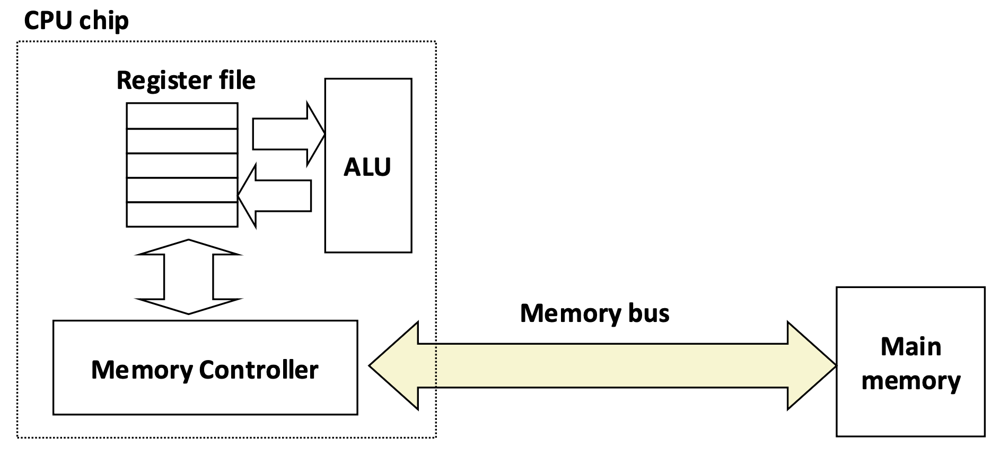
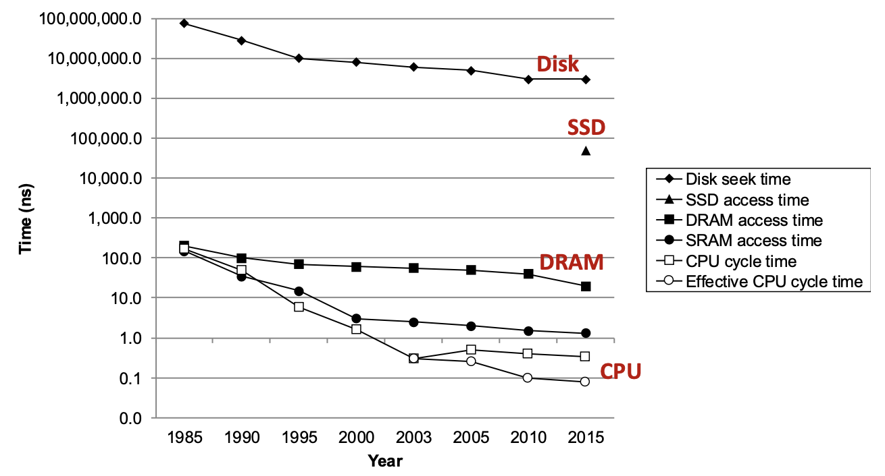
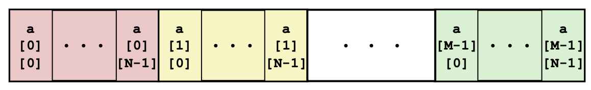
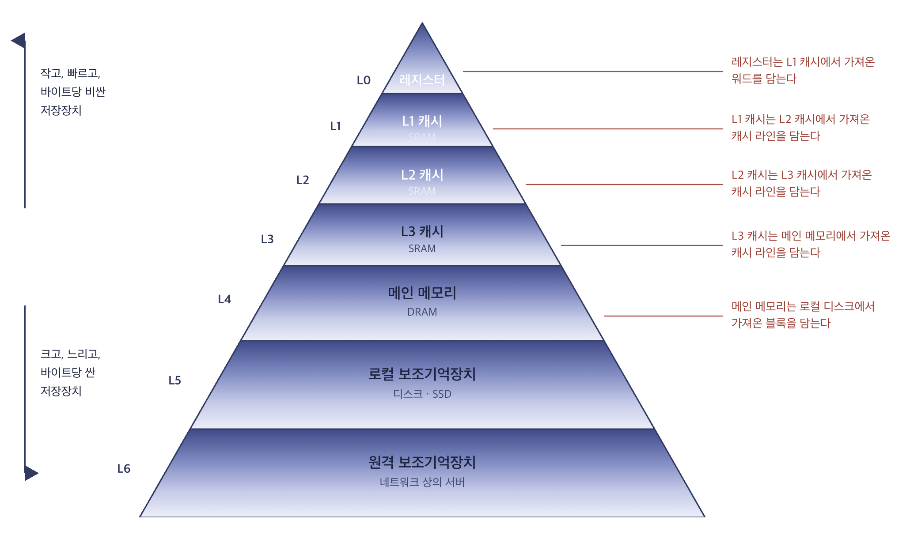
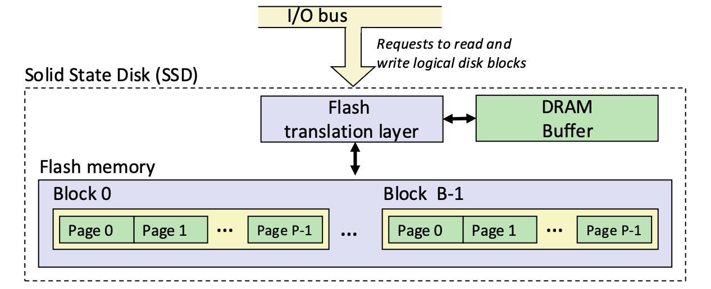

# 13 · 메모리 계층

## 메모리 추상화: 읽기와 쓰기

우리가 프로그램에서 흔히 쓰는 코드를 봅시다.

```c
int x = a;   // a가 있는 메모리 위치의 값을 가져온다
a = y;       // y의 값을 a가 있는 메모리 위치에 넣는다
```

편의상 우리는 이것을 "변수에 값을 넣고 뺀다"고 말하지만, 하드웨어 입장에서 메모리에 대한 연산은 딱 두 가지뿐입니다.

| 연산 | 방향 | 하는 일 |
|---|---|---|
| **읽기 (load)** | 메모리 → CPU | 주소 `A`에 저장된 값을 CPU 안으로 가져온다 |
| **쓰기 (store)** | CPU → 메모리 | CPU가 가진 값을 주소 `A`에 저장한다 |

CPU가 실제로 계산을 수행하는 곳은 **레지스터(register)** 입니다. 레지스터는 CPU 칩 안에 있는 극소수(수십 개)의 초고속 저장 공간으로, 산술 연산 장치(ALU)가 직접 꺼내 쓸 수 있는 유일한 저장소입니다. 따라서 메모리에 있는 데이터로 계산을 하려면 **반드시 먼저 레지스터로 읽어 와야** 하고, 결과를 남기려면 **다시 메모리로 써야** 합니다.



- **레지스터**: 계산이 일어나는 곳. 매우 빠르지만 매우 작다.

- **메인 메모리**: 프로그램의 데이터가 있는 곳. 크지만 느리다.

- **버스(bus)**: 하드웨어 구성 요소들을 연결하는 병렬 배선 묶음. 그중 **메모리 버스**는 주소·데이터·제어 신호를 실어 나른다.

### 읽기

주소 `A`의 값을 레지스터로 가져오는 과정은 이렇게 진행됩니다.

1. CPU가 주소 `A`를 메모리 버스에 올린다.
2. 메인 메모리가 버스에서 `A`를 읽고, 그 위치에 저장된 값 `x`를 꺼내 버스에 올린다.
3. CPU가 버스에서 `x`를 읽어 레지스터에 복사한다.

### 쓰기

레지스터에 있는 값 `y`를 주소 `A`에 저장하는 과정입니다.

1. CPU가 주소 `A`를 버스에 올린다. 메인 메모리는 이를 읽고, 대응하는 데이터가 도착하기를 기다린다.
2. CPU가 값 `y`를 버스에 올린다.
3. 메인 메모리가 `y`를 읽어 주소 `A`에 저장한다.

!!! note 
    소스 코드에서 `x = a;` 한 줄은 "즉시" 일어나는 것처럼 보입니다. 하지만 실제로는 **주소를 보내고 → 메모리가 응답하고 → 데이터가 돌아오는** 물리적 왕복입니다.

!!! tip 
    성능을 이야기할 때 중요한 단위는 "코드 몇 줄"이 아니라 **메모리 접근 몇 번**입니다. 같은 결과를 내는 두 프로그램이라도, 메모리를 건드리는 횟수와 순서가 다르면 실행 시간이 수십 배 차이 날 수 있습니다.


---

## RAM: SRAM과 DRAM

RAM은 보통 칩 형태로 패키징되거나 프로세서 칩에 내장됩니다. 기본 저장 단위는 **셀(cell)** 이고, 셀 하나가 1비트를 담습니다. 시스템의 "메인 메모리"는 여러 RAM 칩으로 구성됩니다.

|  | 비트당 트랜지스터 | 접근 시간 | 리프레시 필요? | 오류 정정(EDC) | 상대 비용 | 용도 |
|---|---|---|---|---|---|---|
| **SRAM** | 6 또는 8 | 1x | 아니오 | 경우에 따라 | 100x | 캐시 메모리 |
| **DRAM** | 1 (+ 커패시터 1) | 10x | **예** | 예 | 1x | 메인 메모리, 프레임 버퍼 |

- **DRAM**: 트랜지스터 1개 + 커패시터 1개. 커패시터의 전하가 새기 때문에 **주기적으로 리프레시**해야 합니다. 대신 셀이 작아 밀도가 높고 쌉니다.
- **SRAM**: 트랜지스터 6개로 상태를 유지하므로 리프레시가 필요 없고 빠릅니다. 대신 비쌉니다.
- 둘 다 **휘발성(volatile)**: 전원이 끊기면 내용이 사라집니다.


---

## CPU–메모리 격차


수십 년간 CPU의 사이클 시간은 급격히 줄었지만, DRAM 접근 시간은 훨씬 완만하게 줄었습니다. 디스크는 더 심합니다. 
이 격차를 어떻게 메울 수 있을까요? 

---

## 지역성 (Locality)

지역성이란, **최근에 사용한 주소와 같거나 가까운 주소**의 데이터와 명령어를 사용하는 경향이 있는 것을 말합니다. 

- **시간 지역성(temporal locality)**: 최근에 참조된 항목은 가까운 미래에 다시 참조될 가능성이 높다.
- **공간 지역성(spatial locality)**: 주소가 가까운 항목들은 시간적으로도 가까이 참조되는 경향이 있다.

### 예제 1: 배열 합

```c
sum = 0;
for (i = 0; i < n; i++)
    sum += a[i];
return sum;
```

| 참조 대상 | 패턴 | 지역성 |
|---|---|---|
| `a[i]` | 연속된 원소를 차례로 접근 (**stride-1**) | 공간 |
| `sum` | 매 반복마다 재참조 | 시간 |
| 명령어 | 순차적으로 실행 | 공간 |
| 루프 본문 | 반복적으로 재실행 | 시간 |

### 예제 2: 2차원 배열 — 행 우선 vs 열 우선

C의 배열은 **행 우선(row-major)** 으로 저장됩니다. 즉 메모리에는 다음 순서로 놓입니다.



#### 좋은 지역성

```c
int sum_array_rows(int a[M][N]) {
    int i, j, sum = 0;
    for (i = 0; i < M; i++)
        for (j = 0; j < N; j++)
            sum += a[i][j];
    return sum;
}
```

메모리를 저장 순서대로 훑습니다 → **stride-1**. 공간 지역성 좋음.

#### 나쁜 지역성

```c
int sum_array_cols(int a[M][N]) {
    int i, j, sum = 0;
    for (j = 0; j < N; j++)
        for (i = 0; i < M; i++)
            sum += a[i][j];
    return sum;
}
```

한 번 접근할 때마다 `N`개 원소를 건너뜁니다 → **stride-N**. 공간 지역성 나쁨.

!!! question 
    `sum_array_cols`에서 `M`이 아주 작다면 지역성이 오히려 좋아질 수 있습니다. 왜일까요?

    ??? success "답"
        배열 전체가 작아서 캐시에 통째로 들어가기 때문입니다. 첫 열을 훑는 동안 배열 전체가 캐시에 올라오고, 이후 열들은 모두 적중합니다. 즉 **지역성은 접근 패턴만이 아니라 작업 집합의 크기와 캐시 용량의 관계**로 결정됩니다. 캐시와 관련된 내용은 다음 챕터에서 다룹니다. 

!!! question  
    아래 함수가 `a`를 stride-1로 훑도록 루프를 재배치하세요.

    ```c
    int sum_array_3d(int a[M][N][N]) {
        int i, j, k, sum = 0;
        for (i = 0; i < N; i++)
            for (j = 0; j < N; j++)
                for (k = 0; k < M; k++)
                    sum += a[k][i][j];
        return sum;
    }
    ```

    ??? success "답"
        `a[k][i][j]`에서 가장 자주 참조될 인덱스는 **`j`** 입니다. 따라서 `j` 루프를 가장 안쪽으로 보내고 `k`를 바깥으로 옮깁니다 (`k → i → j` 순서).

---

## 메모리 계층
하드웨어와 소프트웨어는 다음과 같은 특징을 가집니다: 

1. 빠른 저장 기술일수록 **바이트당 비싸고, 용량이 작고, 전력(발열)이 크다.**
2. CPU와 메인 메모리의 속도 격차는 **계속 벌어진다.**
3. 잘 작성된 프로그램은 **좋은 지역성**을 보인다.
4. 메모리가 커지면 신호가 이동할 거리가 길어지고, 하나의 신호가 더 많은 저장 위치로 갈라져 나가야 하므로 크기 자체가 지연과 에너지를 증가시킵니다. 즉 **크고 동시에 빠른 메모리**는 만들기 어렵습니다. 



위로 갈수록 **작고, 빠르고, 바이트당 비싸며**, 아래로 갈수록 **크고, 느리고, 저렴해집니다.** 각 층은 바로 아래 층의 데이터 일부를 담아둡니다.

---

## 디스크와 SSD

계층의 아래쪽은 **비휘발성(nonvolatile)** 입니다. 전원이 꺼져도 내용이 유지됩니다.

- **ROM**: 생산 시점에 프로그래밍
- **EEPROM**: 전기적으로 지울 수 있는 PROM
- **플래시 메모리**: 블록 단위 부분 소거가 가능한 EEPROM. 약 100,000회 소거 후 마모
- **3D XPoint 등 신소재 NVM**

용도: 펌웨어(BIOS, 디스크·네트워크 카드·그래픽 컨트롤러), SSD, 디스크 캐시 등.

### SSD (Solid State Disk)



- 페이지: 512B ~ 4KB, 블록: 32 ~ 128 페이지
- 데이터는 **페이지 단위**로 읽고 씁니다.
- **페이지는 그 페이지가 속한 블록 전체를 지운 뒤에야 쓸 수 있습니다.**
- 한 블록은 약 10,000회 반복 쓰기 후 마모됩니다.

!!! success "순차 vs 임의"
    **순차 접근이 임의 접근보다 빠르다** 

    캐시 블록, 디스크 섹터 등 모두 덩어리 단위 전송을 전제로 설계되어 있기 때문에 순차 접근은 임의 접근보다 빠릅니다. 

    **임의 쓰기가 느린 이유**

    - 블록 소거에 시간이 오래 걸립니다(~1 ms). (SSD는 미리 지워둔 블록 풀을 유지합니다)
    - 한 페이지를 수정하려면 같은 블록의 나머지 페이지들을 새 블록으로 복사해야하기 때문입니다. 

---

## 요약

!!! abstract 핵심 정리

    **메모리 연산은 읽기와 쓰기 두 가지뿐이다**

    - 계산은 오직 **레지스터**에서만 일어난다. 메모리의 데이터로 연산하려면 반드시 레지스터로 읽어 오고, 결과를 남기려면 다시 메모리로 써야 합니다. 
    - `x = a;` 한 줄은 즉시 일어나는 것처럼 보이지만, 실제로는 주소를 버스에 올리고 → 메모리가 응답하고 → 데이터가 돌아오는 **물리적 왕복**입니다. 
    - 따라서 성능의 단위는 "코드 몇 줄"이 아니라 **메모리 접근 몇 번**입니다. 

    **저장 기술에는 근본적인 트레이드오프가 있다**

    - **SRAM**: 트랜지스터 6~8개로 상태를 유지 → 빠르고 리프레시 불필요, 대신 비싸고 밀도가 낮습니다. 캐시용.
    - **DRAM**: 트랜지스터 1개 + 커패시터 1개 → 싸고 밀도가 높지만 느리고 **리프레시**가 필요합니다. 메인 메모리용.
    - 둘 다 **휘발성**이며, 아래 계층(플래시·디스크)은 **비휘발성**입니다.
    - 빠른 기술일수록 바이트당 비싸고 용량이 작고 전력 소모가 큽니다. 게다가 메모리가 커지면 신호 이동 거리와 분기가 늘어나므로, **크면서 동시에 빠른 메모리**는 원리적으로 만들기 어렵습니다.

    **CPU–메모리 격차는 계속 벌어진다**

    CPU 사이클 시간은 급격히 줄었지만 DRAM 접근 시간은 완만하게만 줄었고, 디스크는 더 심합니다. 이 격차를 소자 기술만으로 메울 수는 없습니다.

    **격차를 메우는 열쇠는 지역성이다**

    - **시간 지역성**: 최근 참조한 항목은 곧 다시 참조됩니다.
    - **공간 지역성**: 주소가 가까운 항목들은 시간적으로도 가까이 참조됩니다.
    - C 배열은 **행 우선** 저장이므로 `sum_array_rows`는 stride-1(좋음), `sum_array_cols`는 stride-N(나쁨)입니다.
    - 단, 지역성은 접근 패턴만으로 결정되지 않습니다. **작업 집합의 크기와 캐시 용량의 관계**가 함께 결정한다. 배열이 충분히 작으면 나쁜 패턴도 전부 적중합니다.

    **메모리 계층은 이 세 가지 사실이 만나 나온 해법이다**

    빠르고 작은 저장소를 위에, 느리고 큰 저장소를 아래에 쌓고, **각 층이 바로 아래 층의 데이터 일부를 담아둡니다.** 프로그램이 좋은 지역성을 보이는 한, 대부분의 접근은 위쪽 층에서 처리됩니다. 그 결과 시스템은 **가장 아래 층의 용량을 가지면서 거의 가장 위층의 속도**를 내는 것처럼 동작합니다.

    **계층의 아래쪽에서는 "덩어리 단위"가 지배한다**

    - 캐시 블록, 디스크 섹터, SSD 페이지 모두 덩어리 단위 전송을 전제로 설계되었습니다 → **순차 접근이 임의 접근보다 빠릅니다**
    - SSD는 **페이지 단위로 읽고 쓰지만, 쓰기 전에 그 페이지가 속한 블록 전체를 지워야 합니다** 블록 소거가 느리고(~1 ms) 나머지 페이지를 새 블록으로 복사해야 하므로 **임의 쓰기가 특히 느립니다.**
    - 플래시는 소거 횟수에 한계가 있어 마모됩니다. 