# 14 · 캐시

## 캐시

**캐시(cache)**란, 더 크고 느린 장치의 데이터 **부분집합**을 담아두는, 더 작고 빠른 저장 장치입니다. 

**메모리 계층은 모든 `k`에 대해, 레벨 `k`의 더 빠르고 작은 장치는 레벨 `k+1`의 더 크고 느린 장치의 캐시 역할을 한다고 볼 수 있습니다.**이것이 가능한 이유는 **지역성** 때문입니다. 프로그램은 레벨 `k`의 데이터를 레벨 `k+1`의 데이터보다 훨씬 자주 접근하기 때문입니다. 

### 블록 단위 전송

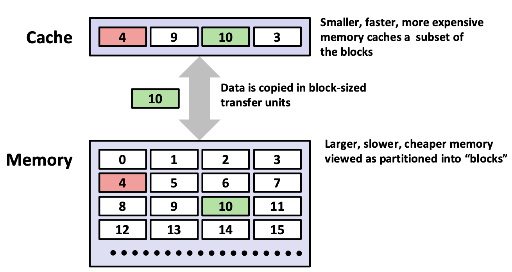

데이터는 **블록(block)** 단위로 복사됩니다. 하위 레벨 메모리는 고정 크기 블록들로 분할되어 있다고 보고, 캐시는 그중 일부를 담습니다. 워드가 아니라 블록인 이유는 한 바이트를 요청해도 그 주변 바이트들이 곧 필요할 가능성이 높기 때문입니다(공간 지역성). 어차피 왕복 비용이 큰 김에 이웃까지 통째로 가져오는 것이 이득입니다.

### Hit과 Miss

- **Hit**: 필요한 블록 `b`가 캐시에 이미 있음
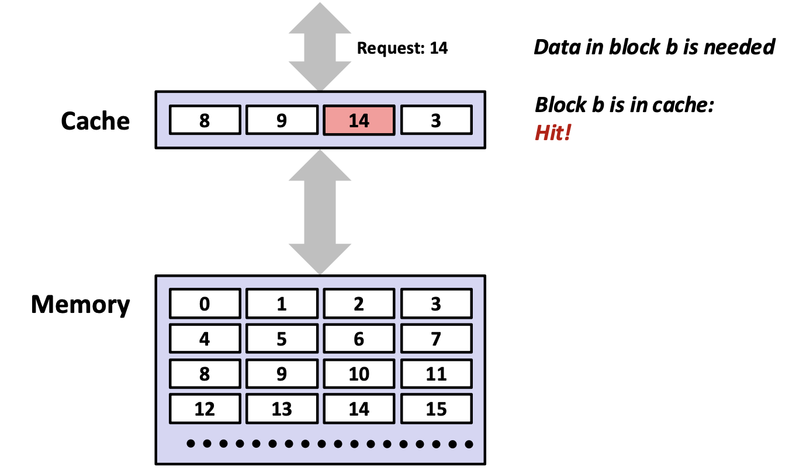

- **Miss**: 없음 → 하위 레벨에서 블록 `b`를 가져와 캐시에 저장. 이때 두 가지 정책이 필요합니다.
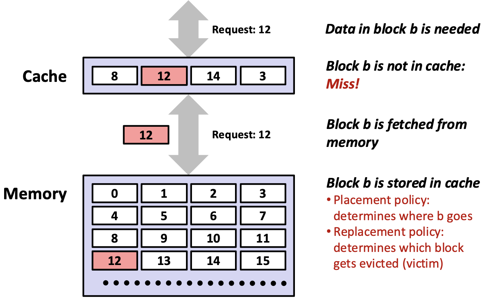
- **배치 정책(placement policy)**: `b`를 캐시의 어디에 넣을 것인가?
- **교체 정책(replacement policy)**: 자리가 없다면 어느 블록을 쫓아낼 것인가(**victim**)?

### Miss의 3가지 종류

| 종류 | |
|---|---|
| **Cold(Compulsory) Miss** | 캐시가 비어 있고 그 블록을 **처음** 참조했을때 발생하는 miss |
| **Capacity Miss** | 캐시 용량보다 현재 추가로 넣을 블록들(working set)이 더 많을때 발생하는 miss  |
| **Conflict Miss**| 캐시에 여유가 있는데도 여러 블록이 **같은 자리**로만 매핑되어 발생하는 miss  |

!!! example "Conflict Miss 예시"
    레벨 `k+1`의 블록 `i`가 레벨 `k`의 블록 `i mod 4`에만 놓일 수 있다고 합시다. 이때 블록 0, 8, 0, 8, ... 을 번갈아 참조하면 둘 다 자리 0으로 매핑되어 **매번 Miss**가 발생하게 됩니다. 이는 캐시가 비어 있어도 발생합니다. 

!!! note Working set이란 
    프로그램이 **어느 시점 근방에서 실제로 활발히 접근하는 데이터의 집합**입니다. 프로그램이 가진 전체 데이터가 아니라, "지금 이 구간에서 반복적으로 접근하고 있는 부분"만을 가리킵니다. 따라서 working set은 시간에 따라 변할 수 있습니다. 

---

## CPU 캐시의 구조

CPU 캐시는 하드웨어가 로드/스토어에 반응해 **자동으로** 관리하는 작고 빠른 SRAM 저장소입니다.

!!! note "캐시는 보이지 않고, 메모리는 보인다"
    - **캐시는 소프트웨어에 투명(invisible)** 합니다. 명령어로 직접 주소를 지정할 수 없고, 코드를 고치지 않아도 성능과 전력이 개선됩니다.
    - **메모리는 소프트웨어에 보입니다.** 명령어가 주소로 직접 접근합니다. 최적화 여지가 있지만, 그건 **코드를 바꿔야만** 얻어집니다.

    캐시의 효과를 극대화하려면 **지역성이 좋은 코드**를 써야 합니다.

### 파라미터 (S, E, B)

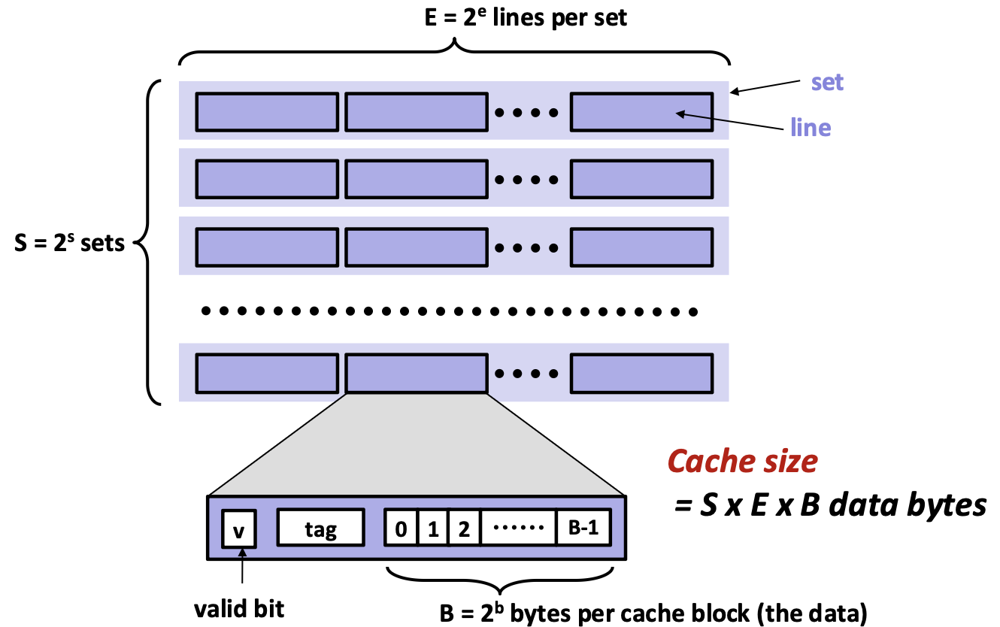

- $S = 2^s$: **셋(set)** 의 개수
- $E = 2^e$: 셋당 **라인(line)** 의 개수 (associativity)
- $B = 2^b$: 블록당 **바이트** 수

$$\text{캐시 용량} = S \times E \times B \ \text{바이트 (데이터 기준)}$$

각 라인은 `[유효 비트 v | 태그 tag | 데이터 블록 B바이트]` 로 구성됩니다.

### 주소 분해
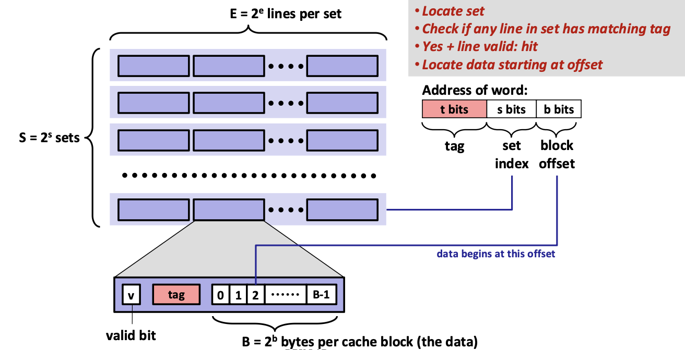

$m$비트 주소는 세 부분으로 나뉩니다.

```
| t bits (tag) | s bits (set 인덱스) | b bits (block offset) |
```

- **블록 오프셋** (하위 $b$비트): 블록 안에서 몇 번째 바이트인가
- **셋 인덱스** (가운데 $s$비트): 어느 set을 볼 것인가
- **태그** (상위 $t$비트): 그 set의 line이 내가 찾는 블록이 맞는가

여기서 $t = m - s - b$ 입니다.

### 읽기 과정

1. set 인덱스로 **set을 찾는다.**
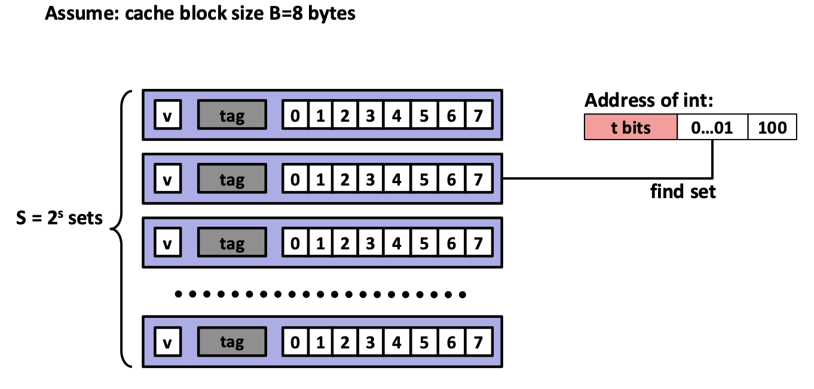
2. 그 set의 line들 중 **tag가 일치**하는 것이 있는지 검사한다.
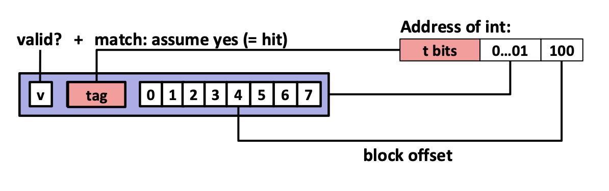
3. 일치하고 **valid 비트가 1**이면 → **hit**.
4. 블록 오프셋 위치부터 데이터를 꺼낸다.


일치하는 line이 없거나 valid하지 않으면 **miss**이고, 하위 레벨에서 블록을 가져와 그 set의 line 하나를 교체합니다.

---

### Direct Mapped 캐시 (E = 1)


set당 line이 하나뿐이므로, 각 블록이 갈 수 있는 자리는 **정확히 하나**입니다. 태그가 안 맞으면 무조건 기존 line을 교체하게 됩니다. 하드웨어 구조는 단순하겠지만, **conflict miss에 취약**해집니다. 

!!! example "S=4, E=1, B=2, 4비트 주소 (M=16바이트)"
    주소 분해: `t=1, s=2, b=1`

    참조 트레이스 (1바이트씩 읽기): `0, 1, 7, 8, 0`

    | 참조 | 이진수 | 태그 | 셋 | 오프셋 | 결과 |
    |---|---|---|---|---|---|
    | 0 | `0 00 0` | 0 | 0 | 0 | miss (cold) |
    | 1 | `0 00 1` | 0 | 0 | 1 | **hit** |
    | 7 | `0 11 1` | 0 | 3 | 1 | miss (cold) |
    | 8 | `1 00 0` | 1 | 0 | 0 | miss (cold) |
    | 0 | `0 00 0` | 0 | 0 | 0 | miss (**conflict**) |

    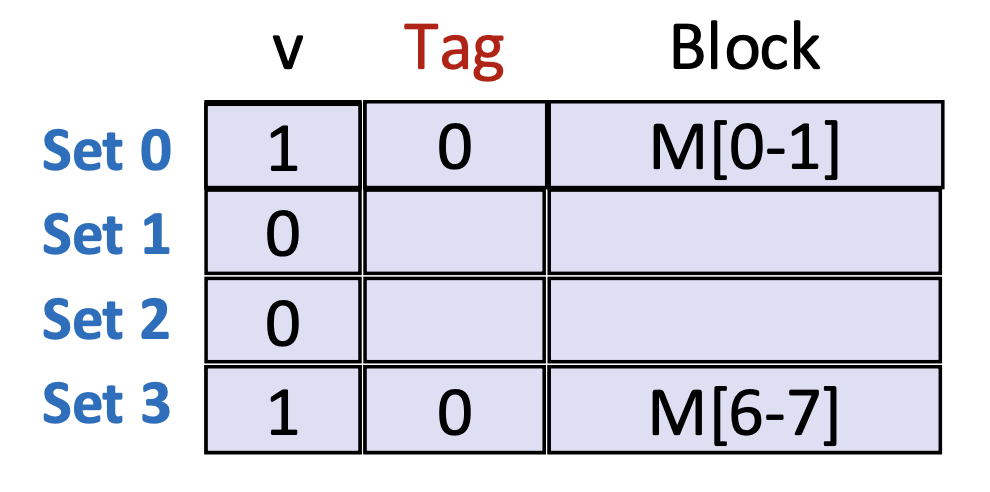

---

### E-way Set-Associative 캐시 (E > 1)

set당 line이 여러 개이므로, 한 set 안에서 **모든 태그를 병렬로 비교**합니다. miss 시 그 set의 line 중 하나를 골라 교체하며, 교체 정책으로는 **random**, **LRU(least recently used)** 등이 쓰입니다.

#### 교체 정책 (Replacemnet Policy)
- **random**: 무작위 선택. 구현이 가장 간단합니다. 
- **LRU (least recently used)**: 가장 오래 참조되지 않은 line을 교체합니다. 시간 지역성 가정과 가장 잘 맞지만, 연관도가 높아지면 사용 순서를 기록하는 비용이 커지게됩니다. 
- 실제 하드웨어는 완전한 LRU 대신 **의사-LRU(pseudo-LRU)** 같은 근사 기법을 사용합니다. 

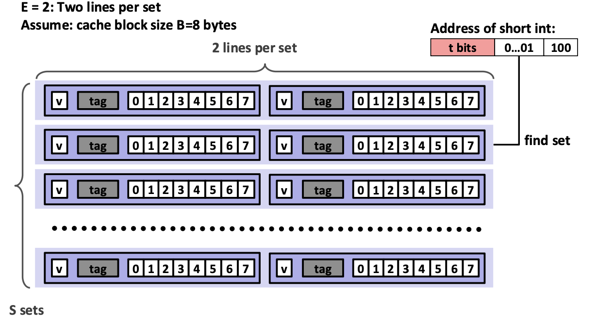
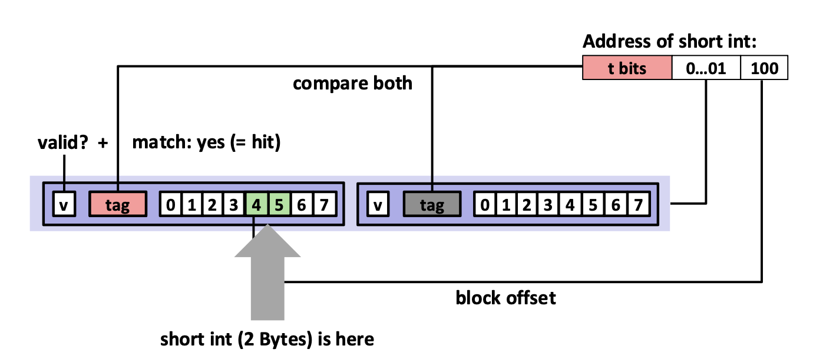
!!! example "같은 트레이스, S=2, E=2, B=2"
    주소 분해: `t=2, s=1, b=1`

    | 참조 | 이진수 | 태그 | 셋 | 결과 |
    |---|---|---|---|---|
    | 0 | `00 0 0` | 00 | 0 | miss |
    | 1 | `00 0 1` | 00 | 0 | **hit** |
    | 7 | `01 1 1` | 01 | 1 | miss |
    | 8 | `10 0 0` | 10 | 0 | miss |
    | 0 | `00 0 0` | 00 | 0 | **hit** |

    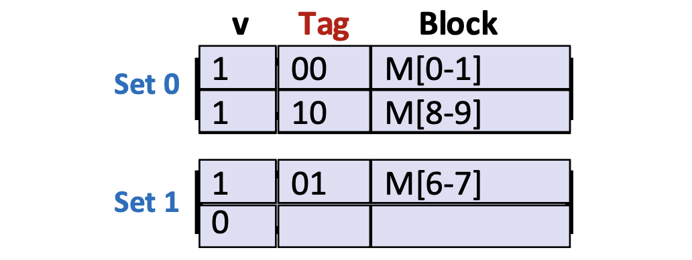

!!! info "연관도($E$)의 상충 관계"
    연관도 $E$를 키우면 conflict miss는 줄지만, tag 비교기가 많아지고 hit 판정 경로가 길어져 **hit 지연과 전력이 늘어납니다.** 그래서 L1은 보통 낮은 연관도, 하위 레벨 캐시는 더 높은 연관도를 씁니다.

!!! question 
    32KB, 8-way 집합 연관, 블록 크기 64바이트인 L1 캐시가 있고 주소는 48비트입니다. $s$, $b$, $t$ 는 각각 몇 비트일까요?

    ??? success "답"
        - $B = 64 = 2^6 \Rightarrow b = 6$
        - 라인 수 $= 32768 / 64 = 512$, 셋 수 $S = 512 / 8 = 64 = 2^6 \Rightarrow s = 6$
        - $t = 48 - 6 - 6 = 36$
---

## 쓰기는 어떻게 처리하는가

같은 데이터의 복사본이 L1, L2, L3, 메인 메모리, 디스크에 **동시에 존재**하기 때문에, 쓰기의 경우 어느 시점에 어디까지 갱신할지 결정해야합니다. 

### Write Hit

| 정책 | 동작 |
| --- | --- |
| **Write-through** | 캐시와 메모리에 즉시 함께 write합니다. 단순하지만 쓰기 트래픽이 많습니다. |
| **Write-back** | 캐시에만 쓰고, 그 라인이 교체될 때에 메모리에 반영합니다. 각 라인에 해당 데이터가 변경되었는지 여부를 체크하는 **dirty bit**를 필요로 합니다. |

### Write Miss

| 정책 | 동작 |
| --- | --- |
| **Write-allocate** | 블록을 캐시로 읽어온 뒤 캐시에서 갱신합니다. 그 위치에 쓰기가 더 이어질 것 같으면 유리한 방식입니다. |
| **No-write-allocate** | 캐시에 올리지 않고 메모리에 바로 씁니다. |


### Write-back + Write-allocate
Write-through, No-write-allocate와 같은 조합도 가능하나, 오늘날 대부분의 CPU 캐시는 Write-back, Write-allocate 조합을 채택하여 사용합니다. 


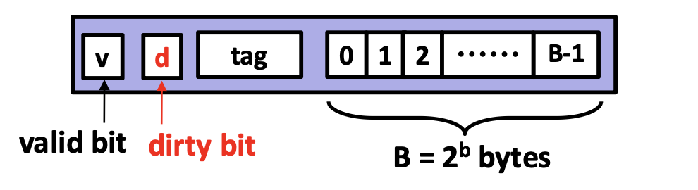

**쓰기가 발생했을 때 Hit인 경우**

1. 블록 내용을 갱신한다.
2. dirty bit를 1로 설정한다. (이 비트는 **sticky** 해서, 교체될 때만 지워진다.)

**쓰기가 발생했을 때 Miss인 경우**

1. 읽기 미스와 똑같이 메모리에서 블록을 가져온다.
2. 그 다음 쓰기 히트와 똑같이 처리한다.

**라인이 교체되는데 dirty bit가 1인 경우**

1. `2^b` 바이트 **블록 전체**를 메모리에 write back 한다.
2. dirty bit를 0으로 지운다.
3. 라인을 새 내용으로 교체한다.

---

## 실제 캐시: Intel Core i7

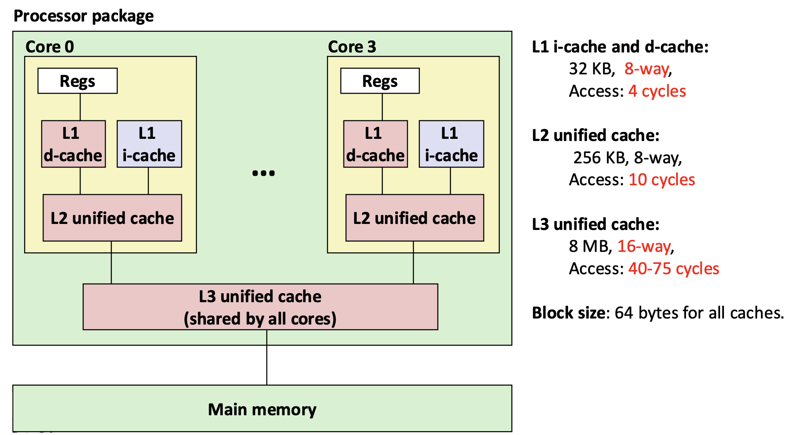

- L1은 명령어 캐시(i-cache)와 데이터 캐시(d-cache)가 **분리**되어 있습니다. 
- L2 이하는 통합(unified)입니다. 
- 계층이 내려갈수록 크기·연관도·접근 시간이 모두 커집니다. 
- **모든 캐시의 블록 크기는 64바이트**입니다. 

---

## 캐시 성능 지표

### Miss ratio
- 캐시에서 찾지 못한 참조의 비율 = miss 수 / 전체 접근 수 = `1 - hit ratio`
- 전형적으로 L1은 <1% ~ 10%, L2는 크기에 따라 1% 미만까지 내려갈 수 있습니다. 

### Hit time
- 캐시의 line을 프로세서에 전달하는 데 걸리는 시간. **line이 캐시에 있는지 판단하는 시간을 포함**합니다. 
- L1 약 4 cycles, L2 약 10 cycles.

### Miss penalty
Miss 때문에 추가로 드는 시간. 메인 메모리 기준 보통 50~200 cycles이며, 하드웨어의 크기가 커짐에 따라 **증가하는 추세**입니다. 


#### 예시 
Hit time 1 cycle, Miss penalty 100 cycles인 단순한 모델의 경우를 생각해봅시다. 

```text
평균 접근 시간 = hit time + miss ratio × miss penalty
```

| Hit Ratio | 계산 | 평균 접근 시간 |
| --- | --- | --- |
| 97% | 1 + 0.03 × 100 | **4 cycles** |
| 99% | 1 + 0.01 × 100 | **2 cycles** |

Hit ratio보다 miss ratio가 캐시 성능 지표로 자주 사용됩니다. 그 이유는 캐시 성능을 좌우하는 것은 hit 접근이 아니라 miss 접근이기 때문입니다. hit ratio 99%와 97%는 2%p 차이지만, miss ratio로 보면 1%와 3%로 세 배 차이입니다. miss 한 번의 비용이 hit 한 번보다 훨씬 크므로, 실행 시간도 그만큼 벌어집니다.

---

## 캐시 친화적 코드

1. **자주 실행되는 곳을 빠르게 하기** : 계산과 메모리 접근의 대부분이 일어나는 핵심 함수의 **안쪽 반복문**에 집중합니다. 
2. **안쪽 반복문의 miss를 줄이기**
    - 같은 변수를 반복 참조 → 시간 지역성
    - **stride-1** 접근 패턴 → 공간 지역성

"지역성이 좋다/나쁘다"를 **miss ratio라는 수치로 정량화**할 수 있습니다. 

### stride란 무엇인가

**stride(보폭)** 는 연속된 두 번의 메모리 접근이 **주소상 몇 칸 떨어져 있는가**를 뜻합니다.
배열을 훑는 코드에서는 반복문이 인덱스를 얼마씩 증가시키는지가 곧 stride입니다.

```c
for (i = 0; i < n; i += k)   // k가 stride
    sum += a[i];
```

- `k = 1` → `a[0], a[1], a[2], a[3], ...` : **stride-1**, 메모리를 저장 순서대로 빠짐없이 훑는다.
- `k = 4` → `a[0], a[4], a[8], ...` : 세 칸씩 건너뛴다.

stride는 배열 인덱스만의 개념이 아니라 **실제 주소 간격**입니다. 2차원 배열을 열 우선으로 훑는 `a[0][j], a[1][j], a[2][j], ...` 는 인덱스로는 `i`가 1씩 늘지만, 행 우선 저장이므로 주소는 매번 `N`개 원소만큼 건너뜁니다(**stride-N**).


캐시는 **블록 단위**로 데이터를 가져옵니다. 원소가 8바이트(`long`)이고 블록이 64바이트라면,
한 블록에는 원소 **8개**가 들어 있습니다. **블록 하나를 가져오는 비용은 그 안의 원소를 몇 개 쓰든 똑같기 때문에** 가져온 8개 중 실제로 몇 개를 쓰는가"가 miss ratio을 좌우합니다.

- **stride 1**: 블록을 가져오면 8개를 다 쓴다 → miss ratio **1/8**.
- **stride 4**: 블록당 2개만 쓴다 → miss ratio **1/2**.
- **stride 8 이상**: 블록당 1개만 쓰고 버린다 → miss ratio **1.0**.

정리하면, 블록당 원소가 8개일 때 미스율은 대략 아래와 같이 됩니다. 

```text
miss ratio ≈ min(stride / 8, 1.0)
```


---

## 예시

### C 배열의 메모리 배치

C 언어의 배열은 **행 우선(row-major)** 순서로 배치됩니다. 즉 각 행이 연속된 메모리에 놓이고, `a[i][j]`는 `a[i*N + j]`에 해당합니다. 

```c
for (i = 0; i < N; i++)  sum += a[0][i];   // 한 행의 열을 따라감
```
→ 연속된 원소를 접근합니다. 블록 크기 `B`가 원소 크기보다 크면 공간 지역성을 활용한다.
**miss ratio = sizeof(원소) / B**

```c
for (i = 0; i < N; i++)  sum += a[i][0];   // 한 열의 행을 따라감
```
→ `N × 8`바이트씩 떨어진 곳을 접근한다. 공간 지역성이 **전혀 없다**.
**miss ratio = 1.0**


### 행렬 곱 예시 분석

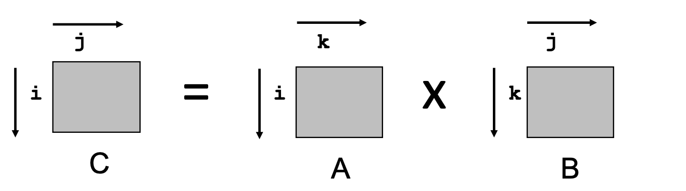
`N × N` 행렬 곱 `C = A × B`를 생각해 봅시다. 

이해를 위해 아래와 같은 전제 하에 분석을 진행합니다: 

- 원소는 `double`(8바이트) 타입, 블록 크기 32B (= 블록당 `double` 4개 저장)
- 총 연산량은 `O(N³)`으로 **반복문 순서와 무관하게 동일**
- `N`이 매우 커서 `1/N ≈ 0`으로 근사 가능, 캐시가 행 하나를 통째로 담을 수 없음 
- **안쪽 반복문의 접근 패턴만** 분석

#### ijk 
```c
for (i = 0; i < n; i++) {
    for (j = 0; j < n; j++) {
    sum = 0.0;
    for (k = 0; k < n; k++)
        sum += a[i][k] * b[k][j];
    c[i][j] = sum;
    }
}
```
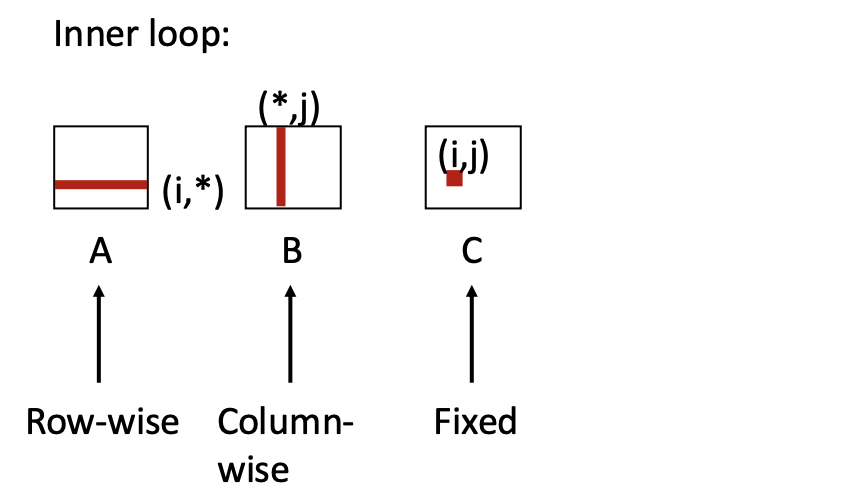

안쪽 반복문에서: `A`는 행 방향 `(i,*)`, `B`는 **열 방향** `(*,j)`, `C`는 고정 `(i,j)`

| A | B | C | 평균 미스/반복 |
| --- | --- | --- | --- |
| 0.25 | 1.0 | 0.0 | **1.25** |

#### kij

```c
for (k = 0; k < n; k++) {
    for (i = 0; i < n; i++) {
    r = a[i][k];
    for (j = 0; j < n; j++)
        c[i][j] += r * b[k][j];
    }
}
```
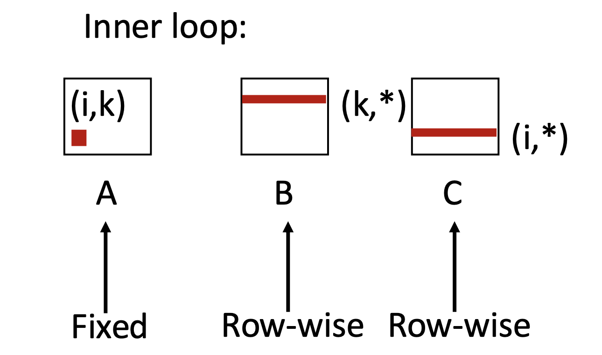
안쪽 반복문에서: `A`는 고정 `(i,k)`, `B`와 `C` 모두 **행 방향**.

| A | B | C | 평균 미스/반복 |
| --- | --- | --- | --- |
| 0.0 | 0.25 | 0.25 | **0.5** |

#### jki 

```c
for (j = 0; j < n; j++) {
    for (k = 0; k < n; k++) {
    r = b[k][j];
    for (i = 0; i < n; i++)
        c[i][j] += a[i][k] * r;
    }
}
```
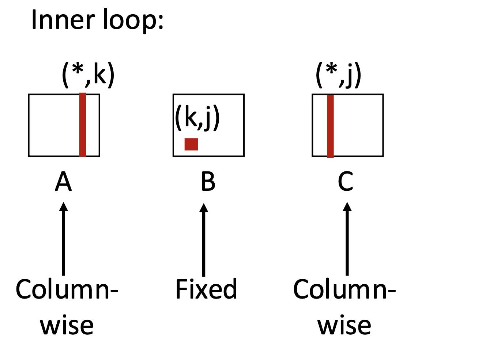
안쪽 반복문에서: `B`는 고정 `(k,j)`, `A`와 `C` 모두 **열 방향**.

| A | B | C | 평균 미스/반복 |
| --- | --- | --- | --- |
| 1.0 | 0.0 | 1.0 | **2.0** |

#### 실측 결과 및 분석 정리 
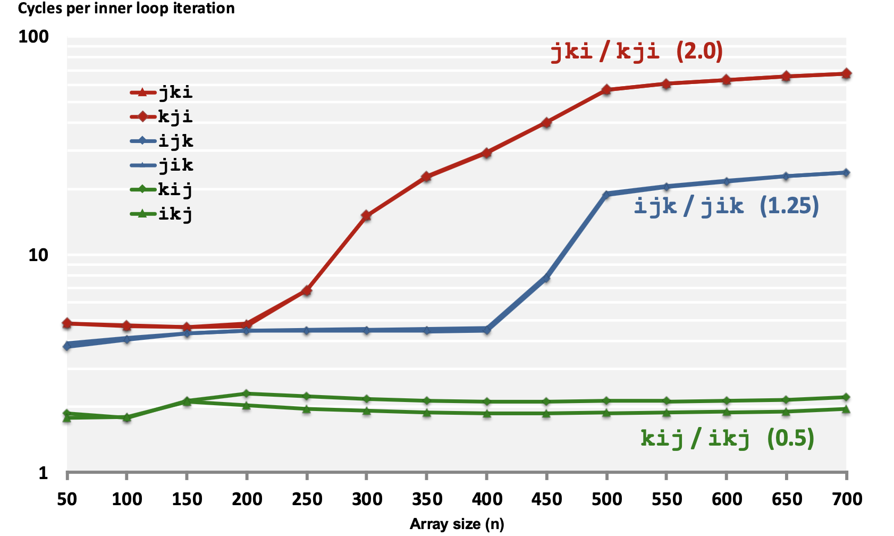

Core i7로 실제로 측정하였을 때(안쪽 반복문 1회당 사이클 수 측정)에서도 성능 차이가 그대로 나타나는 것을 관찰할 수 있습니다. 배열이 작을 때(`n` ≈ 50~150)는 세 그룹이 비슷하지만, working set이 캐시를 넘어서는 순간부터 성능 차이가 커지게 됩니다. `kij/ikj`는 `n`이 커져도 거의 평평하게 유지되는 반면, `jki/kji`는 `n = 250` 부근부터 저하되는 모습을 실제로 관찰 가능합니다. 

!!! note 
    캐시 친화적 

---

## 요약
!!! abstract 핵심 정리

    **메모리 연산은 읽기와 쓰기 두 가지뿐이다**

    - 계산은 오직 **레지스터**에서만 일어난다. 메모리의 데이터로 연산하려면 반드시 레지스터로 읽어 오고, 결과를 남기려면 다시 메모리로 써야 한다.
    - `x = a;` 한 줄은 즉시 일어나는 것처럼 보이지만, 실제로는 주소를 버스에 올리고 → 메모리가 응답하고 → 데이터가 돌아오는 **물리적 왕복**이다.
    - 따라서 성능의 단위는 "코드 몇 줄"이 아니라 **메모리 접근 몇 번**이다.

    **저장 기술에는 근본적인 트레이드오프가 있다**

    - **SRAM**: 트랜지스터 6~8개로 상태를 유지 → 빠르고 리프레시 불필요, 대신 비싸고 밀도가 낮다. 캐시용.
    - **DRAM**: 트랜지스터 1개 + 커패시터 1개 → 싸고 밀도가 높지만 느리고 **리프레시**가 필요하다. 메인 메모리용.
    - 둘 다 **휘발성**이며, 아래 계층(플래시·디스크)은 **비휘발성**이다.
    - 빠른 기술일수록 바이트당 비싸고 용량이 작고 전력 소모가 크다. 게다가 메모리가 커지면 신호 이동 거리와 분기가 늘어나므로, **크면서 동시에 빠른 메모리**는 원리적으로 만들기 어렵다.

    **CPU–메모리 격차는 계속 벌어진다**

    CPU 사이클 시간은 급격히 줄었지만 DRAM 접근 시간은 완만하게만 줄었고, 디스크는 더 심하다. 이 격차를 소자 기술만으로 메울 수는 없다.

    **격차를 메우는 열쇠는 지역성이다**

    - **시간 지역성**: 최근 참조한 항목은 곧 다시 참조된다.
    - **공간 지역성**: 주소가 가까운 항목들은 시간적으로도 가까이 참조된다.
    - C 배열은 **행 우선** 저장이므로 `sum_array_rows`는 stride-1(좋음), `sum_array_cols`는 stride-N(나쁨)이다.
    - 단, 지역성은 접근 패턴만으로 결정되지 않는다. **작업 집합의 크기와 캐시 용량의 관계**가 함께 결정한다. 배열이 충분히 작으면 나쁜 패턴도 전부 적중한다.

    **메모리 계층은 이 세 가지 사실이 만나 나온 해법이다**

    빠르고 작은 저장소를 위에, 느리고 큰 저장소를 아래에 쌓고, **각 층이 바로 아래 층의 데이터 일부를 담아둔다.** 프로그램이 좋은 지역성을 보이는 한, 대부분의 접근은 위쪽 층에서 처리된다. 그 결과 시스템은 **가장 아래 층의 용량을 가지면서 거의 가장 위층의 속도**를 내는 것처럼 동작한다.

    **계층의 아래쪽에서는 "덩어리 단위"가 지배한다**

    - 캐시 블록, 디스크 섹터, SSD 페이지 모두 덩어리 단위 전송을 전제로 설계되었다 → **순차 접근이 임의 접근보다 빠르다.**
    - SSD는 **페이지 단위로 읽고 쓰지만, 쓰기 전에 그 페이지가 속한 블록 전체를 지워야 한다.** 블록 소거가 느리고(~1 ms) 나머지 페이지를 새 블록으로 복사해야 하므로 **임의 쓰기가 특히 느리다.**
    - 플래시는 소거 횟수에 한계가 있어 마모된다.
