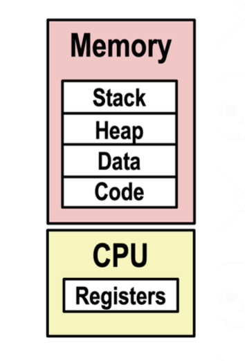
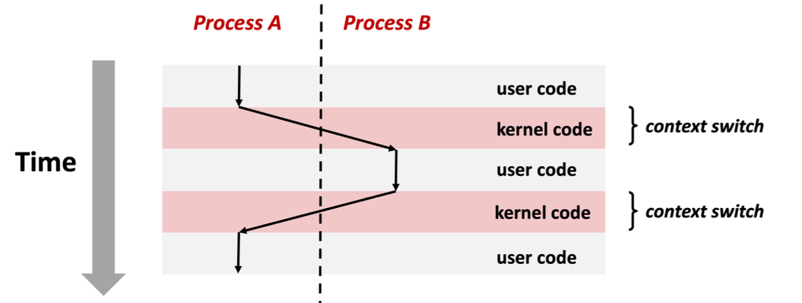
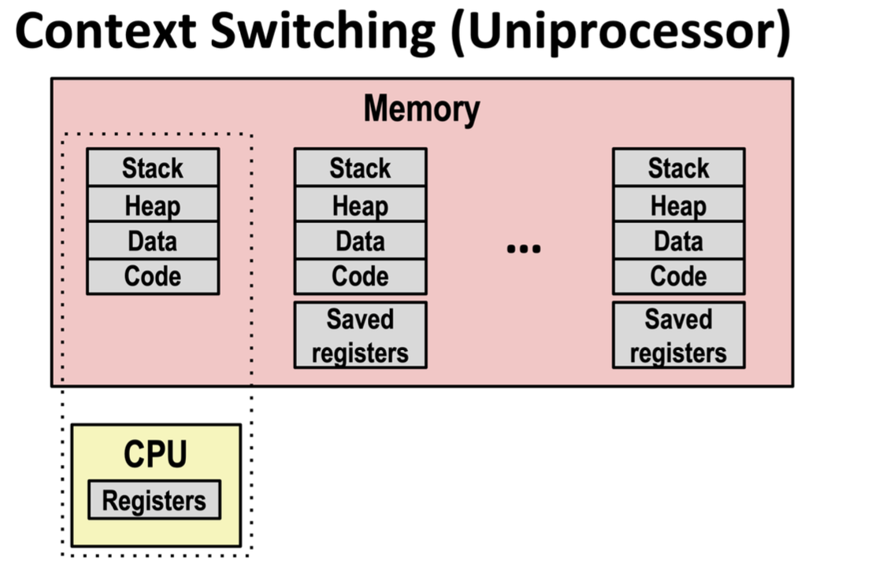
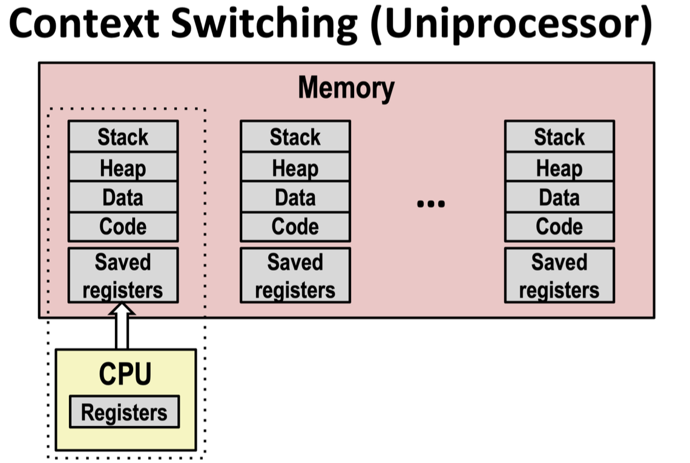
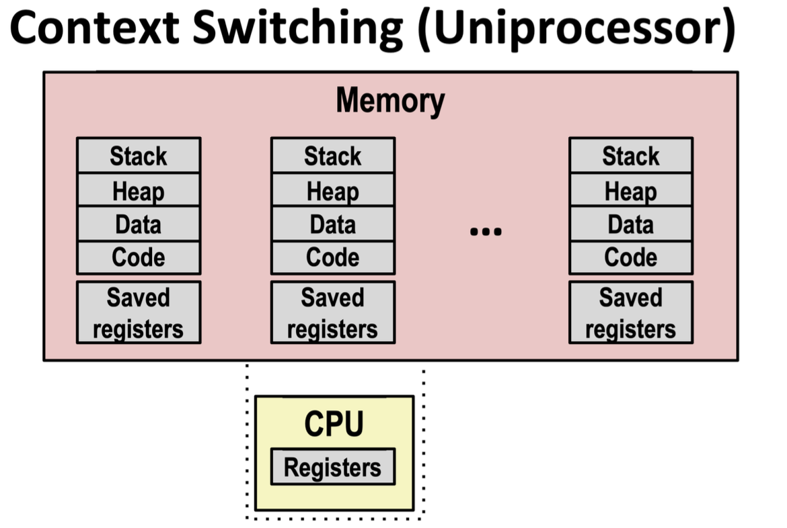
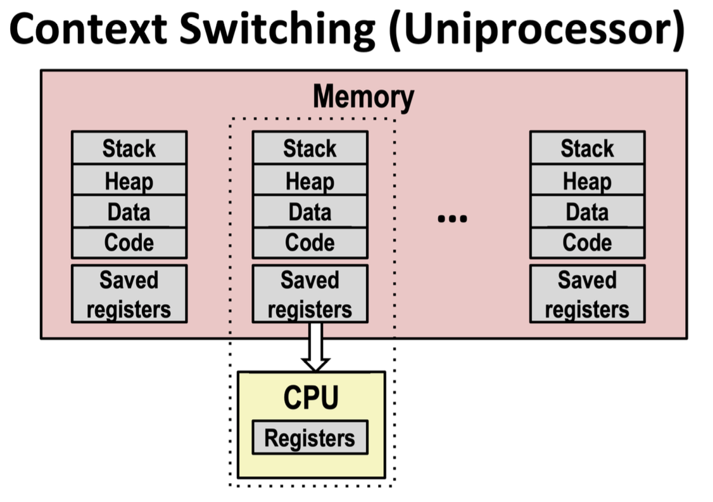
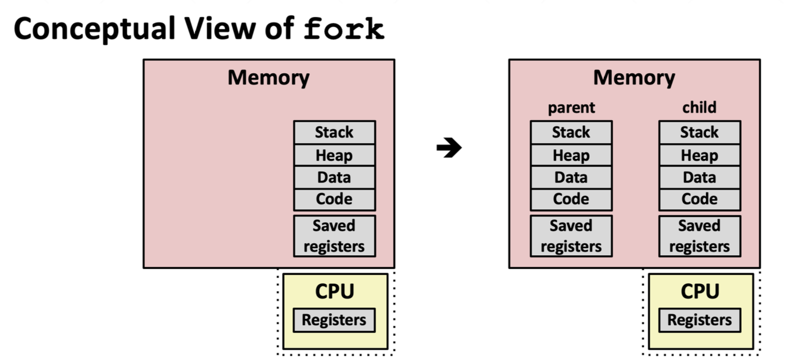
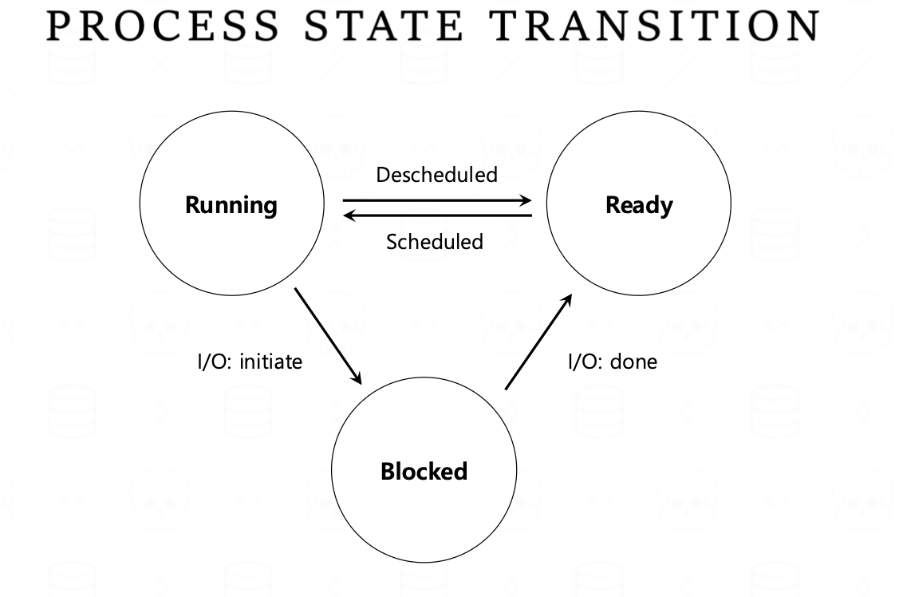
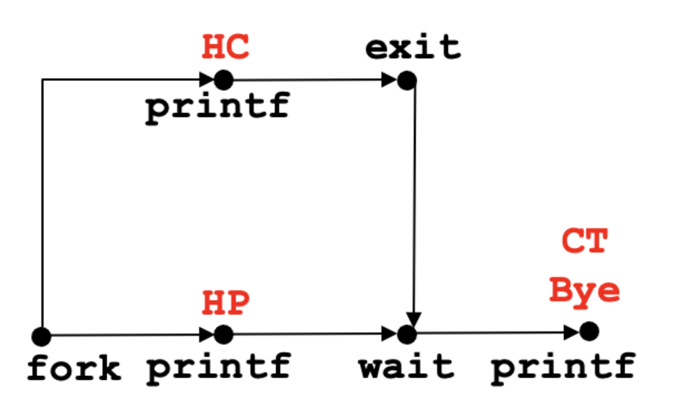

# 15 · 프로세스와 스레드

## 프로세스란 무엇인가



**프로세스**(process)는 "실행 중인 프로그램의 인스턴스"입니다. 같은 프로그램을 여러 번 실행하면 여러 개의 프로세스가 생기는 것처럼, 프로그램과 프로세스는 다른 개념입니다.

프로세스는 모든 프로그램에게 두 가지 핵심 추상화를 심어줍니다:

- **독립된 주소 공간(private address space)** : 마치 이 메모리 전체를 자기 혼자 쓰는 것처럼 보이게 합니다.
- **논리적 제어 흐름(logical control flow)** : 마치 CPU 전체를 자기 혼자 쓰는 것처럼 보이게 합니다. (커널의 **컨텍스트 스위칭** 메커니즘으로 구현됩니다.)

## 커널은 어떻게 여러 프로세스를 오가는가: 컨텍스트 스위칭



CPU 코어 하나는 한 번에 딱 한 가지 명령어 흐름만 실행합니다. 시작부터 종료까지
순서대로 명령어를 읽고 실행할 뿐입니다. 그런데도 컴퓨터는 마치 여러 프로세스가
동시에 도는 것처럼 보이게 만드는데, 그것을 가능하게 해주는 것이 **컨텍스트 스위칭**입니다.

!!! important "커널은 별도 프로세스가 아니다"

    커널은 "또 하나의 프로세스"가 아니라, 모든 프로세스가 공유하는 **메모리 상주 코드
    조각**입니다. 제어 흐름이 프로세스 A에서 B로 넘어갈 때, 실제로는 A의 유저 코드 →
    커널 코드(A의 문맥에서 실행됨) → B의 유저 코드 순서로 진행됩니다. 커널 코드가 그
    사이에서 "다음에 누굴 실행시킬지" 결정하고 전환해주는 것입니다.

컨텍스트 스위칭이 하는 일은 정확히 세 단계입니다:

**전환 전**



프로세스 A가 CPU를 차지하고 실행 중입니다.

**1단계: 레지스터 저장**



현재 실행 중인 프로세스(A)의 레지스터 값을 메모리에 저장합니다.

**2단계: 스케줄**



다음에 실행할 프로세스(B)를 스케줄합니다.

**3단계: 레지스터 로드**



B가 저장해뒀던 레지스터 값을 CPU에 로드하고, 주소 공간을 전환합니다.

!!! tip "레지스터란"

    레지스터는 CPU 안에 있는 아주 작지만 매우 빠른 저장 공간입니다. 지금 실행 중인
    명령어가 어디까지 진행됐는지, 계산 중인 값이 무엇인지 같은 정보가 여기 담겨
    있습니다. 프로그램을 잠깐 멈췄다가 나중에 정확히 그 지점부터 다시 이어서
    실행하려면, 이 레지스터 값들을 어딘가에 보관해뒀다가 그대로 되돌려놔야 합니다.

멀티코어 환경에서는 CPU 코어마다 별도의 프로세스를 동시에 실제로 실행할 수 있지만,
"어떤 프로세스를 어느 코어에 배정할지"는 여전히 커널이 결정합니다. 그래서 유저
입장에서 두 프로세스가 "동시에 실행되는 것처럼 보인다(concurrent)"는 것과, 실제로
물리적으로 겹쳐서 실행된다(parallel)는 것은 코어 개수에 따라 다른 이야기입니다 —
코어가 하나뿐이면 실행은 사실 **인터리빙**된 것일 뿐이지만, 그래도 두 프로세스가
서로의 실행에 영향을 주고받을 수 있다는 점은 똑같습니다.

## fork()

```c
#include <stdio.h>
#include <unistd.h>

int global_counter = 0;

int main() {
    global_counter = 10;
    pid_t pid = fork();   // 지금 이 시점에서 프로세스가 통째로 복제된다

    if (pid == 0) {
        // 자식 프로세스
        global_counter += 1;
        printf("child : %d\n", global_counter);
    } else {
        // 부모 프로세스
        global_counter += 100;
        printf("parent: %d\n", global_counter);
    }
    return 0;
}
```



`fork()`는 자식에게는 `0`을, 부모에게는 자식의 PID를 리턴값으로 돌려줍니다. 자식은 부모의
**거의** 완전한 복사본입니다: 주소 공간도, 열린 파일 디스크립터들도 그대로 복사되지만,
PID는 다릅니다.

!!! note "실행 순서는 예측할 수 없다"

    위 코드를 여러 번 실행하면, `child : ...`와 `parent: ...` 중 어느 줄이 먼저 찍힐지는
    매번 달라질 수 있습니다:

    ```text
    child : 11        parent: 110       child : 11        parent: 110
    parent: 110       child : 11        parent: 110       child : 11
    ```

    두 프로세스가 완전히 독립된 메모리를 갖고 있어서 **값 자체가 틀리게 나오는 일은
    없지만**(각자 자기 사본만 바꾸므로), 어느 프로세스가 먼저 스케줄되어 실행되는지는
    커널 마음입니다. "메모리가 독립적이어도 실행 순서는 여전히 비결정적"이라는 게 이후
    동시성 논의 전체에 깔리는 전제입니다.

!!! note "질문"

    자식이 `global_counter`를 바꾸면 부모가 보는 값도 바뀔까요?

    **답: 아니오.** `fork()`는 호출 시점의 메모리 상태를 통째로 복제하기 때문에,
    그 순간부터 부모와 자식은 **완전히 독립된 주소 공간**을 가집니다. 자식의 변경은
    자식만의 사본에만 반영됩니다.

## 스레드와 `pthread_create`

지금까지 본 프로세스는 각자 독립된 주소 공간을 가졌습니다. **스레드(thread)**는
이와 달리, 하나의 프로세스 **안에서** 실행되는 또 다른 실행 흐름입니다. 같은
프로세스에 속한 스레드들은 그 프로세스의 주소 공간(코드, 전역 변수, 힙)을 그대로
공유하고, 스택만 스레드마다 따로 가집니다. `pthread_create`로 스레드를 만들면
이걸 직접 확인할 수 있습니다.

```c
#include <stdio.h>
#include <pthread.h>

int global_counter = 0;

void *worker(void *arg) {
    global_counter += 1;
    return NULL;
}

int main() {
    pthread_t t1, t2;
    pthread_create(&t1, NULL, worker, NULL);
    pthread_create(&t2, NULL, worker, NULL);
    pthread_join(t1, NULL);
    pthread_join(t2, NULL);
    printf("%d\n", global_counter);
    return 0;
}
```

이번엔 두 스레드가 **같은 global_counter**를 두고 경쟁합니다. 결과가 항상 2로 나올
거라 예상하기 쉽지만, 실행할 때마다 다를 수도 있습니다 

!!! important

    같은 프로세스의 스레드끼리는 자동으로 메모리를 공유하지만, 서로 다른 프로세스는
    아무것도 공유하지 않습니다. 그래서 여러 프로세스가 같은 데이터를 봐야 한다면,
    스레드처럼 "그냥 되는" 게 아니라 별도의 메커니즘을 통해 공유해야 합니다.

## 프로세스가 커널에게 도움을 요청하는 법: 시스템 콜

프로그램이 **자기 프로세스 바깥에** 영향을 미치고 싶을 때, 예를 들어 파일을 읽거나 쓰거나,
현재 시각을 얻거나, 메모리를 더 할당받거나(`sbrk`), 새 프로세스를 만들거나 등의 요청을 할 때는 반드시
커널에게 부탁해야 합니다. 이 부탁을 **시스템 콜(system call)** 이라고 합니다. 

"이제 커널 코드를 실행해라"라고 직접 쓰는 일은 없어 보이지만, 사실 `syscall`이라는
특수 명령어 하나가 정확히 그 역할을 합니다. `fopen`처럼 익숙한 라이브러리 함수도,
내부적으로는 결국 `syscall` 명령어로 커널에 진입했다가 돌아오는 코드로 이어집니다.

지금까지 본 `fork()`도, 곧 볼 `wait()`과 `execve()`도 전부 시스템 콜입니다. 셋 다
"이 프로세스 하나만으로는 할 수 없는 일"(새 프로세스 생성, 다른 프로세스의 종료를
기다리기, 프로세스 이미지를 통째로 갈아 끼우기)이기 때문입니다.

## 프로세스의 생애주기: state와 `wait()`



프로세스는 실행되는 동안 다음 세 상태(state)를 오갑니다:

- **Running** — 지금 CPU 코어를 잡고 실행되고 있는 상태
- **Ready** — 실행될 준비는 됐지만, 당장 쓸 수 있는 코어가 없어서 대기 중인 상태
- **Blocked** — I/O 같은 외부 이벤트가 끝날 때까지는 실행을 계속할 수 없는 상태

이 세 상태 사이의 전환은 다음 네 가지입니다:

- **Running → Ready** (descheduled): 커널이 이 프로세스를 잠깐 멈추고 다른 프로세스에게
  코어를 줄 때
- **Ready → Running** (scheduled): 커널이 이 프로세스에게 코어를 다시 배정할 때
- **Running → Blocked** (I/O 시작): 이 프로세스가 I/O 등 외부 이벤트를 기다려야 할 때
- **Blocked → Ready** (I/O 완료): 기다리던 이벤트가 끝나서 다시 실행 후보가 될 때


프로세스가 `exit()`을 부르거나 `main`에서 리턴하면, 이 세 상태 순환에서 완전히
벗어나 **종료(terminated)**됩니다. 하지만 커널은 부모가 그 종료 상태(exit status)를
확인할 때까지 프로세스 정보를 완전히 지우지 않는데, 이 "아직 안 치워진" 상태를
**좀비(zombie)**라고 부릅니다. 부모가 **`wait(int *child_status)`**를 호출해서
자식을 "거둬가야(reap)" 비로소 완전히 사라집니다.

`wait()`은 현재 프로세스를 **자식 중 하나가 종료할 때까지** 멈춰 세우는 시스템 콜입니다.
그래서 아래처럼 부모가 `wait()`을 호출하면, "자식이 끝났다"는 메시지가 항상 "부모가
기다림을 끝냈다"는 메시지보다 먼저 나오도록 순서를 강제할 수 있습니다:

```c
if (fork() == 0) {
    printf("HC: hello from child\n");
    exit(0);
} else {
    printf("HP: hello from parent\n");
    wait(&child_status);
    printf("CT: child has terminated\n");
}
printf("Bye\n");
```



`HC`와 `HP`의 순서는 여전히 예측할 수 없지만(둘 다 `wait` 호출 전에 일어나는 일이므로),
`CT`는 **반드시** `HC` 다음에만 나올 수 있습니다 — `wait()`이 자식 종료를 실제로
기다리기 때문입니다. 이렇게 "무엇이 비결정적이고 무엇이 보장되는지"를 정확히 구분하는
연습이, 나중에 락/atomics가 지키는 순서 보장을 이해하는 데 그대로 이어집니다.

## (참고) `execve`: 프로세스를 다른 프로그램으로 갈아 끼우기

`fork()`가 "프로세스를 복제"하는 거라면, `execve()`는 **지금 이 프로세스 안에서** 코드,
데이터, 스택을 통째로 다른 프로그램으로 갈아 끼우는 시스템 콜입니다. PID와 열린 파일은
그대로 유지되지만, 그 외에는 완전히 새 프로그램으로 다시 시작합니다. `fork()` 다음에
`execve()`를 부르는 것이 유닉스에서 "새 프로그램을 실행"하는 표준 패턴입니다. shell이
명령어를 실행할 때 정확히 이 조합을 씁니다.

## 요약

!!! abstract "핵심 정리"

    - **프로세스**는 "실행 중인 프로그램의 인스턴스"이며, 모든 프로그램에게 **독립된 주소 공간**(메모리를 혼자 쓰는 것 같은 착각)과 **논리적 제어 흐름**(CPU를 혼자 쓰는 것 같은 착각)을 제공한다.

    - 이 착각을 만들어내는 것이 **컨텍스트 스위칭**이다. 커널은 ①현재 프로세스의 레지스터를 저장하고 ②다음 프로세스를 스케줄한 뒤 ③그 프로세스의 레지스터를 로드하고 주소 공간을 전환한다. 커널은 별도의 프로세스가 아니라 모든 프로세스가 공유하는 메모리 상주 코드다.

    - **동시성(concurrent)과 병렬성(parallel)은 다르다.** 코어가 하나면 실행은 인터리빙일 뿐이지만, 어느 쪽이든 프로세스들이 서로의 실행에 영향을 줄 수 있다는 점은 같다.

    - **`fork()`** 는 프로세스를 통째로 복제한다. 자식은 `0`을, 부모는 자식의 PID를 리턴받는다. 복제 이후 두 주소 공간은 완전히 독립적이라 **값이 깨지는 일은 없지만, 실행 순서는 여전히 비결정적**이다.

    - **스레드**는 한 프로세스 안의 또 다른 실행 흐름으로, 코드·전역 변수·힙을 **공유**하고 스택만 따로 갖는다. 그래서 프로세스와 달리 **같은 변수를 두고 경쟁**할 수 있고, 결과가 실행마다 달라질 수 있다. (프로세스 간 공유는 별도 메커니즘이 필요하다.)

    - 프로세스 바깥에 영향을 주는 일(파일 I/O, 메모리 할당, 프로세스 생성 등)은 **시스템 콜**로 커널에 요청해야 한다. `syscall` 명령어가 커널 진입점이며, `fork()`·`wait()`·`execve()`가 모두 시스템 콜이다.

    - 프로세스는 **Running / Ready / Blocked** 세 상태를 오간다 (descheduled, scheduled, I/O 시작, I/O 완료). 종료된 뒤에도 부모가 거두기 전까지는 **좀비**로 남으며, 부모가 **`wait()`** 를 호출해 reap해야 완전히 사라진다.

    - `wait()`은 순서를 **보장**해준다. 자식과 부모의 출력 순서(`HC` vs `HP`)는 예측할 수 없지만, `CT`는 반드시 자식 종료 후에 나온다. **무엇이 비결정적이고 무엇이 보장되는지 구분하는 것**이 이후 락/atomics를 이해하는 출발점이다.

    - **`execve()`** 는 현재 프로세스의 코드·데이터·스택을 다른 프로그램으로 갈아 끼운다. PID와 열린 파일은 유지된다. `fork()` + `execve()`가 유닉스에서 새 프로그램을 실행하는 표준 패턴이다.