# 16 · 주소 공간과 가상 메모리

## 프로그램은 메모리를 어떻게 나눠 쓰는가

초기 시스템은 물리 메모리에 프로그램을 하나만 올렸습니다. 커널이 앞쪽을
차지하고, 나머지 전체를 실행 중인 프로그램 하나가 독점하는 구조입니다. 단순하지만
메모리 대부분이 놀고 있고, 프로그램을 바꿀 때마다 전체를 교체해야 합니다.

그래서 **여러 프로그램을 물리 메모리에 동시에 올려두고, 짧게 번갈아 실행하는**
방식으로 바뀝니다. 활용률은 올라가지만, 여기서 결정적인 문제가 생깁니다.

> 프로그램 A가 잘못된 주소를 계산해 접근하면, 그 주소에는 프로그램 B의 데이터나
> 커널의 코드가 들어 있을 수 있습니다.

즉 **보호(protection)** 문제입니다. 프로그램이 물리 주소를 직접 다루는 한, 남의
메모리를 건드리지 못하게 막을 방법이 없습니다. 이 문제를 해결하는 것이 이번 절의 
주제인 가상 메모리입니다.

## 주소 공간

OS(운영체제)는 각 프로그램에게 **자기 혼자 0번지부터 메모리를 통째로 쓰고 있다는 착각**을
제공합니다. 이 추상화가 **주소 공간(address space)** 입니다. 주소 공간은 크게 네
영역으로 나뉩니다.

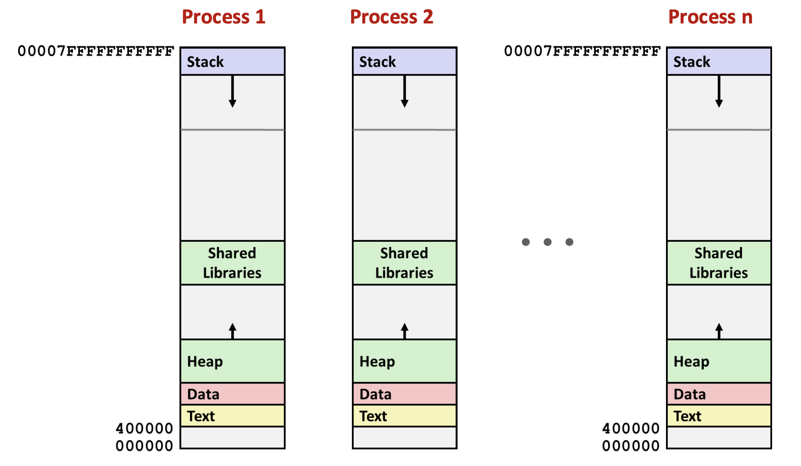

| 영역 | 내용 | 크기 변화 |
|---|---|---|
| **text** | 실행할 기계어 코드 | 고정 (읽기 전용) |
| **data** | 전역·정적 변수 | 고정 |
| **heap** | `malloc`으로 할당하는 영역 | 아래→위로 성장 |
| **stack** | 함수 호출 프레임, 지역 변수 | 위→아래로 성장 |

heap과 stack이 서로 마주보며 자라고 그 사이가 비어 있는 배치는, 어느 쪽이 얼마나
커질지 미리 모르기 때문입니다. 이 "빈 공간"은 주소 공간 상에서만 비어 있고, 물리
메모리를 실제로 차지하지는 않습니다. **주소 공간은 실제 메모리 배치가 아니라 각 프로그램에게 제공하는 가상의 구조입니다.** 주소 공간이 0번지에서 시작한다고 해서 그 프로그램이 물리 메모리 0번지에 놓여
있다는 뜻은 아닙니다.

## 가상 주소와 물리 주소

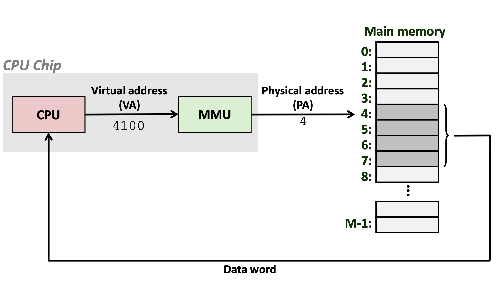

CPU가 내보내는 건 **가상 주소(VA, Virtual Address)**이고, **MMU**(Memory Management Unit)라는 하드웨어가 이걸 **물리 주소(PA, Physical Address)**로 변환한 다음에야 실제 메모리에 접근합니다. 이 변환 정보는 실행 중인 프로그램마다 따로 유지되는 **페이지 테이블**에 저장됩니다.

- **가상 주소 공간(Virtual Address Space)**: 지금 실행되고 있는 프로그램 하나마다
  `{0, 1, ..., N-1}` 형태의 자기만의 가상 주소 집합을 가집니다.
- **물리 주소 공간(Physical Address Space)**: 시스템 전체에 물리 메모리(DRAM)는
  하나 `{0, 1, ..., M-1}`뿐이고, 실행 중인 모든 프로그램이 이걸 나눠 씁니다.

즉 "프로그램 A의 가상 주소 `0x1000`"과 "프로그램 B의 가상 주소 `0x1000`"은 서로 같은 가상 주소를 갖더라도, 다른 물리 주소를 가질 수 있습니다. 

주소 변환은 함수로 볼 수 있습니다.

```
MAP: V → P ∪ {∅}
MAP(a) = a'   가상 주소 a의 데이터가 물리 주소 a'에 있음
MAP(a) = ∅    가상 주소 a의 데이터가 물리 메모리에 없음 (무효거나 디스크에 있음)
```

**변환은 하드웨어가, 설정은 OS가** 담당합니다. 모든 메모리 접근마다 변환이 일어나므로 변환 자체는 하드웨어(MMU)가 해야 하고, 어떤 가상 주소를 어떤 물리 주소로 보낼지 결정하고 하드웨어에 심어 주는 일은 OS가 합니다.

## 가상 메모리가 필요한 이유 

1. **필요한 부분만 물리 메모리에 올리기 위해** : 실행 중인 프로그램이 자신의 가상
   주소 공간 전체를 한 번에 다 쓰는 경우는 드뭅니다. 필요한 부분만 물리 메모리
   (DRAM)에 올려두면, 실제로 쓰는 양이 줄어드는 만큼 다른 프로그램을 위한 메모리가
   더 남고, 가상 주소 공간을 물리 메모리보다 크게 잡을 수도 있습니다.
2. **메모리 관리를 단순화하기 위해** : 모든 프로그램이 0번지부터 시작하는 균일하고
   연속적인 주소 공간을 보게 됩니다. 실제 물리 메모리가 어디에 흩어져 있든 신경 쓸
   필요가 없습니다. 컴파일러·링커도 "코드는 항상 이 주소에서 시작한다"고 가정할 수
   있어 링킹과 로딩이 단순해집니다.
3. **주소 공간을 격리하기 위해** : 하나의 실행 흐름은 다른 실행 흐름의 메모리를
   건드릴 수 없고, 유저 프로그램은 커널의 특권 정보·코드에 접근할 수 없습니다.
   모든 접근이 MMU를 통과하므로, 여기서 권한을 검사하면 됩니다.


## 주소 공간을 어떻게 매핑할 것인가
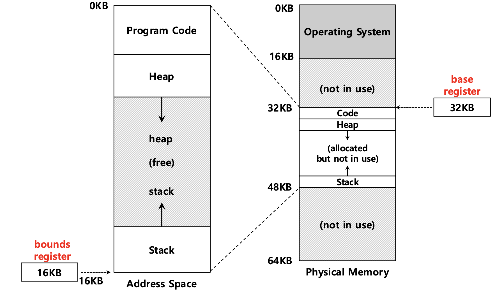

가상 주소에서 물리 주소로의 변환을 구현하는 가장 단순한 방법은 주소 공간 전체를 한 덩어리로 옮기는 것입니다. 하드웨어에 시작 주소(base)와 크기(bounds)를 담은 레지스터를 두고,
`물리 주소 = 가상 주소 + base`로 변환하면서 bounds를 넘는 접근은 예외로 막는
식입니다. 실제로 초기 시스템들이 이렇게 동작했고, 이것만으로도 재배치와 보호는
해결됩니다.

하지만 주소 공간이 한 덩어리라면 heap과 stack 사이의 거대한 빈 공간까지 물리 메모리를 차지해야 하고(부분 적재 불가), 두 프로그램이 같은 라이브러리 코드를 쓸 때 일부만 공유할 수도 없고(공유
불가), text는 읽기 전용, data는 읽기·쓰기처럼 영역별로 권한을 다르게 줄 수도
없습니다(세밀한 보호 불가).

원인은 **덩어리가 너무 크기 때문입니다.** 주소 공간을 고정 크기의 작은 조각으로
잘라 조각 단위로 매핑하면 세 문제를 해소할 수 있습니다. 이 조각을 **페이지(page)**,
물리 메모리 쪽의 대응하는 조각을 **프레임(frame)** 또는 **물리 페이지**라 부르고, 그
대응 관계를 담은 표가 **페이지 테이블(page table)** 입니다.


## 페이지 테이블과 PTE
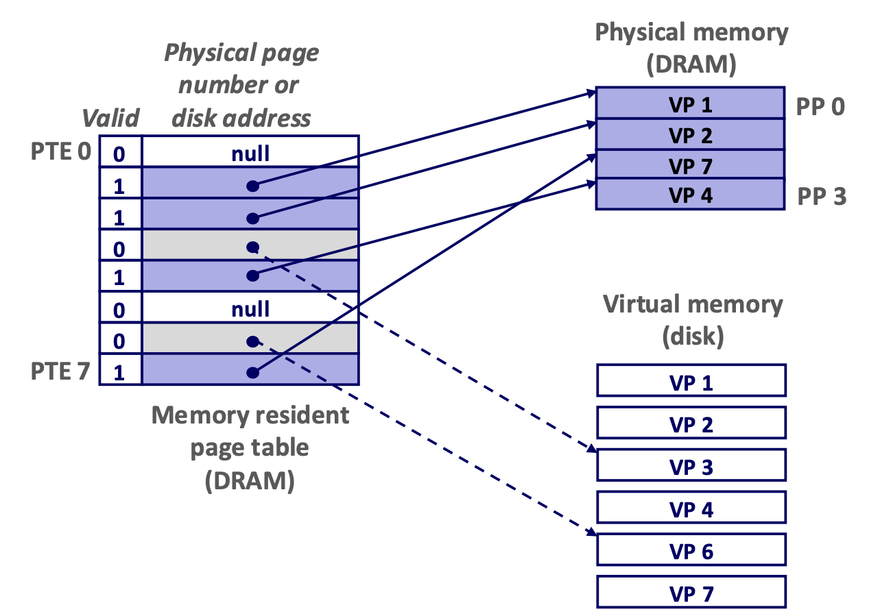
프로그램마다 하나씩 존재하는 커널 자료구조로, DRAM에 놓입니다. 각 항목이 **PTE(Page Table Entry)**입니다.

| 필드 | 의미 |
|---|---|
| valid 비트 | 이 가상 페이지가 지금 물리 메모리에 있는가 |
| PPN(Physical Page Number) / 디스크 주소 | valid=1이면 물리 페이지 번호, valid=0이면 디스크 위치 또는 `null` |

valid=0이면 두가지로 해석될 수 있습니다. 디스크 주소가 있으면 **할당됐지만 메모리에 없는** 페이지, `null`이면 **아직 할당조차 안 된** 페이지. 이 둘이 `MAP(a) = ∅`입니다.

## 캐시로서의 가상 메모리

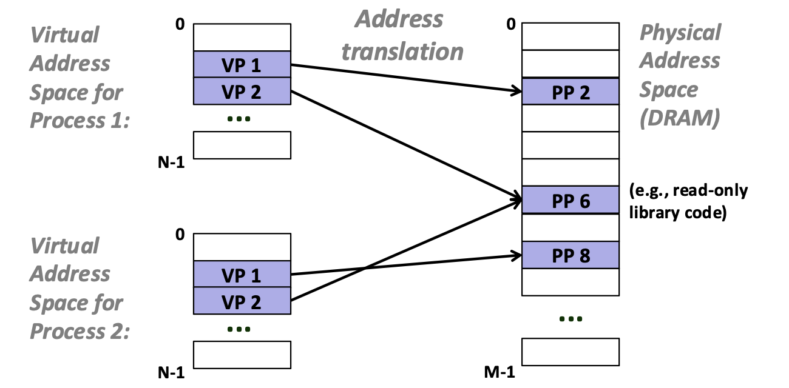

개념적으로 가상 메모리는 **디스크에 저장된 N바이트 배열**이고, DRAM은 지금 쓰는 부분만 담는 **캐시**입니다. 페이지가 메모리에 있으면 **페이지 Hit**, 없으면 **페이지 폴트(Page Fault)**(DRAM 캐시 미스)를 일으킵니다.

### 페이지 hit
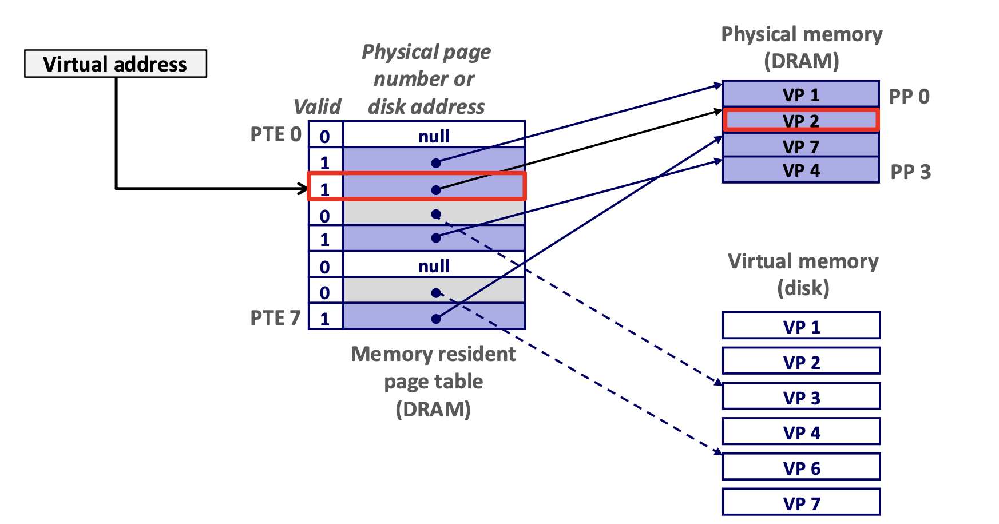

### 페이지 폴트 처리(Page Fault Handling)
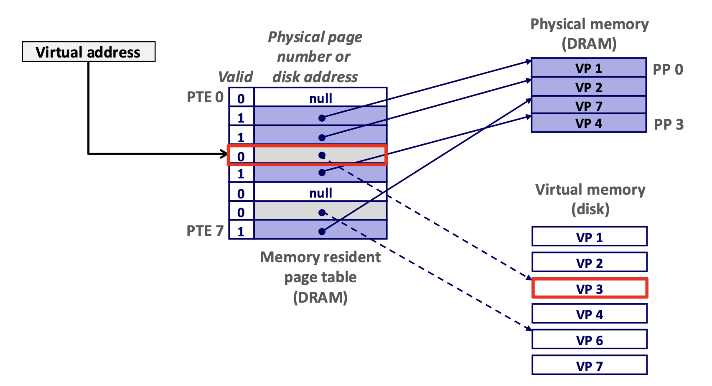

1. MMU가 PTE에서 valid=0 확인 → 예외 발생
2. 커널의 **페이지 폴트 핸들러(Page fault handler)** 실행
3. **victim 페이지** 선정, dirty면 디스크에 먼저 기록
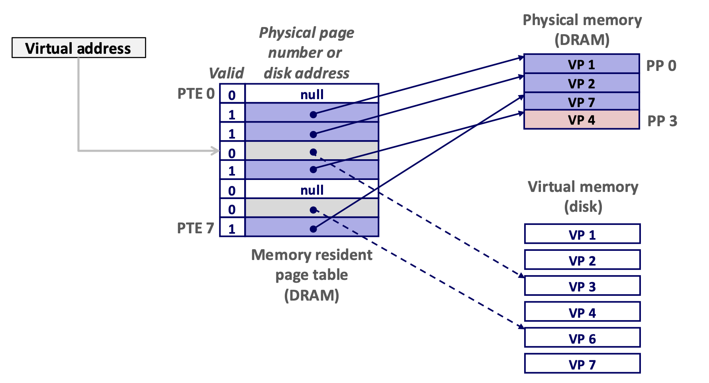
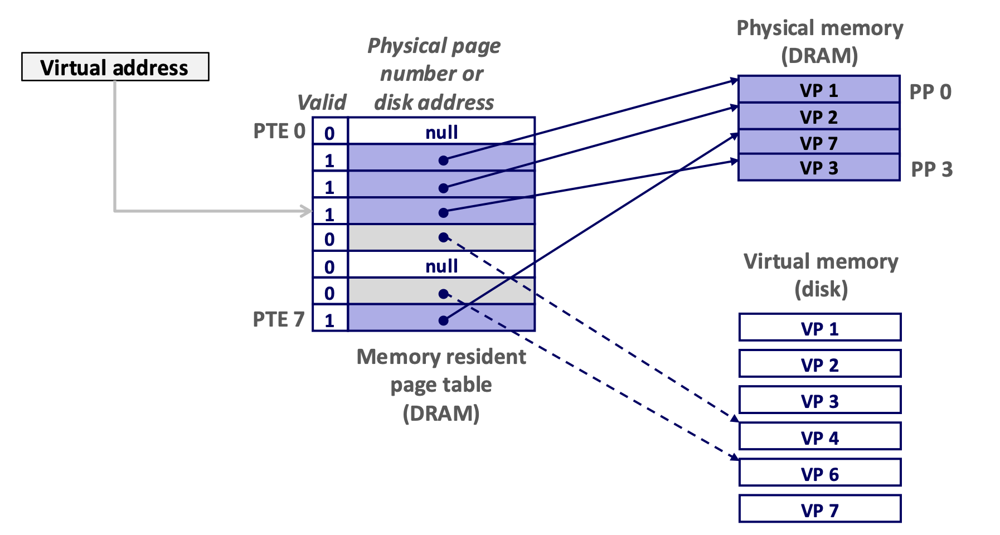
4. 필요한 페이지를 디스크에서 읽고 PTE 갱신
5. **fault를 일으킨 명령어를 재실행** (Hit)

프로그램은 fault를 일으킨 명령어가 두 번 실행된 걸 모릅니다. miss가 날 때까지 기다렸다 가져오는 이 방식이 **요구 페이징(demand paging)** 이라고 합니다. 

### DRAM 캐시의 설계

DRAM을 디스크의 캐시로 본다면, 캐시 설계에서 고려해야하는 블록 크기, 연관도(associative), 교체 정책, 쓰기 정책의 요소들도 DRAM 캐시에서도 마찬가지로 고려해야합니다.

DRAM 캐시의 경우 SRAM 캐시의 miss penalty보다 크기 때문에 아래와 같이 설계됩니다: 

- 한 번 갈 때 많이 가져와야 하므로 페이지(블록)의 크기는 4KB
- miss를 최대한 줄여야 하므로 fully associative(완전 연관)
- 하드웨어 대신 소프트웨어(커널)에게 정교하고 복잡한 교체 알고리즘을 수행케 함 
- write-back: 매번 쓰기가 발생할때마다 디스크에 부담을 주므로 dirty 비트를 활용한 write-back 쓰기 방식. 

특히 두 번째가 중요합니다. 일반 캐시는 주소의 인덱스 비트로 들어갈 자리가 정해지지만, 완전 연관이면 어떤 가상 페이지든 어떤 물리 페이지에나 놓일 수 있어 위치를 계산할 방법이 없습니다. 그래서 대응 관계를 전부 적어 둔 별도의 표가 필요하고, 그것이 페이지 테이블입니다.

DRAM 캐시가 잘 동작하는 이유는 결국 지역성 덕분입니다. miss penalty가 100만 사이클인 구조는 매번 미스가 난다면 쓰기 어렵습니다. 그런데 프로그램은 어느 시점에든 전체 가상 페이지가 아니라 활동적인 페이지 몇 개에만 접근합니다. 이 집합을 working set 이라 부르고, 시간 지역성이 좋은 프로그램일수록 working set이 작습니다.

즉, 성능은 working set이 물리 메모리에 들어가느냐로 갈립니다.

- working set < 물리 메모리 : 초기 cold miss 이후에는 거의 히트. 정상 동작
- working set > 물리 메모리 : `스래싱(thrashing)`. 페이지가 끊임없이 들어오고 나가며 성능 저하 

여러 프로그램이 함께 돌 때는 각자의 워킹 셋 합이 물리 메모리를 넘는 순간 스래싱이 발생합니다.

### 할당과 적재
`malloc`으로 새 페이지가 필요하면 커널은 디스크 공간을 잡고 PTE에 기록하되 **valid=0으로 둡니다.** 물리 메모리는 처음 접근하는 순간에야 배정됩니다.

## 관리 도구로서의 가상 메모리


- **할당(allocation)** : 각 가상 페이지는 *어떤* 물리 페이지에든, 시점마다 다른 곳에 놓여도 됩니다. 연속 공간을 찾을 필요가 없으니 단편화가 사라집니다.
- **공유(sharing)** : 두 프로그램의 가상 페이지를 **같은 물리 페이지**로 매핑. 읽기 전용 라이브러리가 대표적입니다.
- **링킹(linking)** : 모두 동일한 배치를 가정할 수 있어(코드는 항상 `0x400000`…) 물리 위치를 몰라도 주소를 확정합니다.
- **로딩(loading)** : `execve`는 `.text`/`.data`용 PTE를 **invalid로 만들어 두기만** 합니다. 실제 내용은 fault가 날 때마다 페이지 단위로 복사되므로, 실행 시작이 파일 전체 복사를 기다리지 않습니다.

## 보호 도구로서의 가상 메모리

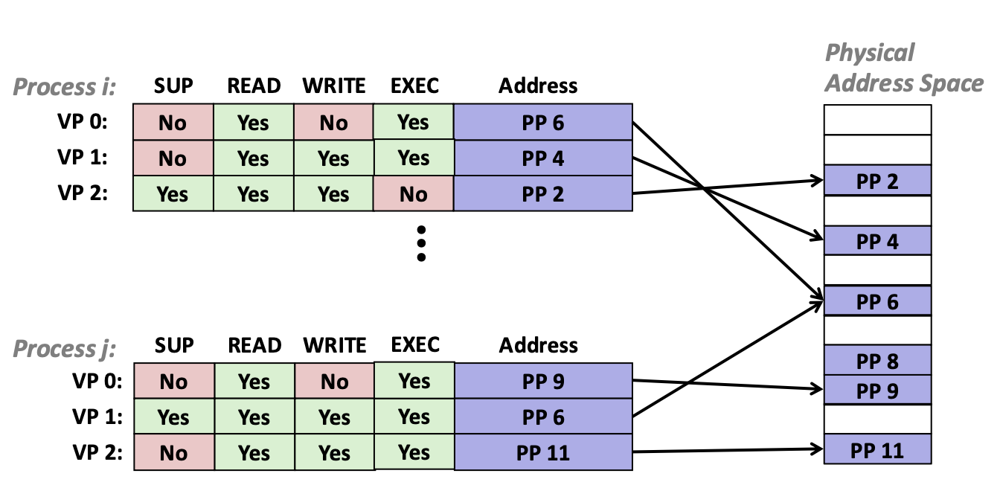

PTE에 권한 비트를 덧붙이고 접근마다 MMU가 확인합니다.

| 비트 | 위반 시 |
|---|---|
| READ / WRITE | 예외(전형적으로 segmentation fault) |
| EXEC | 데이터 영역의 코드 실행 차단 |
| SUP | 커널 모드 전용. 유저의 커널 영역 접근 차단 |

권한이 **페이지 단위**라는 점이 base and bounds의 한계를 메웁니다. 같은 주소 공간 안에서 text는 읽기·실행, data는 읽기·쓰기로 다르게 줄 수 있습니다.

## 주소 변환

### 주소의 분할

| 기호 | 의미 |
|---|---|
| `N = 2^n` | 가상 주소 공간의 주소 개수 (가상 주소 n비트) |
| `M = 2^m` | 물리 주소 공간의 주소 개수 (물리 주소 m비트) |
| `P = 2^p` | 페이지 크기 (바이트) |
| **VPN / VPO** | Virtual Page Number (n−p비트) / Virtual Page Offset (p비트) |
| **PPN / PPO** | Physical Page Number (m−p비트) / Physical Page Offset = **VPO와 동일** |

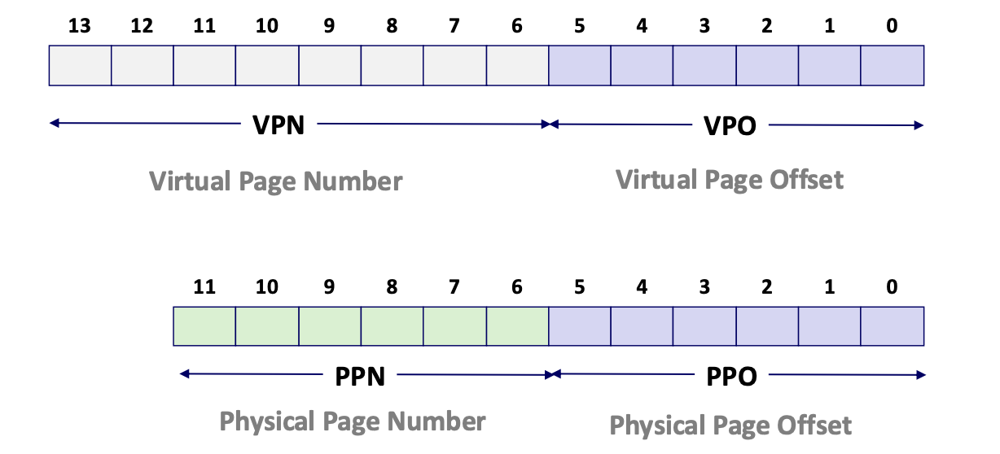

n과 m은 독립입니다. 물리 메모리가 가상 주소 공간보다 작은 것이 정상이고(m < n), 그래서 MAP(a) = ∅가 존재합니다.

가상 주소와 물리 주소는 모두 페이지 번호 + 페이지 내 오프셋으로 쪼개집니다. 페이지 크기가 P = 2^p이면 하위 p비트가 페이지 안에서의 위치를 가리키고, 이 부분은 변환할 필요가 없습니다. 같은 페이지 안이라면 가상이든 물리든 몇 번째 바이트인지는 그대로이기 때문입니다. PPO = VPO인 이유입니다.

즉, 변환은 결국 VPN → PPN 하나만 바꾸는 일입니다. 이것이 페이지 단위 매핑의 핵심 단순화입니다.

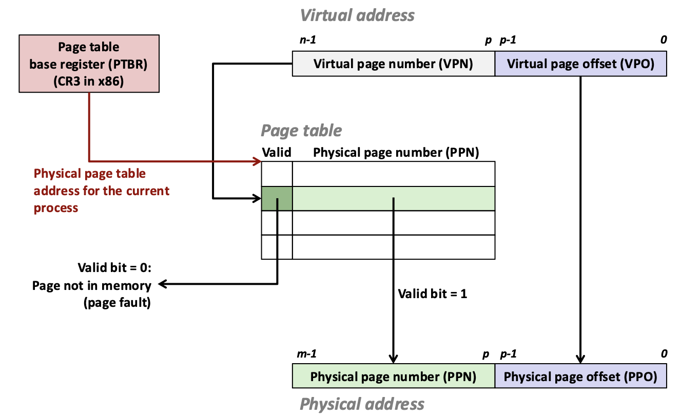


### 변환 절차

**PTBR**(x86의 `CR3`)이 현재 프로그램 페이지 테이블의 **물리** 주소를 담습니다. 문맥 전환 때 이 값을 갈아 끼우면 주소 공간 전체가 교체됩니다.
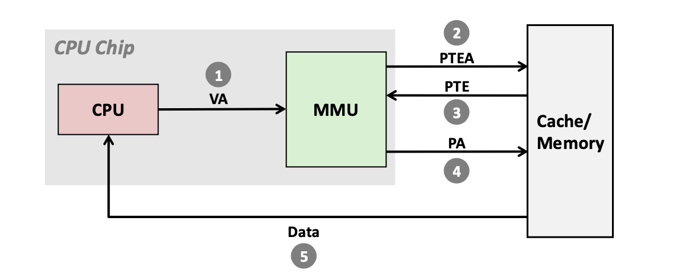

1. CPU가 MMU에 VA 전달
2. MMU가 `PTBR + VPN`으로 PTE 주소(PTEA)를 계산해 PTE를 읽음
3. valid=1 → `PA = PPN : VPO` 조립 (valid=0이면 page fault)
4. PA를 캐시/메모리로 보내 데이터 획득


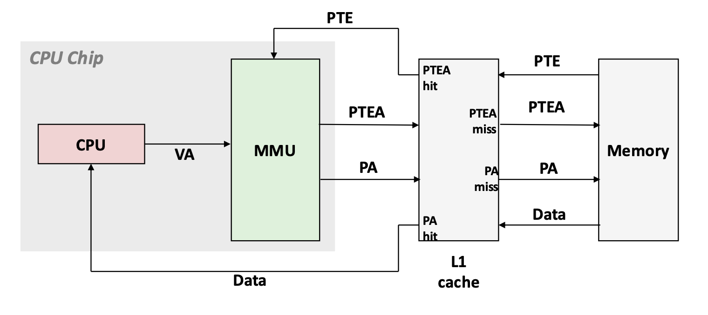

2단계는 "PTEA라는 **물리 주소**로 메모리를 읽는" 일반적인 메모리 접근입니다. 따라서 PTE는 특별 대우를 못 받아 **다른 데이터에 밀려 evict될 수 있고, hit해도 L1 지연이 붙습니다.** 데이터 한 번 읽으려고 메모리 계층을 두 번(PTE + 데이터) 타는 셈이고, 이것이 다음에 설명할 TLB가 필요한 이유입니다.

### TLB

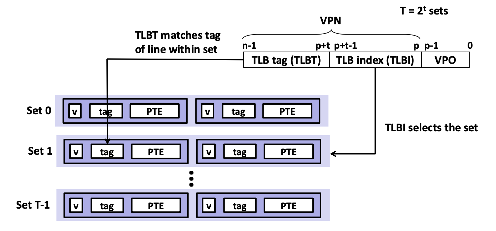

MMU 안에 두는 **VPN → PTE** 전용 캐시입니다. 작은 집합 연관 하드웨어 캐시로, VPN을 `[ TLBT(태그) ][ TLBI(인덱스) ]`로 쪼개 인덱싱합니다.

- **hit**: 캐시/메모리 접근 없이 즉시 PPN
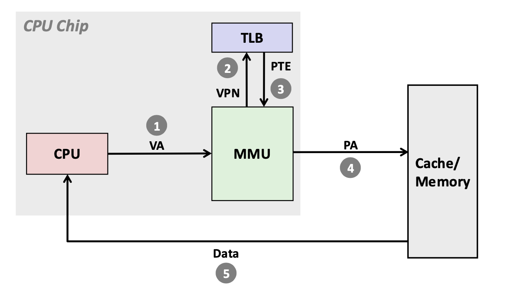
- **miss**: PTE를 위한 접근이 한 번 추가
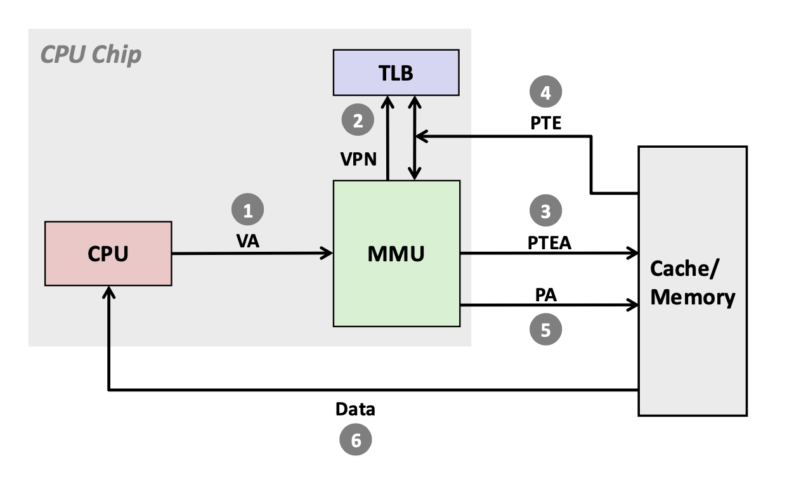

TLB miss는 드뭅니다. 한 페이지가 4KB이므로 한 번의 변환 결과가 4KB 범위 전체에 재사용되기 때문입니다.

!!! note 
    **TLB 미스 != 페이지 폴트**입니다. 미스는 변환 정보가 MMU 안에 없다는 뜻이고, 폴트는 **데이터가 물리 메모리에 없다**는 뜻입니다. 캐시 히트/미스는 변환이 끝난 **뒤** 물리 주소로 판정되므로 TLB 히트여도 캐시 미스일 수 있습니다.

### 다단계 페이지 테이블

4KB 페이지, 48비트 주소, 8바이트 PTE라면 `2^48 / 2^12 × 2^3 = 512 GB`. 프로그램마다 512GB짜리 표가 필요합니다. 원인은 **거의 전부   비어 있는 주소 공간까지 표에 자리를 잡아 두기 때문**입니다.

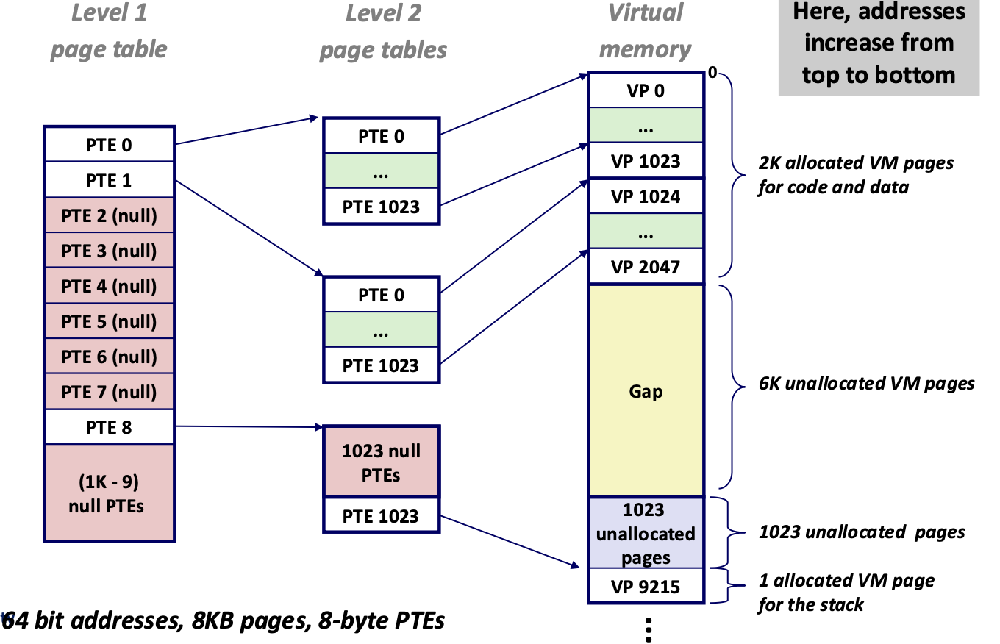
표를 계층으로 쪼개면, 1단계 표의 PTE는 2단계 표를, 2단계 표의 PTE는 실제 페이지를 가리킵니다. 핵심 이득은 **할당되지 않은 영역의 상위 PTE를 `null`로 두면 그 아래 표를 아예 만들지 않아도 된다**는 점입니다. heap·stack 사이의 거대한 빈 공간이 몇 개의 null 항목으로 압축됩니다.

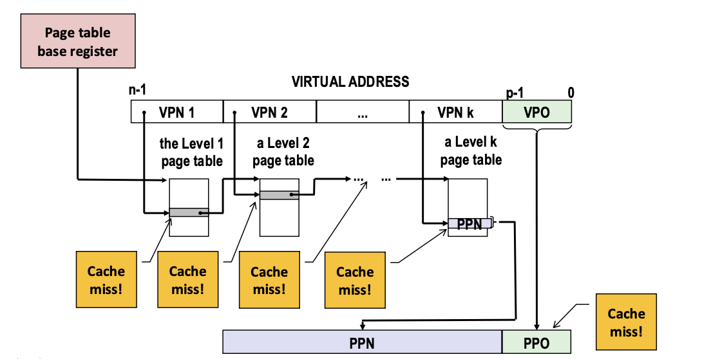
대가가 있습니다. 주소 하나에 **k번의 메모리 로드**가 필요하고, 이 로드들은 서로 다른 단계의 표를 건드리므로 **공간 지역성이 없습니다.** 그래서 TLB는 선택이 아닙니다. **TLB가 히트하면 k번의 순회 전체를 건너뜁니다.** MMU가 가장 먼저 하는 일이 TLB 조회인 이유입니다.

## 메모리 매핑

지금까지 물리 메모리를 디스크의 캐시로 봤습니다. 그렇다면 각 페이지의 원본은 디스크의 어디에 있을까요. 두 가지입니다.

- swap 공간: heap, stack처럼 파일에 대응하지 않는 영역. 익명 페이지(anonymous page) 라 부릅니다
- 파일: 디스크에 있는 어떤 파일의 특정 구간 → memory mapped file

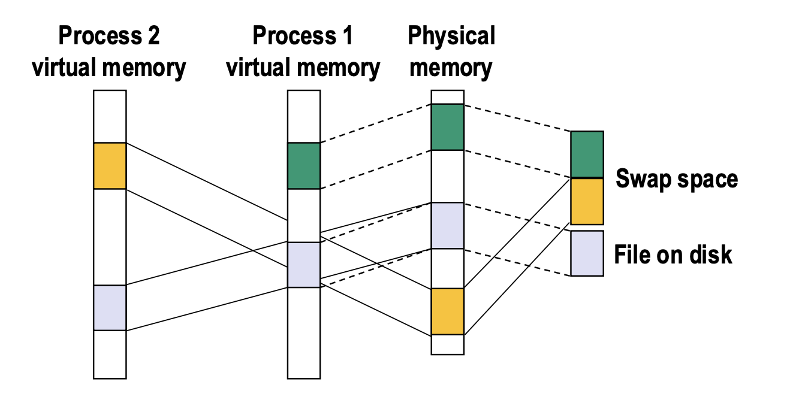

두 번째가 가능해지면 파일을 읽는 일이 메모리를 읽는 일과 같아집니다. 파일을 주소 공간에 매핑해 두면 read 호출 없이 포인터로 접근하면 되고, 해당 페이지가 아직 메모리에 없으면 page fault가 발생해 커널이 파일의 그 부분을 읽어 옵니다. 새로운 기계장치가 아니라 demand paging을 그대로 쓰는 것입니다. "없으면 fault, 커널이 원본에서 가져옴, 명령어 재실행"이라는 절차는 동일하고, 원본이 swap 공간이 아니라 파일일 뿐입니다.

이 관점에서 보면 앞에서 설명한 loading도 다시 읽힙니다. execve가 .text/.data용 PTE를 invalid로만 만들어 두고 끝낸다는 것은, 결국 실행 파일을 주소 공간에 매핑해 두는 일입니다. 코드는 실행이 진행되며 fault가 날 때마다 실행 파일에서 페이지 단위로 올라옵니다.

공유(sharing)도 마찬가지로 일반화됩니다. 두 프로세스가 같은 파일의 같은 구간을 매핑하면, 커널은 그 구간을 물리 메모리에 한 번만 올려 두고 양쪽 페이지 테이블이 그 물리 페이지를 가리키게 합니다. "공유는 읽기 전용 라이브러리를 copy 하나로 공유한다"고 한 것이 이를 의미한다고 볼 수 있습니다. 이는 공유 라이브러리 파일을 여러 프로세스가 매핑한 결과입니다.


### mmap


```c
void *mmap(void *start, int len, int prot, int flags, int fd, int offset);
```
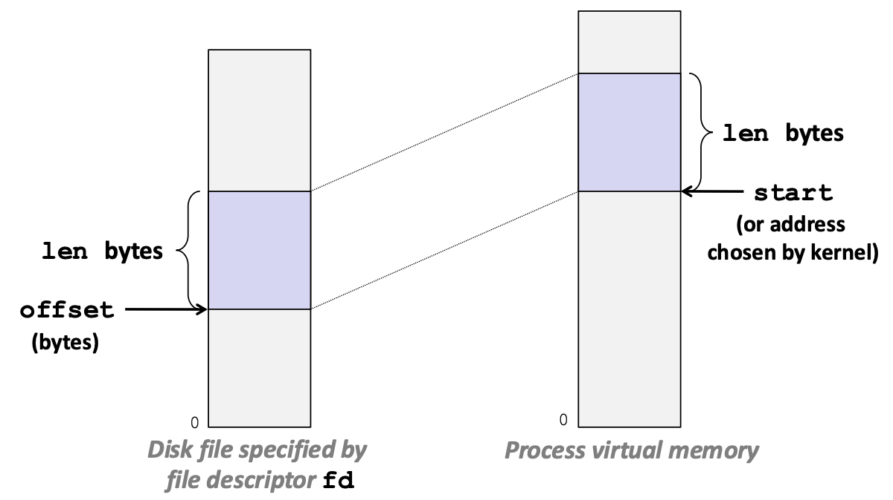

파일 `fd`의 `offset`부터 `len`바이트를 가능하면 `start`에 매핑합니다. `start=0`이면 커널이 고르고, `prot`(`PROT_READ/WRITE/EXEC`)은 PTE 권한 비트로 내려가며, `flags`로 `MAP_ANON`(익명) / `MAP_PRIVATE`(사본) / `MAP_SHARED`(진짜 공유)를 고릅니다. 주 용도는 **큰 파일 읽기**, **프로세스 간 공유 메모리**, **파일 기반 자료구조**입니다.

### Copy-on-write

fork는 부모와 똑같은 내용의, 그러나 별개인 주소 공간을 자식에게 줘야 합니다. 별개여야 하는 이유는 이후 자식이 변수에 쓴 값이 부모에게 보이면 안 되기 때문입니다. 정직하게 구현하면 heap·stack·data를 전부 새 물리 페이지에 복사해야 하고, 주소 공간이 크면 그만큼 느립니다.

"별개"가 실제로 필요해지는 순간은 누군가 쓰기를 할 때뿐입니다. 둘 다 읽기만 한다면 물리 페이지가 하나든 둘이든 결과가 구분되지 않습니다. 그러니 복사를 미뤘다가, 진짜 쓰기가 일어난 페이지만 그때 복사하면 됩니다.

문제는 "쓰기가 일어난 순간"을 커널이 어떻게 아느냐인데, 이미 있는 보호 비트로 해결됩니다. PTE의 쓰기 권한을 꺼두면 쓰기를 시도하는 순간 하드웨어가 예외를 던져 커널이 호출됩니다.

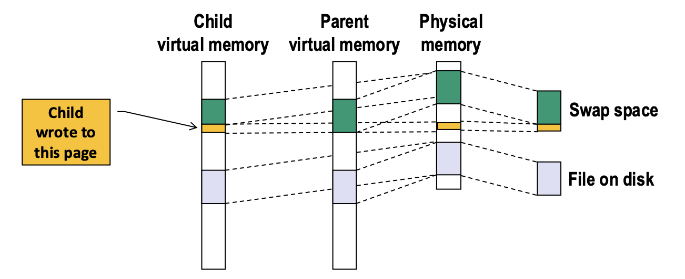

1. fork 시점에 물리 페이지는 하나도 복사하지 않고 페이지 테이블만 복제해, 양쪽 PTE가 같은 물리 페이지를 가리키게 둡니다
2. 양쪽 모두의 PTE를 읽기 전용으로 바꿉니다 (부모가 먼저 쓸 수도 있으므로)
3. 어느 쪽이든 쓰기를 시도하면 보호 예외 → 커널이 그 페이지 하나만 새 물리 페이지로 복사하고, 쓰려던 쪽 PTE가 사본을 가리키며 쓰기 가능해지도록 고친 뒤 명령어를 재실행합니다

프로그램은 아무것도 눈치채지 못합니다. 그림의 노란 페이지가 3번을 겪어 사본이 생긴 상태이고, 아무도 쓰지 않은 나머지는 여전히 물리 페이지 하나를 공유합니다. 읽기만 하는 페이지는 영원히 복사되지 않습니다.


## 요약 
!!! abstract 핵심 정리

    - 여러 프로그램을 물리 메모리에 함께 올리는 순간, 프로그램이
      물리 주소를 직접 다루면 남의 메모리를 막을 방법이 없다. 가상 메모리는 이 문제에
      대한 답이다.

    - 각 프로그램은 0번지부터 시작하는 자기만의 연속된 공간
      (text/data/heap/stack)을 본다. 이는 물리 배치가 아니라 OS가 제공하는 추상화이며,
      heap과 stack 사이의 빈 공간은 물리 메모리를 차지하지 않는다.

    - **변환은 하드웨어, 설정은 OS.** CPU가 내는 VA를 MMU가 PA로 바꾸고(`MAP: V → P ∪ {∅}`), 어떤 매핑을 쓸지 결정해 페이지 테이블에 심는 것은 커널의 몫이다.

    - **페이지 단위로 자른 이유.** base&bound처럼 주소 공간을 한 덩어리로 옮기면 재배치와
      보호는 되지만 부분 적재·공유·영역별 권한이 불가능하다. 덩어리를 고정 크기 페이지로
      쪼개고 VPN → PPN만 바꾸면(VPO = PPO) 세 문제가 한꺼번에 풀린다.

    - **VM은 디스크의 캐시다.** 원본은 디스크에 있고 DRAM은 지금 쓰는 부분만 담는다.
      없으면 page fault → victim 축출 → 적재 → **명령어 재실행**(demand paging).
      miss penalty가 극단적으로 크므로 4KB 블록, 완전 연관, write-back, 소프트웨어 교체
      정책으로 설계된다. 완전 연관이기 때문에 위치를 계산할 수 없고, 그래서 페이지 테이블이
      필요하다.

    - **성능은 working set이 가른다.** working set이 물리 메모리에 들어가면 cold miss 이후
      대부분 히트, 넘어서면 thrashing이다.

    - **주소 변환 하나로 관리와 보호를 모두 얻는다.** 관리 측면에서는 단편화 없는 할당,
      물리 페이지 공유, 링킹·로딩의 단순화를, 보호 측면에서는 READ/WRITE/EXEC/SUP를
      **페이지 단위**로 검사하는 일을 같은 매핑 위에서 처리한다.

    - **변환 비용은 TLB로 갚는다.** PTE 읽기도 결국 메모리 접근이라 접근당 계층을 두 번
      탄다. 다단계 페이지 테이블은 빈 영역의 표를 만들지 않아 공간을 줄이는 대신 k번의
      로드를 요구하고 지역성도 없으므로, TLB 히트로 순회 전체를 건너뛰는 것이 전제가 된다.
      (TLB 미스 ≠ 페이지 폴트)

    - **응용은 모두 같은 원리의 재사용이다.** 파일 매핑은 원본이 swap 대신 파일일 뿐인
      demand paging이고, 로딩은 실행 파일을 매핑해 두는 일이며, COW는 PTE의 쓰기 권한을
      꺼서 "쓰기가 일어난 순간"을 예외로 잡아내는 일이다. 새로운 장치를 더한 것이 아니라
      fault와 보호 비트를 다르게 활용한 것이다.