# 17 · 동적 할당

## 동적 할당이란?

크기가 컴파일 시점에 정해지는 데이터는 전역 변수나 스택에 두면 됩니다. 하지만 실제 프로그램에서 필요한 메모리의 크기는 대부분 **실행 시점에야** 알 수 있습니다. 입력 파일의 행 수, 사용자가 요청한 레코드 개수, 네트워크로 들어온 메시지 길이 같은 것들입니다.

이때 사용자는 `malloc` 같은 **동적 메모리 allocator(dynamic memory allocator)** 를 통해 실행 중에 가상 메모리를 얻습니다. Allocator는 프로세스 가상 메모리의 한 영역인 **힙(heap)**을 관리합니다.

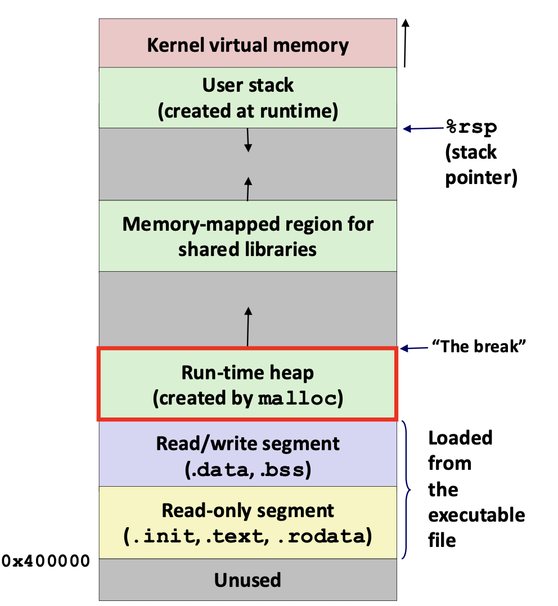

**응용 프로그램 → 동적 메모리 allocator(라이브러리) → 힙**의 구조로 동적 할당이 이루어집니다. 
`malloc`은 시스템 콜이 아니라 **라이브러리 함수**입니다. 매번 커널에 들어가면 너무 느리기 때문에, allocator는 커널에서 `sbrk`/`brk` 시스템 콜로 힙의 위쪽 경계(break/brk)를 옮겨 힙을 늘리거나 줄여 큰 덩어리를 받아 두고 그것을 잘게 쪼개어 응용 프로그램에 나눠 줍니다. 이 "잘게 쪼개는 정책"이 이 챕터의 주제입니다.

allocator는 힙을 **가변 크기 블록(block)** 들의 모음으로 관리합니다. 각 블록은 **할당됨(allocated)** 또는 **가용(free)** 중 하나입니다.

### allocator의 두 종류

| 구분 | 할당 | 해제 | 예 |
|---|---|---|---|
| **명시적(explicit) allocator** | 응용 프로그램 | **응용 프로그램** | C의 `malloc`/`free` |
| **묵시적(implicit) allocator** | 응용 프로그램 | **allocator(가비지 컬렉터)** | Java의 `new`, Python |

이 챕터에서는 **명시적 allocator**를 다룹니다.

---

## 동적 allocator의 제약 

**응용 프로그램 쪽**

- `malloc`과 `free`를 **임의의 순서로** 호출할 수 있다.
- `free`의 인자는 반드시 `malloc`으로 얻은 블록이어야 한다.

**명시적 allocator 쪽** 

- 할당되는 블록의 개수나 크기를 **제어할 수 없다**.
- `malloc` 요청에 **즉시** 응답해야 한다. 요청을 모아 두거나 순서를 바꿀 수 없다.
- 블록은 **가용 메모리 안에서만** 배치해야 한다.
- 모든 정렬 요구를 만족시켜야 한다 (x86-64에서 16바이트 정렬).
- **가용 메모리만** 수정할 수 있다.
- **이미 할당된 블록은 이동시킬 수 없다.** 즉 **압축(compaction)이 불가능**하다.

!!! question "이미 할당된 블록을 이동시킬 수 없는 이유"
    응용 프로그램이 `malloc`이 준 주소를 그대로 포인터로 들고 있기 때문입니다. allocator는 그 포인터의 복사본이 어디에 몇 개나 흩어져 있는지 allocator는 알 수 없습니다. 블록을 옮기면 그 포인터들이 전부 무효가 됩니다. 반대로 **가비지 컬렉션(GC)을 쓰는 언어**는 포인터를 추적할 수 있으므로 압축이 가능합니다.

---

## 성능 목표

요청 열 $R_0, R_1, \dots, R_k, \dots, R_{n-1}$ 이 주어졌을 때, allocator의 목표는 두 가지이며 이 둘은 **서로 충돌**합니다.

### 목표 1: 처리량(throughput)

단위 시간당 완료한 요청의 수입니다.

> 예: 10초 동안 `malloc` 5,000회 + `free` 5,000회 → 처리량 1,000 ops/sec

### 목표 2: 메모리 이용률(peak memory utilization)

$k$번째 요청까지 처리한 시점에서 다음을 정의합니다.

- **집계 페이로드(aggregate payload) $P_k$**: `malloc(p)`가 만든 블록의 **페이로드**는 $p$바이트입니다. $P_k$는 현재 할당되어 있는 모든 블록의 페이로드 합입니다.
- **최대 집계 페이로드 $\max_{i \le k} P_i$**: 요청 $k$까지의 구간에서 $P_i$의 최댓값.
- **현재 힙 크기 $H_k$**: 논의를 단순화하기 위해 힙은 `sbrk`로 **커지기만 하고 줄어들지 않는다**고 가정합니다.
- **오버헤드 $O_k$**: 힙 공간 중 프로그램 데이터로 쓰이지 **않는** 비율.

$$
O_k = \frac{H_k}{\max_{i \le k} P_i} - 1.0
$$

오버헤드는 낮을수록 좋습니다. 극단적으로 처리량만 높이려면 요청마다 힙 끝에서 새 공간을 떼어 주고 `free`를 무시하면 되지만, 오버헤드는 무한정 늘어납니다. 반대로 오버헤드를 최소화하려면 매번 전체 힙을 뒤져 가장 알맞은 자리를 찾아야 하니 느려집니다. **allocator 설계란 이 두 축 사이에서 균형점을 찾는 일**입니다.

---

## 단편화(fragmentation)

메모리 활용률이 나빠지는 주된 원인은 **단편화**입니다. 두 종류가 있습니다.

### 내부 단편화 (internal fragmentation)

**블록 크기가 페이로드보다 클 때** 그 차이가 내부 단편화입니다.

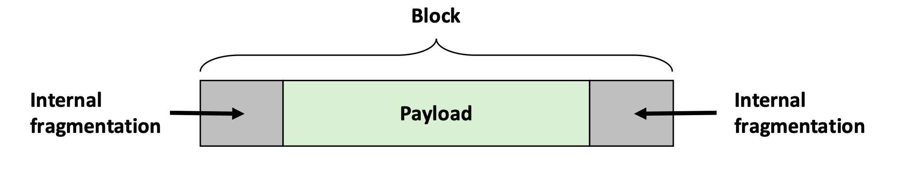

원인:

- 힙 자료구조(헤더/푸터)를 유지하기 위한 오버헤드
- 정렬을 맞추기 위한 패딩
- 명시적인 정책 결정 (예: 작은 요청에 큰 블록을 그냥 내주는 경우)

내부 단편화는 **과거 요청 패턴만으로 결정**되므로 **측정하기 쉽습니다**.

### 외부 단편화 (external fragmentation)

**가용 메모리의 총합은 충분한데, 요청을 담을 만큼 큰 단일 가용 블록이 없을 때** 발생합니다.

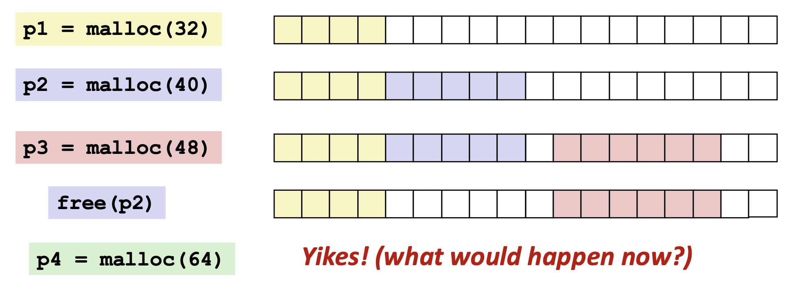

가용 블록(free block)를 전부 더하면 64바이트를 넘지만, 흩어져 있어서 요청을 만족시킬 수 없습니다. 결국 힙을 더 늘려야 합니다.

외부 단편화는 **앞으로 들어올 요청 패턴에 의존**하므로 **측정하기 어렵습니다**. 같은 힙 상태라도 다음 요청이 16바이트면 문제가 없고 64바이트면 문제가 됩니다.

---

## 동적 allocator 설계 목표 

allocator를 실제로 만들려면 다음과 같은 내용들을 고려해야합니다. 

1. **포인터 하나만 받고서 얼마나 해제해야 하는지 어떻게 아는가?** → 헤더(header)
2. **가용 블록들을 어떻게 추적하는가?** → free block(가용 블록) 추적 
3. 요청보다 큰 가용 블록에 넣을 때, **남는 공간을 어떻게 처리하는가?** → 분할(splitting)
4. 들어갈 수 있는 블록이 여럿일 때 **어느 것을 고르는가?** → 배치 정책(replacement policy)
5. **해제된 블록을 어떻게 재사용하는가?** → 병합(coalescing)

### 헤더 

블록 바로 앞 워드에 블록 전체 길이(헤더 자신 포함, 바이트 단위)를 저장합니다. 이 워드가 헤더(header) 입니다. 포인터 하나만 있어도 헤더를 읽어 크기를 알 수 있습니다.
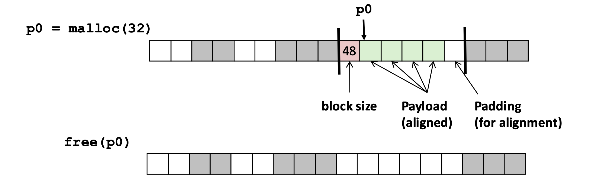

할당된 블록마다 한 워드 추가가 되므로 내부 단편화가 발생하는 대가가 있습니다. 

### 가용 블록(free block) 추적 방법

| 방법 | 아이디어 | 대가 |
|---|---|---|
| **1. Implicit list** | 길이 필드를 이용해 **모든 블록**을 순서대로 연결 | 각 블록에 할당/가용 태그가 필요 |
| **2. Explicit list** | **가용 블록끼리만** 포인터로 연결 | 포인터를 저장할 공간이 필요 |
| **3. Segregated free list** | 크기 클래스별로 가용 리스트를 여러 개 유지 | 구조가 복잡 |
| **4. 크기순 정렬** | 균형 이진 트리(예: 레드-블랙 트리)의 노드를 가용 블록 안에 두고 길이를 키로 사용 | 구현·유지 비용 |

다음 절에 이어서 가장 단순한 **1. Implicit list**를 설명합니다. 나머지는 계속 이어서 다음 절에서 다룹니다.

## Implicit Free List 

각 블록에 대해 크기 뿐만 아니라, 해당 블록의 **할당 여부** 또한 알아야 합니다. 따라서 각각에 대해 워드를 2개 사용하지 않고, 헤더 워드 하나에 두가지 정보를 모두 담는 트릭을 사용합니다. 이 트릭이 가능한 이유는, 블록이 정렬되어 있으면 주소의 하위 몇 비트는 항상 0이기 때문에 그 항상 0인 비트를 할당/가용 플래그로 사용할 수 있기 때문입니다. 
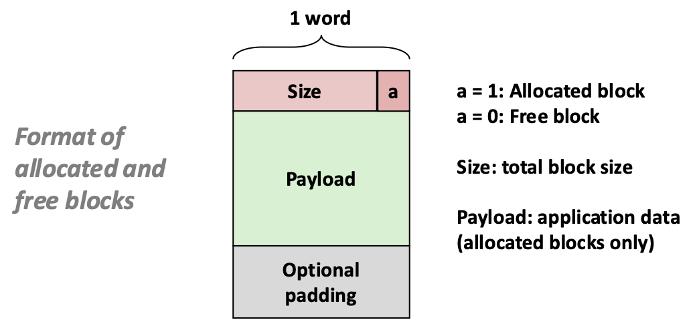


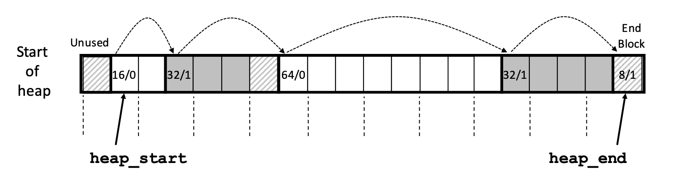

- 헤더는 `크기/할당비트` 로 표기했습니다.
- 회색이 할당된 블록, 흰색이 가용 블록입니다.
- 정렬해야 하는 것은 헤더가 아니라 **페이로드**입니다. `malloc`이 반환하는
  주소는 페이로드의 시작 주소이고 이것이 16바이트 경계에 맞아야 하는데,
  헤더는 그 8바이트 앞에 놓입니다. 그래서 헤더는 항상 정렬 경계에서
  반 칸(8바이트) 어긋난 자리에 오게 됩니다.

### 자료구조와 접근 함수

```c
typedef uint64_t word_t;

typedef struct block {
    word_t header;
    unsigned char payload[0];   // 길이 0 배열
} block_t;
```

```c
/* 블록 포인터 → 페이로드 포인터 */
return (void *) (block->payload);

/* 페이로드 포인터 → 블록 포인터 */
return (block_t *) ((unsigned char *) bp - offsetof(block_t, payload));
```

!!! note "`offsetof`"
    `offsetof(struct, member)`는 구조체 안에서 멤버의 바이트 오프셋을 돌려주는 표준 매크로입니다. 포인터 산술을 손으로 쓰는 것보다 안전합니다.

헤더 접근:

```c
/* 할당 비트 꺼내기 */
return header & 0x1;

/* 크기 꺼내기 (하위 4비트 마스킹 — 16바이트 정렬 가정) */
return header & ~0xfL;

/* 헤더 쓰기 */
block->header = size | alloc;
```

### 리스트 순회

블록의 크기를 알면 다음 블록의 위치를 알 수 있습니다. 이것이 "implicit(묵시적)"이라 부르는 이유입니다. 별도의 링크 포인터 없이 **크기 필드가 곧 링크 역할**을 합니다.

```c
static block_t *find_next(block_t *block)
{
    return (block_t *) ((unsigned char *) block + get_size(block));
}
```

---

### 가용 블록 찾기: 배치 정책

헤더를 포함하여 담을 블록을 찾는 문제입니다.

#### First fit

리스트를 처음부터 훑어 **들어갈 수 있는 첫 번째** 가용 블록을 고릅니다.

```c
static block_t *find_fit(size_t asize)
{
    block_t *block;
    for (block = heap_start; block != heap_end;
         block = find_next(block))
    {
        if (!(get_alloc(block)) && (asize <= get_size(block)))
            return block;
    }
    return NULL;   // 맞는 블록 없음
}
```

- 전체 블록 수(할당 + 가용)에 대해 **선형 시간**이 걸릴 수 있습니다.
- 실제 실행 시에는 리스트 앞부분에 잘게 쪼개진 **"파편(splinter)"** 이 쌓여, 매번 그 앞부분을 헛되이 훑게 될 수 있습니다. 

#### Next fit

First fit과 같지만, **지난 탐색이 끝난 지점부터** 시작합니다.

- 쓸모없는 앞부분을 다시 훑지 않으므로 보통 더 빠릅니다.
- 다만 단편화는 **오히려 나빠진다**는 연구 결과가 있습니다.

#### Best fit

리스트 전체를 훑어 **들어가면서 남는 바이트가 가장 적은** 블록을 고릅니다.

- 남는 조각이 작아지므로 대체로 메모리 이용률이 좋아집니다.
- First fit보다 느립니다.
- 여전히 **탐욕(greedy) 알고리즘**이며 최적성을 보장하지 않습니다.

---

### 가용 블록에 배치하기: 분할(splitting)

요청 크기가 찾아낸 가용 블록보다 작을 수 있습니다. 블록을 통째로 내주면 내부 단편화가 커지므로, **남는 부분을 잘라 새 가용 블록으로 만듭니다.**

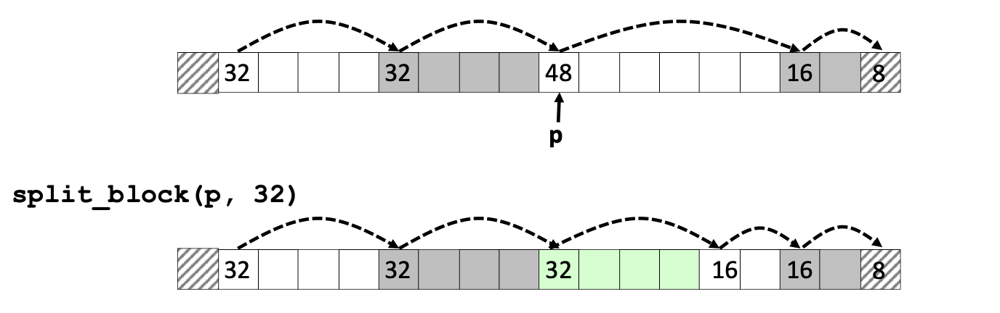

```c
// 주의: 아직 완성본이 아니다 (푸터가 없다)
static void split_block(block_t *block, size_t asize)
{
    size_t block_size = get_size(block);

    if ((block_size - asize) >= min_block_size) {
        write_header(block, asize, true);
        block_t *block_next = find_next(block);
        write_header(block_next, block_size - asize, false);
    }
}
```

남는 부분이 **최소 블록 크기보다 작으면 자르지 않습니다.** 헤더조차 못 넣는 조각은 만들어 봐야 쓸모가 없기 때문입니다. 이 임계값을 어떻게 정하느냐가 곧 "내부 단편화를 얼마나 감수할 것인가"라는 정책 결정입니다.

---

### 해제(free)와 병합(coalescing)

`free`에서 할 일은 "할당" 플래그를 0으로 지우는 것뿐인 것처럼 보입니다.

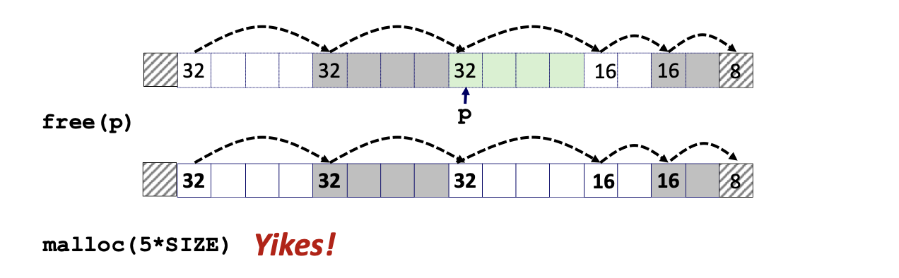

인접한 가용 공간이 충분히 있는데도, **각각이 별개의 작은 가용 블록으로 남아 있어서** allocator가 찾지 못합니다. 이를 **false fragmentation** 라고 합니다.

### 다음 블록과 병합하기

해결책은 해제할 때 **인접한 가용 블록과 합치는(coalesce)** 것입니다. 다음 블록은 `find_next`로 바로 찾을 수 있으니 쉽습니다.

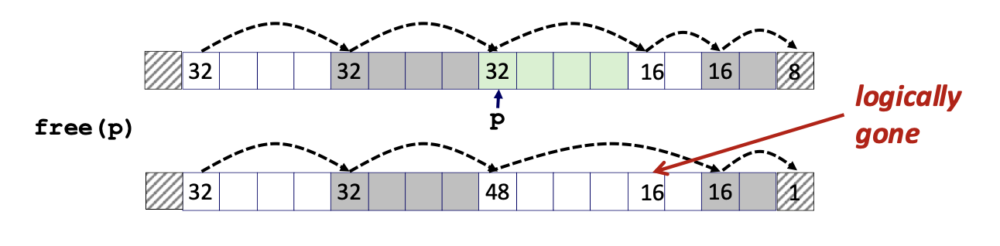

그런데 **이전 블록**과 병합하려면?

- 이전 블록이 **어디서 시작하는지** 어떻게 아는가?
- 이전 블록이 **할당 상태인지** 어떻게 아는가?

Implicit list는 앞으로만 갈 수 있으므로, 힙 시작부터 다시 훑지 않는 한 알 수 없습니다.

---

### 경계 태그(boundary tag)로 양방향 병합

Knuth(1973)의 고전적인 기법입니다. 블록의 **끝(bottom)** 에 크기/할당 워드를 **복제**해 둡니다. 이를 **푸터(footer)** 또는 **경계 태그**라 합니다. 그러면 리스트를 **거꾸로도** 순회할 수 있게 됩니다. 대신 그 대가로 **공간을 더 쓰게 됩니다**.

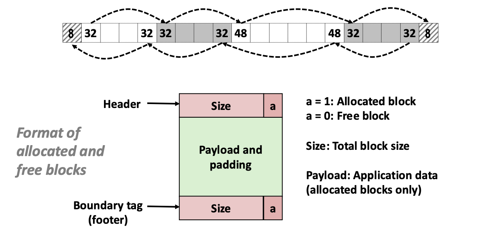

푸터 위치 계산:

```c
const size_t dsize = 2 * sizeof(word_t);

/* 현재 블록의 푸터 */
static word_t *header_to_footer(block_t *block)
{
    size_t asize = get_size(block);
    return (word_t *) (block->payload + asize - dsize);
}

/* 이전 블록의 푸터 = 내 헤더 바로 앞 워드 */
static word_t *find_prev_footer(block_t *block)
{
    return &(block->header) - 1;
}
```

이제 이전 블록의 푸터를 읽으면 그 블록의 크기와 할당 여부를 **상수 시간에** 알 수 있습니다.

### 분할의 완성본

푸터가 생겼으므로 분할할 때 헤더와 푸터를 모두 써야 합니다.

```c
static void split_block(block_t *block, size_t asize)
{
    size_t block_size = get_size(block);

    if ((block_size - asize) >= min_block_size) {
        write_header(block, asize, true);
        write_footer(block, asize, true);

        block_t *block_next = find_next(block);
        write_header(block_next, block_size - asize, false);
        write_footer(block_next, block_size - asize, false);
    }
}
```

### 힙 양 끝의 더미 블록

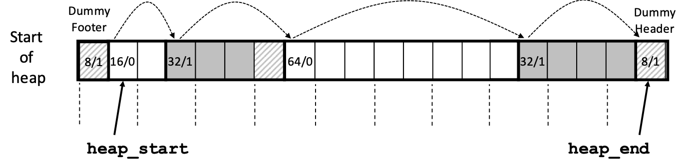

- **첫 헤더 앞의 더미 푸터**: 할당됨으로 표시. 첫 블록을 해제할 때 힙 바깥으로 잘못 병합하는 것을 막습니다.
- **마지막 푸터 뒤의 더미 헤더**: 마지막 블록을 해제할 때 같은 사고를 막습니다.

덕분에 병합 코드에서 "내가 힙의 처음/끝인가?"를 따로 검사할 필요가 없습니다. **경계 조건을 데이터로 흡수하는** 전형적인 시스템 프로그래밍 기법입니다.

### 최상위 코드

```c
const size_t dsize = 2 * sizeof(word_t);

void *mm_malloc(size_t size)
{
    size_t asize = round_up(size + dsize, dsize);

    block_t *block = find_fit(asize);
    if (block == NULL)
        return NULL;

    size_t block_size = get_size(block);
    write_header(block, block_size, true);
    write_footer(block, block_size, true);

    split_block(block, asize);

    return header_to_payload(block);
}

void mm_free(void *bp)
{
    block_t *block = payload_to_header(bp);
    size_t size = get_size(block);

    write_header(block, size, false);
    write_footer(block, size, false);

    coalesce_block(block);
}
```

---

## 경계 태그의 비용과 최적화

푸터는 **모든 블록**에 한 워드를 더합니다. 이는 곧 내부 단편화입니다. 줄일 수 있을까요?

핵심 관찰: **푸터는 "이 블록이 가용인지, 크기가 얼마인지"를 뒤에서 읽기 위한 것**입니다. 그런데 병합은 **가용 블록과만** 일어납니다. 앞 블록이 할당 상태라면 그 크기를 알 필요가 없습니다.

> **푸터는 가용 블록에만 있으면 된다.**

문제는 "앞 블록이 가용인지"를 알아야 푸터를 읽을지 말지 결정할 수 있다는 점입니다. 이 정보는 **내 헤더의 남는 비트**에 넣습니다. 크기가 16의 배수라면 하위 4비트가 비어 있으므로 여유가 있습니다.

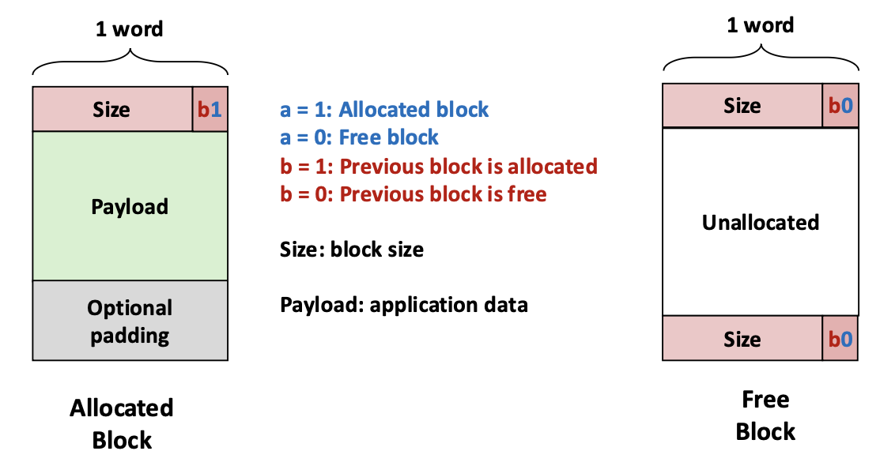

이제 앞서의 네 경우를 이 표현으로 다시 쓰면, 블록을 해제할 때 **다음 블록의 `b` 비트도 갱신**해 주어야 한다는 점만 추가됩니다. 예를 들어 양 블록에서 할당이 되고 사이에 있는 블록이 해제 되는 경우에는 아래와 같이 표현될 수 있습니다.:

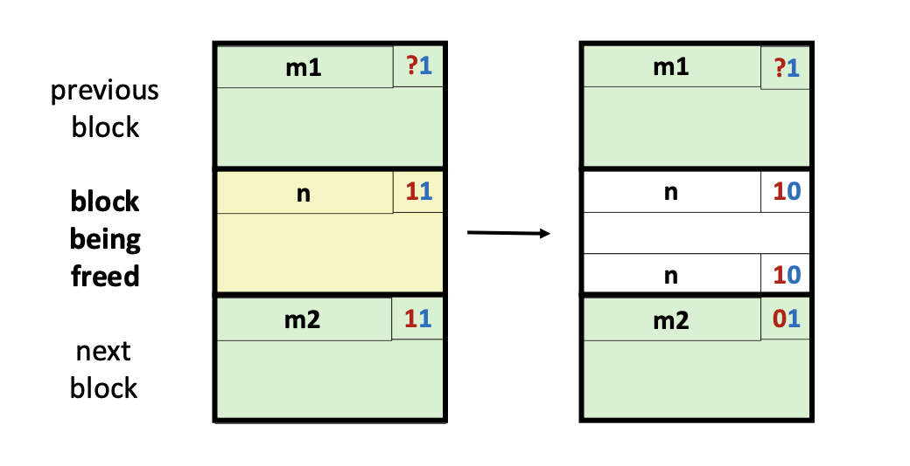


---

### Implicit list 정리 

| 항목 | 평가 |
|---|---|
| 구현 난이도 | 매우 단순 |
| 할당 비용 | **최악의 경우 선형 시간** |
| 해제 비용 | 상수 시간 (병합을 해도 상수 시간) |
| 메모리 오버헤드 | 배치 정책(first/next/best fit)에 따라 결정 |

**선형 시간 할당** 때문에 실제 `malloc`/`free` 구현에는 쓰이지 않습니다. 다만 블록 개수가 적고 예측 가능한 특수 목적 응용에서는 여전히 쓰입니다. 또한, **분할(splitting)** 과 **경계 태그 병합(boundary tag coalescing)** 은 implicit list에만 국한된 기법이 아니라 **모든 allocator에 공통으로 쓰이는 일반적인 기법**입니다. 다음 절에서 볼 explicit list와 segregated list도 블록 내부 구조는 여기서 배운 것에서 그대로 이어집니다. 

---

## Explicit Free List

`find_fit`은 `heap_start`부터 `find_next`로 나아가며 **할당된 블록까지 전부** 지나갑니다. 하지만 우리가 관심 있는 것은 가용 블록뿐입니다.

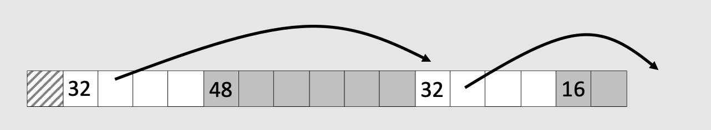

힙이 거의 꽉 차 있을수록 낭비 비율이 커집니다. 할당된 블록이 9할이면 탐색의 9할이 헛수고가 될 수 있는 것입니다. 

!!! success "아이디어"
     할당된 블록까지 스캔하는 대신, 가용 블록끼리만 연결 리스트로 묶자.

### 연결 리스트: 링크를 어디에 두는가

연결 리스트를 만들려면 `next`/`prev` 포인터 두 개를 저장할 자리가 필요합니다. 그런데 **가용 블록의 페이로드 영역은 지금 아무도 쓰고 있지 않습니다.** 그 자리를 빌려 쓰면 됩니다.

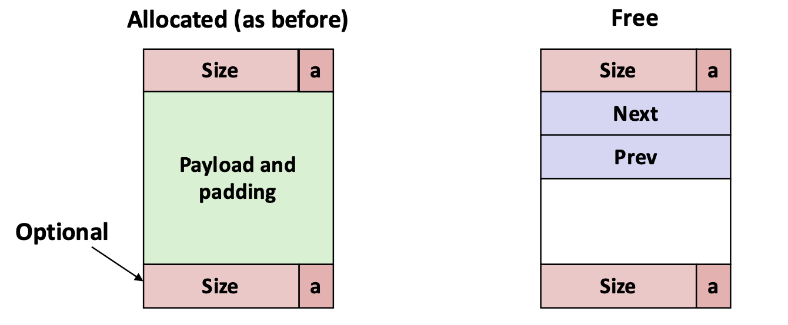

경계 태그는 마찬가지로 필요합니다. 가용 리스트의 링크는 **논리적 이웃**을 알려 줄 뿐입니다. 병합은 **메모리상 인접한** 블록과 하는 것이므로, 앞뒤 블록을 찾으려면 여전히 헤더/푸터가 있어야 합니다. Explicit list는 implicit list를 **대체**하는 것이 아니라 그 위에 리스트를 하나 더 얹는 구조입니다.

### 논리적 순서 ≠ 물리적 순서

리스트의 연결 순서와 메모리 배치 순서는 아무 상관이 없습니다.

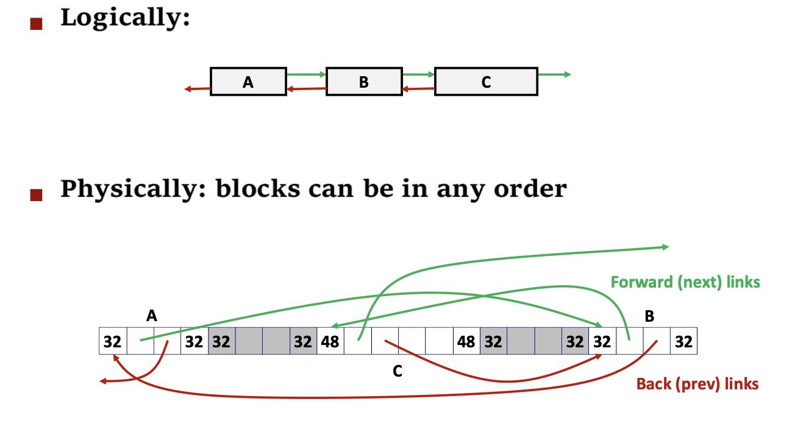

그래서 "앞으로 나아가면 다음 가용 블록"이라는 implicit list의 가정이 여기서는 통하지 않고, **포인터를 명시적으로(explicit) 저장**해야 하는 것입니다.

### 최소 블록 크기

가용 블록 하나가 담아야 하는 것: 헤더(8) + `next`(8) + `prev`(8) + 푸터(8) = **32바이트**.

```
min_block_size = 32   // implicit list에서는 16이면 충분했다
```

블록의 크기를 키우는 것이 내부 단편화를 늘리게 될까요? 다행히 링크는 **가용 블록의 미사용 공간**에 들어가므로 할당된 블록에는 추가 비용이 전혀 없습니다. 하지만 최소 블록 크기가 16 → 32로 올라가므로, `malloc(1)` 같은 아주 작은 요청은 32바이트 블록을 받게 됩니다. **작은 객체를 대량으로 만드는 워크로드의 경우에는 손해**가 발생할 수 있습니다. 

### 할당

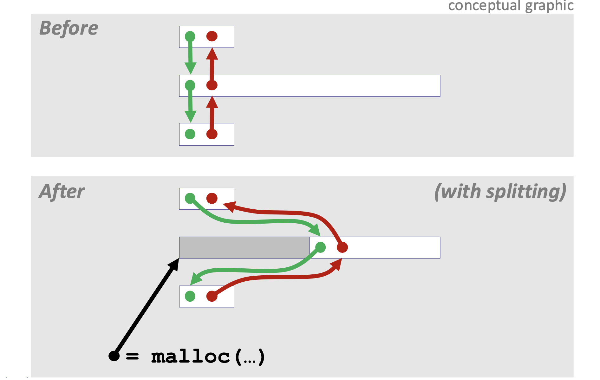

1. 리스트를 따라가며 맞는 블록을 찾는다 (first fit이면 첫 번째).
2. 그 블록을 **리스트에서 떼어낸다(splice out)**: `prev->next = next; next->prev = prev;`
3. 분할이 가능하면 남는 조각을 새 가용 블록으로 만들고 **리스트에 다시 넣는다**.

Implicit list에서는 플래그만 바꾸면 됐지만, 2번/3번 과정에서 볼 수 있듯 **링크 유지 작업이 추가**됩니다.

---

### 해제: 삽입 정책

새로 해제된 블록을 리스트의 **어디에** 넣을 것인가? 세 가지 선택지가 있습니다.

| 정책 | 넣는 위치 | 비용 | 단편화 |
|---|---|---|---|
| **LIFO** | 리스트의 맨 앞(root) | 상수 시간 | 나쁨 |
| **FIFO** | 리스트의 맨 뒤 | 상수 시간 | 나쁨 |
| **주소순(address-ordered)** | `addr(prev) < addr(curr) < addr(next)` 가 유지되도록 | 삽입 위치 탐색 필요 | 좋음 |

- LIFO/FIFO는 구현이 단순하고 상수 시간이라는 장점이 뚜렷합니다.
- 주소순 정책은 삽입할 자리를 찾아야 하므로 느리지만, 연구에 따르면 **단편화가 눈에 띄게 적습니다.** (방금 해제한 블록을 곧바로 재사용하는 LIFO의 습성이 힙 곳곳에 파편을 흩뿌리는 반면, 주소순은 낮은 주소부터 차분히 채워 나가는 경향이 있습니다.)

이 역시 이 절에서 반복해서 나오는 **처리량 vs. 이용률** 트레이드오프의 한 사례입니다.

---

### Explicit list 정리 

| 항목 | Implicit list | Explicit list |
|---|---|---|
| 할당 비용 | **전체** 블록 수에 선형 | **가용** 블록 수에 선형 |
| 해제 비용 | 상수 시간 | 상수 시간 (LIFO/FIFO) |
| 구현 난이도 | 매우 단순 | 리스트 splice in/out이 추가 |
| 공간 | 헤더(+푸터) | 가용 블록에 링크 2워드, 최소 블록 크기 ↑ |

**힙이 대부분 할당된 상태일 때** explicit list 방식이 implicit list 방식보다 빠릅니다. 반대로 힙이 텅 비어 있으면 두 방식의 탐색량은 비슷합니다.

그러나 여전히 **가용 블록이 많아지면 리스트도 길어진다**는 문제가 존재합니다. 16바이트짜리 요청 하나를 위해 4096바이트 가용 블록 수백 개를 지나칠 수도 있습니다. 다음 소개할 방식은 이 리스트 자체를 쪼개는 방법입니다. 

---

## Segregated Free List

**하나의 긴 가용 리스트** 대신, **크기 클래스(size class)마다 리스트 하나씩**을 둡니다.

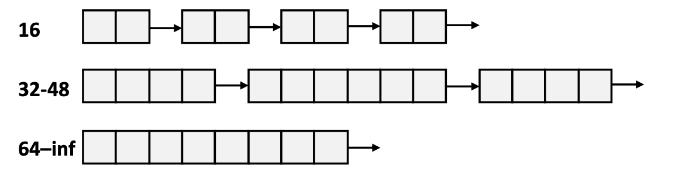

어떤 크기를 어떤 클래스에 넣을지는 **설계 결정**이며, 이용률과 처리량 모두에 큰 영향을 줍니다. 흔한 선택:

- 작은 크기는 **하나씩 따로**: 16, 32, 48, 64, …
- 어느 지점부터는 **2의 거듭제곱 구간**으로: $[2^i + 1,\ 2^{i+1}]$
- **가장 큰 클래스에는 상한이 없어야 한다** (그렇지 않으면 담을 곳이 없는 요청이 생깁니다).

### 크기 $n$의 블록 할당하기

1. $n$에 해당하는 클래스의 리스트에서 $m \ge n$ 인 블록을 찾는다 (그 리스트 안에서는 first fit).
2. 찾았다면: 분할하고, **남은 조각은 그 조각의 크기에 맞는 클래스**로 보낸다.
3. 못 찾았다면: **다음으로 큰 클래스**로 올라가서 반복한다.
4. 끝까지 없다면: `sbrk`로 힙을 늘리고, 필요한 만큼 떼어 준 뒤 나머지를 알맞은 클래스에 넣는다.

해제는 간단합니다. **병합한 뒤, 결과 블록의 크기에 맞는 리스트에 넣습니다.**

### 잘 동작하는 이유 

!!! success "핵심 관찰"
    **분리된 가용 리스트에 대한 first fit 탐색은, 힙 전체에 대한 best fit 탐색을 근사한다.**

`malloc(40)`을 생각해 봅시다. 32–48 클래스의 리스트를 뒤진다는 것은 이미 "40에 가까운 블록들만 모아 놓은 후보군"을 보고 있다는 뜻입니다. 거기서 아무거나 첫 번째를 골라도 남는 조각은 작습니다. 즉 **전체를 훑지 않고도 best fit의 이점을 얻습니다.**

극단적으로, **모든 크기에 각각 클래스를 하나씩 준다면 그것은 정확히 best fit**입니다. 실제 설계는 클래스 개수(메타데이터·탐색 비용)와 근사 정확도 사이에서 타협합니다.

| 항목 | 효과 |
|---|---|
| 처리량 | 2의 거듭제곱 클래스면 클래스 탐색이 로그 시간 — 선형보다 훨씬 빠름 |
| 이용률 | best fit 근사 → 파편이 작음 |
| 대가 | 리스트 배열 관리, 클래스 경계 설계라는 추가 복잡도 |

이것이 오늘날 실제 `malloc` 구현(glibc, tcmalloc, jemalloc 등)이 공통적으로 취하는 기본 골격입니다.

---

## 실제 allocator: ptmalloc2와 jemalloc

**여러 스레드가 동시에 `malloc`을 부른다면?** 어떻게 될까요. Segregated list까지 왔어도 가용 리스트는 여전히 **공유 자료구조**입니다. 두 스레드가 같은 리스트를 동시에 건드리면 자료구조가 깨지므로 락(lock)으로 보호해야 하고, 코어가 많아질수록 그 락 앞에서 스레드들이 줄을 서게 됩니다. 실제 allocator들의 차이는 대부분 이 지점에서 갈립니다.

!!! note "`malloc`은 하나가 아니다"
    C의 `malloc`은 libc가 제공하는 라이브러리 함수이므로, **실제로 어떻게 할당하는지는 libc 구현에 달려 있습니다.** 리눅스의 기본은 glibc이고, glibc가 쓰는 allocator가 **ptmalloc2**입니다. 프로그램을 다시 컴파일해 다른 allocator를 링크하면 `malloc`의 동작을 통째로 바꿀 수 있습니다.

### ptmalloc2 (glibc의 기본 allocator)

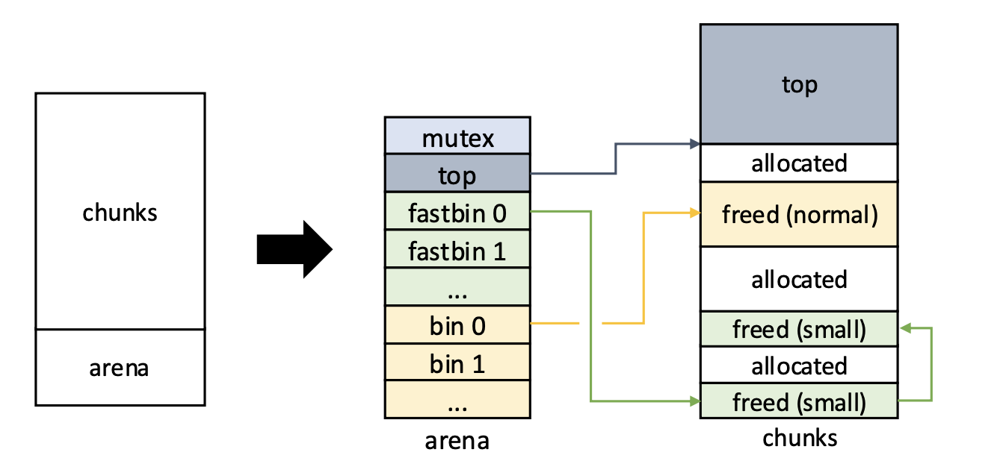

핵심 자료구조는 **arena**, **chunk**, **bin** 세 가지입니다.

- **chunk**: 우리가 지금까지 다룬 "블록"입니다. 헤더를 갖고, 할당/가용 상태를 가집니다.
- **bin**: 크기 클래스별 가용 리스트입니다. 작은 크기 전용의 **fastbin**과 일반 **bin**으로 나뉩니다. 즉 앞 절의 segregated free list 그 자체입니다.
- **arena**: bin들과 **mutex**, 그리고 힙 꼭대기를 가리키는 **top chunk**를 묶은 독립적인 힙 하나입니다.

`malloc`은 알맞은 bin에서 chunk를 꺼내 오고, 없으면 top chunk를 쪼갭니다. `free`는 chunk를 병합해 bin에 되돌려 놓습니다. 여기까지는 앞 절 내용과 정확히 같습니다.

### 멀티스레드 지원: per-thread arena
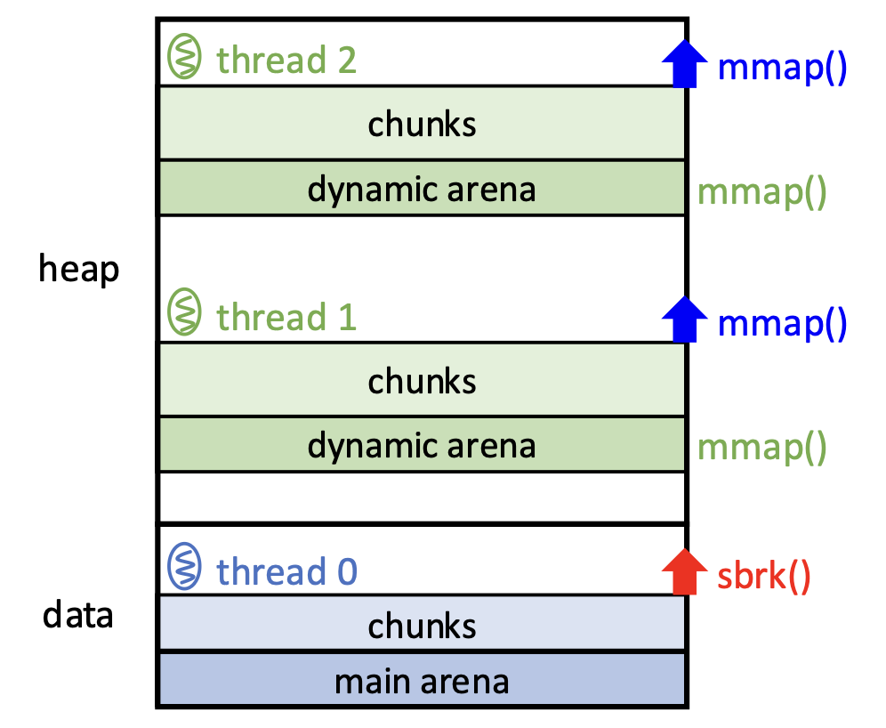

락 경합(lock contention)을 줄이려고 arena를 여러 개 둡니다. 최초 스레드는 `sbrk`로 확장되는 **main arena**를 쓰고, 이후 스레드들은 `mmap`으로 만들어진 **dynamic arena**를 하나씩 배정받습니다. arena마다 mutex가 따로 있으므로, 서로 다른 arena를 쓰는 스레드들은 경합하지 않습니다.

**그런데 두 가지 동기화 오버헤드가 남습니다.**

| 오버헤드 | 언제 발생하는가 |
|---|---|
| **arena mutex** | arena 개수에 상한이 있어(대략 CPU 코어 수), **스레드 수가 그보다 많으면** 여러 스레드가 한 arena를 공유하게 되어 mutex 경합이 커진다 |
| **전역 `mmap_lock`** | dynamic arena를 처음 만들 때, 또는 arena의 top chunk를 더 이상 쪼갤 수 없어 `mmap`을 불러야 할 때. 이 락은 **모든 스레드가 공유**한다 |

결정적으로 **`malloc` 호출마다 락을 잡아야 합니다.** 게다가 한 번에 확보하는 chunk 단위가 작아서(128KB) `mmap`을 부르는 빈도도 높습니다.

### jemalloc

**단편화 회피와 확장성 있는 동시성 지원**을 목표로 하는 범용 allocator입니다. 자료구조는 **tcache**, **arena**, **extent**, **bin**, **run**입니다.

arena·bin은 ptmalloc2와 비슷한 역할이고, 새로 등장하는 것은 다음 둘입니다.

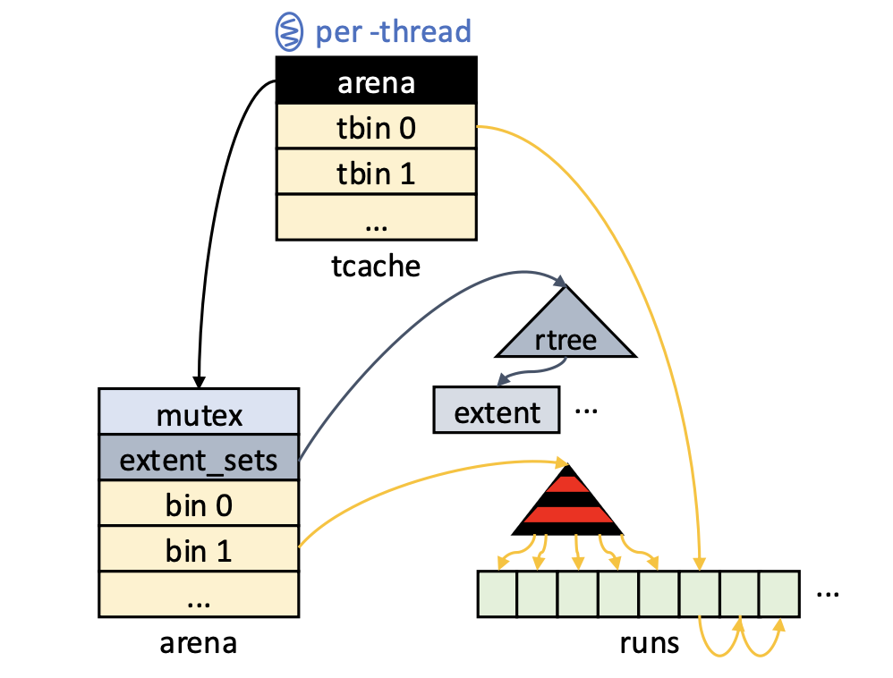

- **tcache (thread cache)**: **스레드마다 하나씩** 있는 캐시입니다. 크기 클래스별 **tbin** 을 갖고, 바로 꺼내 쓸 수 있는 블록들을 미리 쥐고 있습니다.
- **extent / run**: `mmap`으로 받아 온 큰 메모리 영역이 extent이고, 그것을 같은 크기의 슬롯으로 나눈 배열이 run입니다. 블록의 메타데이터는 블록 옆이 아니라 **rtree(radix tree)** 로 관리되는 extent 쪽에 있습니다.

#### 할당

**큰 할당을 하는 경우**
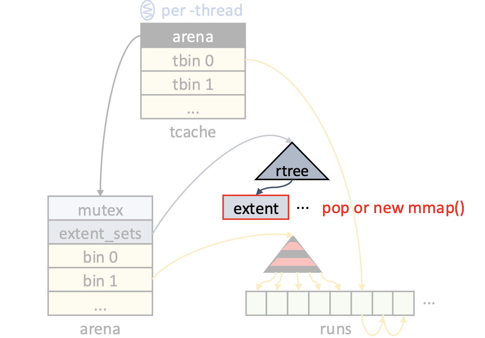

**작은 할당을 하는 경우**

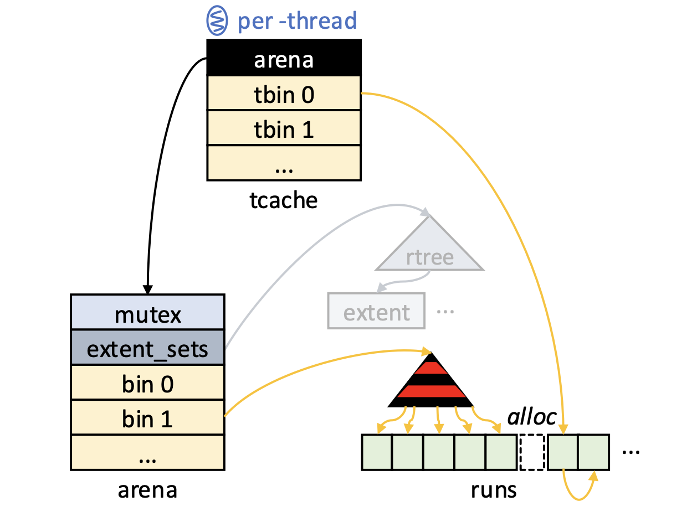

1. 스레드가 자기 **tcache의 tbin**에서 블록을 꺼낸다 → **락이 전혀 필요 없다.**
2. tbin이 비었을 때만 arena의 mutex를 잡고, run에서 **여러 개를 한꺼번에(batch)** 가져와 tbin을 채운다.
3. run도 부족하면 extent를 꺼내 오거나 새로 `mmap`한다.

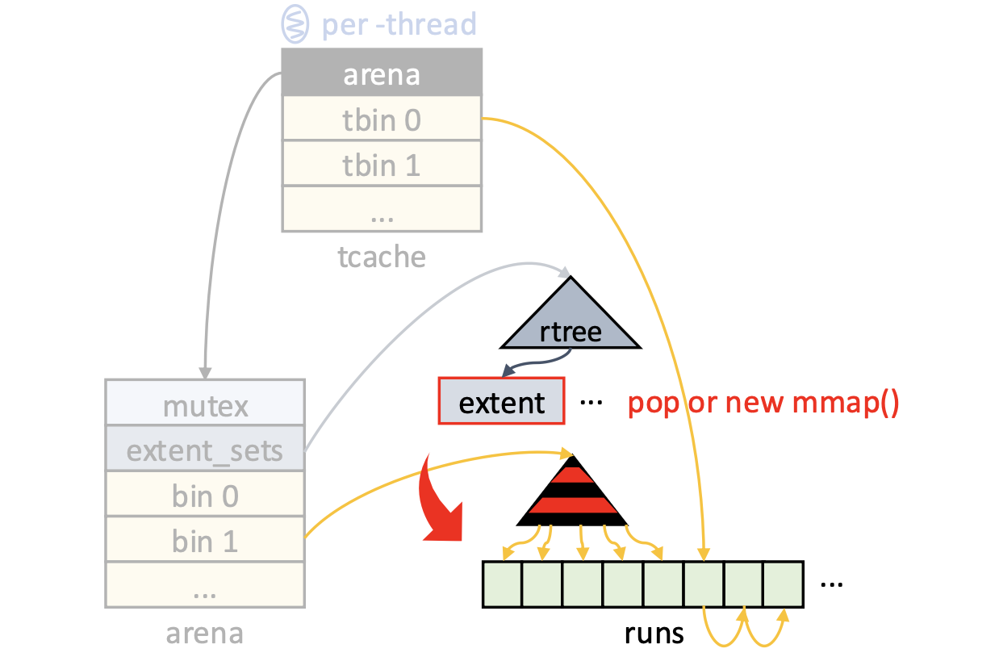

즉 락을 **아예 없애는 것이 아니라 잡는 횟수를 줄이는** 전략입니다.

### 비교
| | ptmalloc2 | jemalloc |
|---|---|---|
| 자료구조 | arena, chunk, bin | tcache, arena, extent, bin, run |
| 락 | **`malloc`마다 arena mutex 획득** | **tcache 경로는 lock-free**, tbin 재충전 시에만 arena mutex |
| 동기화 비용 | 매 호출 | **배치(batch) 단위로 분산** |
| OS에서 받아오는 단위 | chunk 128KB (작음) | extent 4MB (큼) → `mmap_lock` 경합 감소 |
| 메타데이터 위치 | chunk 헤더 | extent + rtree (작은 블록에 헤더 없음) |

---

## 세 방법 비교 정리

| | Implicit | Explicit | Segregated |
|---|---|---|---|
| 무엇을 연결하나 | 모든 블록 (크기 필드가 링크) | 가용 블록 (명시적 포인터) | 가용 블록, 크기 클래스별로 분리 |
| 할당 | 전체 블록 수에 선형 | 가용 블록 수에 선형 | 사실상 로그/상수에 가까움 |
| 해제 | 상수 | 상수 | 상수 |
| 추가 공간 | 헤더/푸터 | + 링크 2워드(가용 블록 내부) | + 클래스별 리스트 헤드 배열 |
| 실사용 | 특수 목적 한정 | 소규모 | **실제 allocator의 기본 골격** (ptmalloc2의 bin, jemalloc의 bin/tbin) |


## 요약

!!! abstract "핵심 정리"
    - **동적 할당은 실행 시점에야 크기를 알 수 있는 데이터를 위한 것**이며, `malloc`은 시스템 콜이 아니라 커널에서 받아 둔 힙을 잘게 쪼개 나눠 주는 라이브러리 함수다.
    - allocator의 두 목표인 **처리량**과 **메모리 이용률**은 서로 충돌한다. 설계란 그 사이에서 균형점을 찾는 일이다.
    - 이용률을 갉아먹는 것은 **내부 단편화**(블록이 페이로드보다 큼, 측정 쉬움)와 **외부 단편화**(총량은 충분한데 큰 블록이 없음, 측정 어려움)다.
    - **헤더 한 워드**에 크기와 할당 비트를 함께 담는 트릭, **분할(splitting)**, **경계 태그 병합(coalescing)** 은 세 방식 모두가 공유하는 일반적 기법이다.
    - 세 방식의 차이는 오직 **가용 블록을 어떻게 찾는가**에 있다: 모든 블록을 훑는 implicit, 가용 블록만 잇는 explicit, 크기 클래스별로 나눈 segregated.
    - **분리된 리스트에 대한 first fit은 힙 전체에 대한 best fit을 근사한다** : 실제 allocator가 segregated list를 쓰는 이유다.
    - 실제 `malloc` 구현들은 여기에 **동시성**이라는 축을 하나 더 얹는다. ptmalloc2는 호출마다 arena mutex를 잡는 반면, jemalloc은 **스레드별 tcache**로 흔한 경로를 lock-free로 만들고 락 획득을 배치 단위로 미룬다.