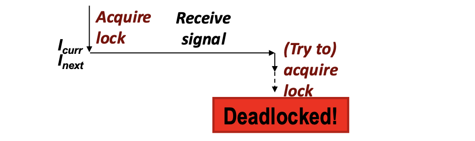
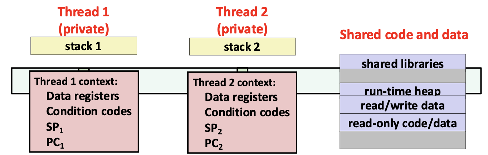
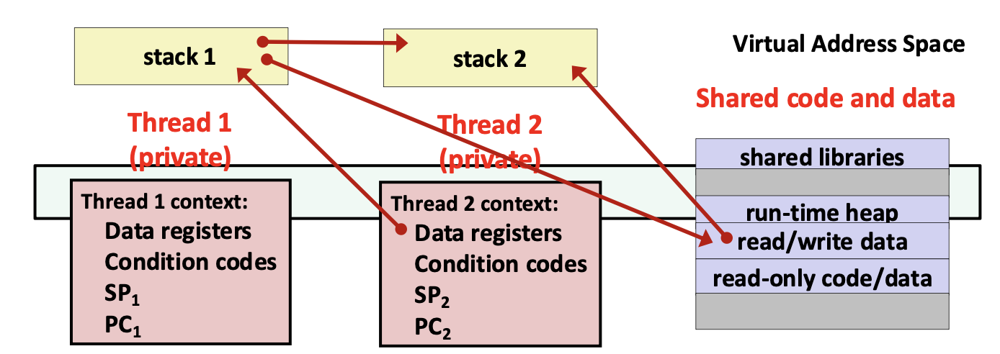
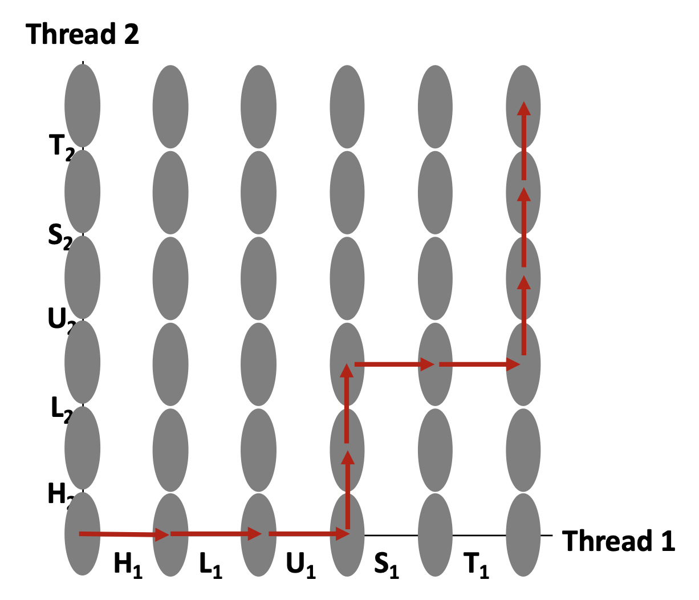
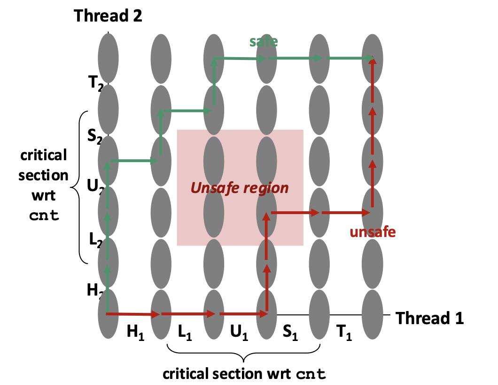
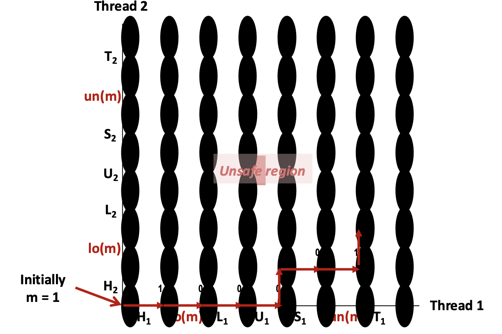

# 18 · 동시성

## 동시성 프로그래밍이란 

사람의 사고는 기본적으로 **순차적**입니다. 그래서 "시간 순서대로 이렇게 실행되겠지"라는 직관에 의존하는데, 동시성 환경에서는 그 직관이 거의 항상 틀립니다. 스케줄러는 프로그래머의 허락을 구하지 않고 임의의 시점에 스레드를 교체하며, 컴퓨터 시스템에서 **일어날 수 있는 모든 실행 순서**를 사람이 머릿속으로 시뮬레이션 하는 것은 오류가 잦고 종종 불가능합니다. 

동시성 프로그램의 문제는 세 부류로 나뉩니다.

| 문제 | 정의 | 비유 |
|---|---|---|
| **레이스(Race)** | 결과가 시스템 다른 곳의 임의적인 스케줄링 결정에 의존한다 | 비행기 마지막 좌석을 누가 차지하는가 |
| **데드락(Deadlock)** | 잘못된 자원 할당으로 어떤 스레드도 전진하지 못한다 | 교차로 한복판에서 서로를 막은 교통 정체 |
| **라이브락 / 기아(Starvation)** | 시스템 전체는 전진하지만 특정 주체가 무한히 기다린다 | 계속 새치기당해 순서가 오지 않는 줄 |

기아는 특히 헷갈리기 쉽습니다. 노란 차가 초록 차에게 양보해야 하고 초록 차가 끊임없이 흘러오면, **전체 시스템은 정상적으로 진행**하지만 노란 차는 영원히 기다립니다. 즉 "시스템이 살아 있다"는 사실이 "모든 참여자가 공평하게 진행한다"를 뜻하지 않습니다. 

!!! example "데드락의 실제 예: 시그널 핸들러에서 `printf`"
    ```c
    void catch_child(int signo) {
        printf("Child exited!\n");   // printf/puts에 재진입! 데드락 위험
        while (waitpid(-1, NULL, WNOHANG) > 0) continue;
    }
    ```
    

    `printf`의 내부 구현은 대략 락 획득 → 작업 → 락 해제입니다. 그런데 락을 잡은 직후 시그널이 도착해 핸들러가 실행되고, handler가 다시 `printf`를 호출하면 **같은 스레드가 이미 자기가 잡고 있는 락을 다시 기다리게 됩니다.** 아무도 그 락을 놓아줄 수 없으므로 프로그램은 그 자리에서 멈춥니다. 따라서 handler 안에서 비동기 시그널 안전(async-signal-safe)하지 않은 함수를 호출하지 않아야합니다. 

코어 수가 늘어나는 방향으로 하드웨어가 발전하는 한, 동시성은 **점점 더 필수적인** 기법입니다.

## 무엇이 공유되는가


스레드는 코드·데이터·힙·커널 컨텍스트를 공유하고, 각자 스택과 레지스터를 갖습니다. 하지만 여기서 흔한 오해가 생깁니다. '전역 변수는 공유, 스택 변수는 private'은 틀린 요약입니다. 개념적으로는 각 스레드의 스택이 private이지만, **실제로는 분리가 강제되지 않습니다.** 레지스터 값만 진짜로 보호되며, 스택은 모두 같은 가상 주소 공간에 있으므로 **어떤 스레드든 다른 스레드의 스택을 읽고 쓸 수 있습니다.**

**개념적** 



**실제** 




그래서 공유는 선언 위치가 아니라 **참조 관계**로 정의합니다. 

!!! note "공유 변수"
    변수 `x`는 **여러 스레드가 `x`의 어떤 인스턴스를 참조할 때, 그리고 그때에만** 공유된다.

이 정의를 적용하려면 세 가지를 알아야 합니다: (1) 스레드의 메모리 모델, (2) 변수의 인스턴스가 메모리에 어떻게 매핑되는가, (3) 각 인스턴스를 몇 개의 스레드가 참조하는가.

### 변수 인스턴스의 매핑 규칙

| 종류 | 선언 위치 | 인스턴스 개수 |
|---|---|---|
| 전역 변수(Global variables) | 함수 밖 | 가상 메모리에 정확히 **1개** |
| 지역 자동 변수(Local automatic variables) | 함수 안, `static` 없음 | **스레드 스택마다 1개** |
| 지역 정적 변수(Local static variables) | 함수 안, `static` 있음 | 가상 메모리에 정확히 **1개** |
| `errno` | 함수 밖이지만 특별 취급 | **스레드마다 1개** |

지역 정적 변수의 경우 선언은 함수 안에 있어 사적으로 보이지만 인스턴스는 하나뿐이므로, 그 함수를 여러 스레드가 실행하면 **공유됨을 유의해야합니다.**

### 예제 분석

```c
char **ptr;  /* 전역 */

void *thread(void *vargp) {
    long myid = (long)vargp;
    static int cnt = 0;
    printf("[%ld]: %s (cnt=%d)\n", myid, ptr[myid], ++cnt);
    return NULL;
}

int main(int argc, char *argv[]) {
    long i;
    pthread_t tid;
    char *msgs[2] = { "Hello from foo", "Hello from bar" };
    ptr = msgs;
    for (i = 0; i < 2; i++)
        pthread_create(&tid, NULL, thread, (void *)i);
    pthread_exit(NULL);
}
```

인스턴스를 나열하면 이렇습니다. `i.m`, `msgs.m`은 main 스택의 인스턴스, `myid.p0`/`myid.p1`은 각 peer 스레드 스택의 인스턴스입니다. 

| 인스턴스 | main | peer 0 | peer 1 | 공유? |
|---|---|---|---|---|
| `ptr` | 예 | 예 | 예 | **O** |
| `cnt` | 아니오 | 예 | 예 | **O** |
| `i.m` | 예 | 아니오 | 아니오 | X |
| `msgs.m` | 예 | 예 | 예 | **O** |
| `myid.p0` | 아니오 | 예 | 아니오 | X |
| `myid.p1` | 아니오 | 아니오 | 예 | X |

`msgs`는 main의 **스택**에 있는데도 공유됩니다. 전역 `ptr`가 그 주소를 가리키고 peer 스레드들이 `ptr`를 통해 접근하기 때문입니다. 반대로 `myid`는 지역 자동 변수라서 스레드마다 별도 인스턴스를 가지므로 공유되지 않습니다. 

### 스레드 인자 전달: 네 가지 시도

어떤 변수가 공유되는지는 스레드에 인자를 어떻게 넘기느냐에 따라 달라집니다. 같은 목적의 코드라도 전달 방식에 따라 안전할 수도, 데이터 레이스가 될 수도 있습니다. 아래 예제들은 모두 전역 배열 `int hist[N]`의 각 원소를 스레드가 하나씩 증가시키는 같은 작업을 서로 다른 방식으로 구현한 것입니다.

=== "① 고유한 포인터 (OK)"

    ```c
        int hist[N] = {0};                                   /* 전역 */

        for (i = 0; i < N; i++)
            pthread_create(&tids[i], NULL, thread, &hist[i]);
        // ...
        void *thread(void *vargp) {
            *(int *)vargp += 1;
            return NULL;
        }
    ```
        각 스레드가 전역 배열의 **서로 다른 원소**를 가리키는 고유한 포인터를 받습니다.
        가리키는 대상이 전역이라 스레드보다 오래 살고, 스레드끼리 가리키는 곳이 겹치지도
        않으므로 안전합니다.

=== "② 값을 캐스팅 (OK)"

    ```c
        for (i = 0; i < N; i++)
            pthread_create(&tids[i], NULL, thread, (void *)i);
        // ...
        void *thread(void *vargp) {
            hist[(long)vargp] += 1;
            return NULL;
        }
    ```
        포인터가 아니라 **값**으로 고유한 인덱스를 받습니다. 넘기는 것이 값이므로 가리킬
        메모리가 아예 없고, 따라서 생명주기 문제도 생기지 않습니다. `long` → `void *` →
        `long` 왕복 캐스팅은 안전합니다. 다만 숫자 하나처럼 작은 데이터에만 쓸 수 있습니다.

=== "③ `malloc`/`free` (OK)"

    ```c
        for (i = 0; i < N; i++) {
            long *p = malloc(sizeof(long));
            *p = i;
            pthread_create(&tids[i], NULL, thread, p);
        }
        // ...
        void *thread(void *vargp) {
            hist[*(long *)vargp] += 1;
            free(vargp);                    /* 소비자가 해제 */
            return NULL;
        }
    ```
        반복마다 새로 할당하므로 각 스레드가 **고유한 포인터**를 받고, 힙에 있으니 부모
        스택 프레임과 무관하게 살아남습니다. 항상 동작하며, 구조체처럼 큰 데이터를 넘길
        때는 이 방법이 필수입니다. 대신 부모가 할당하고 스레드가 해제하여야 누수나 이중 해제가 생기지 않습니다.

=== "④ 스택 슬롯 주소 (WRONG)"

    ```c
        for (i = 0; i < N; i++)
            pthread_create(&tids[i], NULL, thread, &i);   /* 위험! */
        // ...
        void *thread(void *vargp) {
            hist[*(long *)vargp] += 1;
            return NULL;
        }
    ```
        모든 스레드가 main의 `i`라는 **동일한 슬롯**을 가리키는 포인터를 받습니다. 스레드가
        `*(long *)vargp`를 읽는 시점에 main은 이미 `i`를 여러 번 증가시켰을 수도, 아직
        아닐 수도 있습니다. 즉 각 스레드가 고유한 인덱스를 읽을지 **보장이 없고**, 두
        스레드가 같은 인덱스를 읽거나 어떤 인덱스는 아무도 읽지 않을 수 있습니다. 전형적인
        데이터 레이스입니다.

**정리하면**, 안전한 인자 전달의 조건은 두 가지입니다.

1. 스레드마다 가리키는(또는 받는) 대상이 **겹치지 않을 것**
2. 그 대상이 스레드가 읽는 시점까지 **살아 있을 것**

①은 전역 배열로, ②는 값 전달로, ③은 힙 할당으로 두 조건을 만족시킵니다.
④는 첫 번째 조건에서 실패합니다.

--- 

## 데이터 레이스 (Data Race)

공유 변수는 로깅 정보나 파일 캐시처럼 스레드 간에 자료구조를 쉽게 나눠 쓸 수 있지만 유의해서 사용해야합니다. 

```c
static unsigned long cnt = 0;

void *incr_thread(void *arg) {
    unsigned long niters = (unsigned long)arg;
    for (unsigned long i = 0; i < niters; i++)
        cnt++;
    return NULL;
}
```

두 스레드가 각각 `niters`번 증가시키면 `cnt == 2*niters`여야 합니다. 그러나 실제로 실행하면 종종 그보다 **작은** 값이 나오게 됩니다. 

원인은 `cnt++`가 **하나의 동작이 아니라는 데** 있습니다. 소스에서는 한 줄이지만,
CPU가 실제로 하는 일은 세 단계입니다.

```c
temp = cnt;      /* L (Load)   : 메모리에서 현재 값을 읽어 온다 */
temp = temp + 1; /* U (Update) : 읽어 온 값을 CPU 안에서 1 늘린다 */
cnt  = temp;     /* S (Store)  : 늘린 값을 메모리에 되쓴다 */
```

여기서 `temp`는 각 스레드의 **CPU 레지스터**에 해당하는 값으로, 스레드마다 완전히
별개입니다. 즉 두 스레드는 `cnt`라는 메모리 한 칸을 공유하지만, 그 값을 잠시 꺼내
두는 작업 공간은 각자 따로 갖습니다. 그리고 스케줄러는 **이 세 단계 사이 어디서든**
스레드를 교체할 수 있습니다.

앞으로 반복 한 번을 진입부 `H`(head), 본체 **`L` → `U` → `S`**, 마무리 `T`(tail)로
부르겠습니다. 핵심은 다음 한 문장입니다.

!!! note "핵심 아이디어"
    **명령어의 어떤 인터리빙(interleaving)도 가능하며, 그중 일부는 예상과 다른 결과를 낸다.**


=== "정상 인터리빙"

    | 스레드 | 단계 | `temp`₁ | `temp`₂ | `cnt` |
    |---|---|---|---|---|
    | 1 | H₁ | – | – | 0 |
    | 1 | L₁ | 0 | – | 0 |
    | 1 | U₁ | 1 | – | 0 |
    | 1 | S₁ | 1 | – | **1** |
    | 2 | H₂ | – | – | 1 |
    | 2 | L₂ | – | 1 | 1 |
    | 2 | U₂ | – | 2 | 1 |
    | 2 | S₂ | – | 2 | **2** |

    스레드 1의 `L·U·S`가 모두 끝난 뒤 스레드 2가 시작했으므로 결과는 2입니다.

=== "잘못된 인터리빙"

    | 스레드 | 단계 | `temp`₁ | `temp`₂ | `cnt` |
    |---|---|---|---|---|
    | 1 | H₁ | – | – | 0 |
    | 1 | L₁ | 0 | – | 0 |
    | 1 | U₁ | 1 | – | 0 |
    | 2 | H₂ | – | – | 0 |
    | 2 | L₂ | – | **0** | 0 |
    | 1 | S₁ | 1 | – | 1 |
    | 2 | U₂ | – | 1 | 1 |
    | 2 | S₂ | – | 1 | **1** |

    스레드 2가 값을 읽은 시점(`L₂`)에 스레드 1은 아직 되쓰기(`S₁`)를 하지 않았습니다.
    그래서 스레드 2는 낡은 값 0을 읽고, 나중에 1을 써 넣으면서 스레드 1이 쓴 1을
    덮어씁니다. 두 번 증가시켰는데 결과는 1, 증가 한 번이 **사라졌습니다**.

두 표의 차이는 단 하나입니다. **한 스레드가 읽고 되쓰는 사이에 다른 스레드가 끼어들었는가.**
끼어들지 않으면 정상적으로 진행되고, 끼어들면 갱신이 유실됩니다.

## 진행 그래프(Progress Graph): 임계 구역과 위험 영역

인터리빙을 표로 하나씩 나열하는 것은 한계가 있습니다. **진행 그래프(progress graph)** 는 두 스레드의 실행 상태 공간을 그림으로 볼 수 있습니다. 

- 각 **축**은 한 스레드 내부 명령어의 순차적 순서를 나타냅니다. 
- 각 **점**은 가능한 실행 상태 $(\text{Inst}_1, \text{Inst}_2)$입니다. 예를 들어 $(L_1, S_2)$는 스레드 1이 $L_1$까지, 스레드 2가 $S_2$까지 완료한 상태를 의미합니다. 
- **궤적(trajectory)** 은 합법적인 상태 전이의 나열, 즉 하나의 구체적인 동시 실행입니다. 예: $H_1, L_1, U_1, H_2, L_2, S_1, T_1, U_2, S_2, T_2$.



!!! note "임계 구역과 위험 영역"
    

    - **임계 구역(critical section)**: 공유 변수 `cnt`에 대해 `L`, `U`, `S`가 이루는 명령어 구간. 어떤 공유 변수에 대한 임계 구역의 명령어들은 **서로 인터리빙되어서는 안 됩니다.**
    - **위험 영역(unsafe region)**: 두 스레드가 동시에 임계 구역 안에 있는 상태들의 집합. 진행 그래프에서 두 임계 구역이 교차하는 직사각형 영역입니다. 
    - **안전한 궤적**: 어떤 위험 영역에도 들어가지 않는 궤적.
    trajectory가 `cnt`에 대해 **올바른 것은 그것이 안전할 때, 그리고 그때에만**입니다.

즉 문제는 "어떻게 위험 영역을 통과하지 않는 궤적만 발생하도록 강제할 것인가"로 바꿔 볼 수 있습니다. 

## Data race를 해결하는 방법 1. 상호 배제/뮤텍스(mutex)
안전한 궤적을 어떻게 보장할 수 있을까요? 이는 스레드의 실행을 **동기화(synchronize)** 하여 위험한 궤적이 애초에 생길 수 없게 만듦으로써 해결이 가능합니다. 즉, 각 임계 구역에 대해 **상호 배타적 접근(mutually exclusive access)** 을 보장해야 합니다. 

**뮤텍스(mutex, MUTual EXclusion)** 는 잠김(locked) 또는 풀림(unlocked) 두 상태만 갖는 불투명한(opaque) 객체입니다. boolean 값이지만 산술 연산을 할 수 없고, 처음에는 풀림 상태이며 연산은 두 가지뿐입니다. 

- `lock(m)`: 잠겨 있지 않으면 잠그고 반환한다. 잠겨 있으면 풀릴 때까지 기다린 뒤 재시도한다.
- `unlock(m)`: 뮤텍스가 잠긴 상태에서, **그것을 잠근 코드만** 호출할 수 있다. 상태를 풀림으로 바꾼다.

```c
static unsigned long cnt = 0;
static pthread_mutex_t lock = PTHREAD_MUTEX_INITIALIZER;

void *incr_thread(void *arg) {
    unsigned long niters = (unsigned long)arg;
    for (unsigned long i = 0; i < niters; i++) {
        pthread_mutex_lock(&lock);
        cnt++;                          /* 임계 구역 */
        pthread_mutex_unlock(&lock);
    }
    return NULL;
}
```

### mutex는 왜 동작하는가 


뮤텍스의 불변식("동시에 최대 한 스레드만 잠글 수 있다")은 진행 그래프 위에 위험 영역을 **forbidden region** 을 만듭니다. 어떤 궤적도 이 영역에 진입할 수 없으므로, 위험 영역에도 도달할 수 없게 됩니다. 즉, 안전성이 **구조적으로** 보장되도록 할 수 있습니다. 

잠금을 할 때 지켜야할 규약은 다음과 같습니다: 

- 어떤 공유 변수를 보호하는 뮤텍스는 **모든** 접근 지점에서 일관되게 잡아야 한다. 한 곳만 빠뜨리면 보호는 무의미하다.
- 임계 구역은 **짧게** 유지한다. 길어질수록 병렬성이 사라진다.
- 여러 뮤텍스를 잡을 때는 **항상 같은 순서로** 잡는다. 순서가 엇갈리면 데드락이 된다.

## Data race를 해결하는 방법 2. 원자적(atomic) 메모리 연산

현대 CPU는 *test-and-set*, *compare-and-swap*, *exchange-and-add* 같은 특수 명령어를 제공합니다. 이들은 메모리에 대한 읽기–수정–쓰기(read-modify-write)를 **하드웨어가 데이터 레이스를 막아 주는 방식으로** 수행하며, 뮤텍스나 세마포어 자체도 이 명령어들로 구현됩니다. 

```c
static _Atomic unsigned long cnt = 0;

void *incr_thread(void *arg) {
    unsigned long niters = (unsigned long)arg;
    for (unsigned long i = 0; i < niters; i++)
        cnt++;                  /* 소스는 그대로, 생성 코드가 달라진다 */
    return NULL;
}
```

소스 코드에서 바뀐 것은 타입 앞의 `_Atomic` 하나뿐입니다. `cnt++`는 그대로인데,
컴파일러가 이 한정자를 보고 **완전히 다른 기계어를 생성**합니다.

=== "일반 `unsigned long`"
    반복 한 번이 하는 일:

    ```text
    L  temp = cnt         ┐
    U  temp = temp + 1    ├─ 세 단계로 쪼개짐
    S  cnt  = temp        ┘
    ```
    
    단계 사이에 스케줄러가 끼어들 수 있습니다. 앞에서 본 대로 다른 스레드가 `L`과 `S`
    사이에 들어오면 갱신이 유실됩니다.

=== "`_Atomic unsigned long`"
    반복 한 번이 하는 일:

    ▣  cnt를 1 증가        ── 쪼갤 수 없는 하나의 연산

    읽기·갱신·쓰기가 하드웨어 수준에서 **하나로 묶여** 실행됩니다. 중간 상태가 아예
    존재하지 않으므로, 다른 스레드가 끼어들 틈도 없습니다.


!!! note "뮤텍스와 차이"
    뮤텍스는 "임계 구역에 한 명만 들어가도록 **문을 잠그는**" 방식이고, 원자적 연산은
    "애초에 **쪼갤 수 없게 만들어** 임계 구역 자체를 없애는" 방식입니다. 목적지는
    같지만, 후자는 잠금·해제라는 별도의 절차가 없어 훨씬 가볍습니다.


## 요약

!!! abstract "핵심 정리"
    - **동시성이 어려운 이유**는 스케줄러가 임의의 시점에 스레드를 교체하고, 가능한
       모든 실행 순서를 사람이 열거할 수 없기 때문입니다. 문제는 레이스, 데드락,
       라이브락/기아로 나뉩니다.
    - **공유 여부는 선언 위치가 아니라 참조 관계**로 결정됩니다. 전역 변수와 지역
       정적 변수는 인스턴스가 하나뿐이고, 지역 자동 변수는 스레드마다 하나씩 갖습니다.
       `static`이 붙은 지역 변수가 특히 함정입니다.
    - **인자 전달이 안전하려면** 스레드마다 받는 대상이 겹치지 않아야 하고, 그 대상이
       읽는 시점까지 살아 있어야 합니다. 두 조건 중 하나라도 깨지면 데이터 레이스입니다.
    - **`cnt++`는 한 동작이 아닙니다.** `L`(읽기) → `U`(갱신) → `S`(쓰기)로 쪼개지며,
       한 스레드가 읽고 되쓰는 사이에 다른 스레드가 끼어들면 갱신이 유실됩니다.
    - **진행 그래프**로 보면 `L·U·S`가 임계 구역이고, 두 스레드가 동시에 그 안에 있는
       상태가 위험 영역입니다. 궤적은 위험 영역을 지나지 않을 때에만 올바릅니다.
    - **뮤텍스**는 위험 영역을 감싸는 forbidden region을 만들어 안전성을 구조적으로
       보장하고, **원자적 연산**은 임계 구역 자체를 쪼갤 수 없게 만들어 없앱니다.