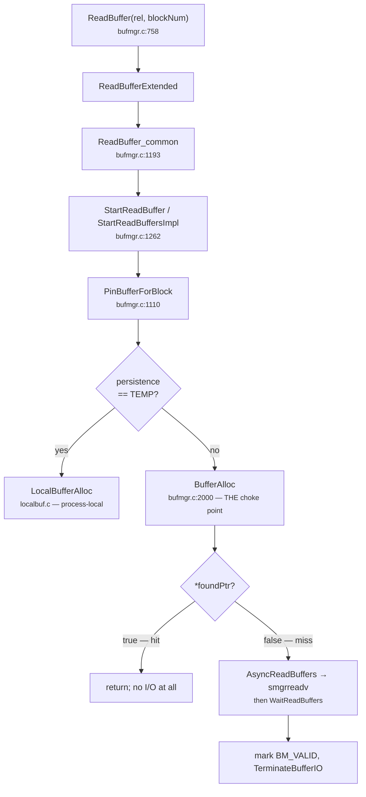

# 06 · 버퍼 풀 사용법 큰 그림

!!! abstract 목표
    버퍼 풀이 외부에 어떤 API를 노출하는지, 그 API를 누가 부르는지, 그리고 버퍼 페이지 요청이 어떻게 처리되는지 전반적 경로를 파악한다.

지금까지는 버퍼 풀의 구성요소를 살펴보았으므로, 이제는 실제로 버퍼 풀이 어떻게 사용되는지 전반적인 차원에서 이해한다.

## 버퍼 풀이 노출하는 API

버퍼 매니저가 외부에 제공하는 것은 `src/include/storage/bufmgr.h` 하나에 모여 있다. 여기서 눈여겨 보아야 할 점은 `ReadBuffer()`류가 `Buffer` 자료형을 반환하고, 버퍼 풀을 사용하는 다른 함수들은 이를 인자로 넣어서 처리한다는 점이다. `Buffer`는 사실 `int`, 즉 정수로서, 버퍼 풀을 사용하는 입장에서는 한 페이지를 가리키는 하나의 숫자만을 알고 있는 것이다. 흥미롭게도 `Buffer`는 우리가 버퍼 풀 내부에서 사용하기로 했던 `buf_id`와 1만큼 차이나는 값인데, 이에 관해서는 [부록](20-buffer-id.md)을 참고하기 바란다.

!!! info "스트리밍 읽기"
    Postgres 18 버전에 들어와서 비동기 I/O가 완전히 통합되고, 스트리밍 읽기가 가능해졌다. 물론 우리는 동기 I/O를 기반으로 진행할 것이지만, 비동기 I/O로 인해 버퍼 풀의 I/O 처리 로직이 일부 변화하였으므로 코드를 읽을 때 비동기적인 패턴을 염두에 둔 구현이라는 점을 고려할 필요가 있다.

| 묶음 | 대표 함수 | 하는 일 |
| --- | --- | --- |
| 읽기 | `ReadBuffer()`, `ReadBufferExtended()`, `ReadBufferWithoutRelcache()` | 블록 하나를 버퍼 풀에 올리고 핀을 잡아 돌려준다 |
| 스트리밍 읽기 | `StartReadBuffers()`, `WaitReadBuffers()` | 여러 블록의 읽기를 시작해 두고 나중에 기다린다 (아래 예고 참고) |
| 확장 | `ExtendBufferedRel()`, `ExtendBufferedRelBy()`, `ExtendBufferedRelTo()` | 릴레이션 끝에 새 블록을 붙이고 그 버퍼를 준다 |
| 해제 | `ReleaseBuffer()`, `UnlockReleaseBuffer()`, `ReleaseAndReadBuffer()` | 핀을 놓는다 |
| 락 | `LockBuffer()`, `ConditionalLockBuffer()`, `LockBufferForCleanup()` | 페이지 내용 락을 잡고 놓는다 |
| 변경 표시 | `MarkBufferDirty()`, `MarkBufferDirtyHint()` | "이 페이지를 고쳤다"고 알린다 |
| 일괄 처리 | `FlushRelationBuffers()`, `DropRelationBuffers()`, `CheckPointBuffers()`, `BgBufferSync()` | 조건에 맞는 버퍼 전체를 쓰거나 버린다 |
| 수명 주기 | `BufferManagerShmemInit()`, `InitBufferManagerAccess()`, `AtEOXact_Buffers()` | 초기화와 트랜잭션 경계 정리 |

## 세 개의 문

API가 많아 보이지만, 공유 버퍼 프레임을 실제로 **획득**하는 입구는 셋뿐이다.

```text
   접근 방법 / 복구 / 유지보수 코드
        │              │                    │
        │ 읽기          │ 확장                │ 일괄 처리
        ▼              ▼                    ▼
  ReadBuffer 계열   ExtendBufferedRel 계열   Flush/Drop 계열
        │              │                    │
        ▼              ▼                    ▼
   BufferAlloc()   (자체 경로 — §14)     기술자 배열을 직접 훑음
        │              │                    (새 프레임을 얻지 않는다)
        └──────┬───────┘
               ▼
        버퍼 테이블 + 교체 전략
```

* **읽기**는 전부 `BufferAlloc()`으로 수렴한다. 백엔드가 읽는 모든 페이지가 이 함수를 지난다.
* **확장**만이 유일한 예외다. 릴레이션 끝에 블록을 새로 붙일 때는 디스크에서 읽어올 내용이 없으므로
  경로가 다르고, 확장 락이라는 별도의 문제도 생긴다. [§14](14-relation-extension.md)가 이 예외
  하나만을 위해 존재한다.
* **일괄 처리**는 새 프레임을 얻지 않는다. 이미 있는 기술자 배열을 `0..NBuffers-1`로 훑으면서 조건에
  맞는 것을 쓰거나 버릴 뿐이다. 그래서 버퍼 테이블도 교체 전략도 거치지 않는다.

이 그림 덕분에 `BufferAlloc()` 하나만 떼어 놓고 추론할 수 있다.

## 읽기 경로 따라가기

PostgreSQL 16이 비동기 I/O 계층을 도입했고, 18에서 버퍼 읽기가 그 위로 올라갔다. 예전에는 짧았던
호출 사슬에 프레임이 두 개 늘어난 것이 그 결과다. `io_method = sync`(가정 G8)에서는 비동기 경로가
동기 읽기로 퇴화하지만, **프레임 자체는 그대로 남아 있어서 gdb로 밟게 된다.**



각 프레임이 맡은 일은 다음과 같다.

| 프레임 | 하는 일 |
| --- | --- |
| `ReadBuffer()` | 편의 함수. `MAIN_FORKNUM`, 전략 없음으로 채워서 넘긴다 |
| `ReadBufferExtended()` | 포크 번호, `ReadBufferMode`, 접근 전략을 받는 진짜 진입점 |
| `ReadBuffer_common()` | 영속성 판정, 특수 모드 처리, 그리고 읽기 연산 하나를 구성 |
| `StartReadBuffer()` / `StartReadBuffersImpl()` | 버퍼를 확보하고, I/O가 필요한지 판정 |
| `PinBufferForBlock()` | 공유 풀과 로컬 풀의 갈림길 |
| `BufferAlloc()` | 버퍼 테이블 조회 → 미스면 희생 버퍼 확보 → 등록 |

`ReadBuffer_common()`의 끝부분을 보면 이 구조가 드러난다.

```c title="bufmgr.c:1193 — ReadBuffer_common, 발췌"
    /*
     * Signal that we are going to immediately wait. If we're immediately
     * waiting, there is no benefit in actually executing the IO
     * asynchronously, it would just add dispatch overhead.
     */
    flags = READ_BUFFERS_SYNCHRONOUSLY;
    …
    if (StartReadBuffer(&operation, &buffer, blockNum, flags))
        WaitReadBuffers(&operation);

    return buffer;
```

읽기를 **시작하는 일**과 **기다리는 일**이 분리되어 있고, `StartReadBuffer()`의 반환값이 "기다려야
하는가"다. 히트였다면 `false`가 돌아오고 `WaitReadBuffers()`는 호출조차 되지 않는다.

그런데 이 경로는 시작하자마자 곧바로 기다린다. 그래서 비동기로 발행할 이유가 없고, 코드도 그렇게
말한다 — *"If we're immediately waiting, there is no benefit in actually executing the IO
asynchronously, it would just add dispatch overhead."* 그래서 `READ_BUFFERS_SYNCHRONOUSLY`를 붙인다.
**즉 `ReadBuffer()`로 들어온 요청은 사실상 동기 읽기다.** 15.2에서 `ReadBuffer_common()`이 그 자리에서
`smgrread()`를 하던 것과 결과적으로 같고, 달라진 것은 그 읽기가 `WaitReadBuffers()` 안으로 옮겨갔다는
점뿐이다.

`io_method = sync`에서는 여기서 한 걸음 더 나아간다. `StartReadBuffer()`가 I/O를 시작조차 하지 않고
"기다려야 함"만 표시하며, 실제 읽기는 `WaitReadBuffers()`의 재시도 루프 안에서 일어난다. 그 루프는
원래 부분 읽기(partial read) 재시도를 위한 것인데, sync 경로가 별도 코드 없이 그 위에 얹혀 간다.

```c title="bufmgr.c:1652 — WaitReadBuffers의 주석"
    /*
     * In the case of IOMETHOD_SYNC, we start - as we used to before the
     * introducing of AIO - the IO in WaitReadBuffers(). This is done as part
     * of the retry logic below, no extra code is required.
     *
     * This path is expected to eventually go away.
     */
```

갈림길은 `PinBufferForBlock()`에 있다.

```c title="bufmgr.c:1110 — PinBufferForBlock, 갈림길만 발췌"
static pg_attribute_always_inline Buffer
PinBufferForBlock(Relation rel, SMgrRelation smgr, char persistence,
                  ForkNumber forkNum, BlockNumber blockNum,
                  BufferAccessStrategy strategy, bool *foundPtr)
{
    …
    if (persistence == RELPERSISTENCE_TEMP)
    {
        bufHdr = LocalBufferAlloc(smgr, forkNum, blockNum, foundPtr);
        if (*foundPtr) pgBufferUsage.local_blks_hit++;
    }
    else
    {
        bufHdr = BufferAlloc(smgr, persistence, forkNum, blockNum,
                             strategy, foundPtr, io_context);
        if (*foundPtr) pgBufferUsage.shared_blks_hit++;
    }
    …
    return BufferDescriptorGetBuffer(bufHdr);
}
```

임시 테이블은 다른 백엔드가 볼 수 없으므로 공유 버퍼 풀에 올릴 이유가 없다. 그래서 프로세스 로컬
버퍼(`localbuf.c`)로 빠진다. 락도 핀 카운트도 원자적 연산도 필요 없는, 훨씬 단순한 세계다. 우리가
관심 있는 것은 물론 `else` 쪽이다.

### 기억할 두 가지

* **`BufferAlloc()`은 공유 풀로 들어가는 단 하나의 입구다.** 백엔드가 읽는 모든 페이지가 이곳을
  지난다. 이를 거치지 않고 공유 프레임을 얻는 함수는 릴레이션 확장([§14](14-relation-extension.md))
  뿐이다.
* **`*foundPtr = true`는 아래쪽 전부를 건너뛴다.** `BufferAlloc`이 히트를 보고하면
  `StartReadBuffersImpl`은 `AsyncReadBuffers()`에 닿기도 전에 반환한다. AIO 서브시스템은 그런 요청이
  있었다는 사실조차 모른다. 이것이 PA2b의 Copy-on-Seal이 파고들 지점이며, PA2a에서는 `BufferAlloc`을
  따로 떼어 추론할 수 있는 근거가 된다.

??? info "이 장에서 다루지 않는 것 — 읽기 스트림"

    `StartReadBuffers()`의 진짜 사용자는 `ReadBuffer_common()`이 아니라 `read_stream.c`다. 순차 스캔,
    VACUUM, ANALYZE처럼 **앞으로 읽을 블록을 미리 알 수 있는** 접근은 콜백으로 블록 번호를 흘려주고,
    스트림이 연속된 블록을 `io_combine_limit`까지 묶어 미리 발행해 둔다. 소비자가 첫 버퍼를 처리하는
    동안 뒤쪽 I/O가 진행되므로 겹침이 생긴다.

    다만 그 경로도 결국 `PinBufferForBlock()` → `BufferAlloc()`으로 합류하므로, **버퍼 풀 자체를
    고치는 PA2a에서는 따로 신경 쓸 것이 없다.** 한 가지만 주의하자 — `io_method = sync`라고 해서
    읽기 스트림이 쓰이지 않는 것이 아니다. `io_method`는 그 아래에서 I/O를 어떻게 수행할지만 정한다.
    sync에서는 겹침 효과만 사라지고 블록 병합은 그대로 남는다.

## 앞으로 볼 것

지금 그린 것은 층의 배치도다. 각 층의 내부는 다음 장들에서 하나씩 연다.

| | 다룰 내용 |
| --- | --- |
| [§07](07-bufferalloc.md) | `BufferAlloc()` 자체 — 조회, 미스, 희생 버퍼 확보, 충돌 처리의 네 단계 |
| [§08](08-tag-table-lock.md) | 버퍼 테이블과 파티션 락 — 태그로 프레임을 찾는 층 |
| [§09](09-clock-sweep.md) | `StrategyGetBuffer()`와 클럭 스윕 — 희생자를 고르는 층 |
| [§10](10-pin-lock-spinlock.md) | 핀, 내용 락, 헤더 스핀락 — 이 모든 것을 동시에 안전하게 만드는 층 |
