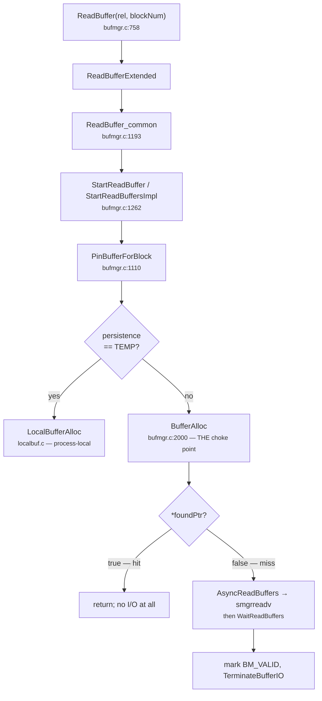

# 06 · From `ReadBuffer()` down to `BufferAlloc()`

*Five frames of stack between "give me block 42" and the hash table.*

PostgreSQL 16 introduced an asynchronous I/O layer, and PG 18 finished routing buffer reads through
it. That adds two frames to a call chain that used to be short. Under `io_method = sync` (your
assumption G8) the async path degenerates into a synchronous read, but the frames are still there
and you will step through them in gdb.



```c title="bufmgr.c:1110 — PinBufferForBlock, trimmed to the fork"
static pg_attribute_always_inline Buffer
PinBufferForBlock(Relation rel, SMgrRelation smgr, char persistence,
                  ForkNumber forkNum, BlockNumber blockNum,
                  BufferAccessStrategy strategy, bool *foundPtr)
{
    …
    if (persistence == RELPERSISTENCE_TEMP)
    {
        bufHdr = LocalBufferAlloc(smgr, forkNum, blockNum, foundPtr);
        if (*foundPtr) pgBufferUsage.local_blks_hit++;
    }
    else
    {
        bufHdr = BufferAlloc(smgr, persistence, forkNum, blockNum,
                             strategy, foundPtr, io_context);
        if (*foundPtr) pgBufferUsage.shared_blks_hit++;
    }
    …
    return BufferDescriptorGetBuffer(bufHdr);
}
```

The two facts to carry forward:

- **`BufferAlloc()` is the single entry point to the shared pool.** Every page that a backend reads
  passes through it. Exactly one other function acquires shared frames without going through it —
  relation extension, [§14](14-relation-extension.md) — and that exception is the reason §14 exists.
- **`*foundPtr = true` short-circuits everything downstream.** If `BufferAlloc` reports a hit,
  `StartReadBuffersImpl` returns before it ever reaches `AsyncReadBuffers()`. The AIO subsystem never
  learns the request happened. This is the hook PA2b's Copy-on-Seal will exploit; in PA2a it is
  simply why you can reason about `BufferAlloc` in isolation.
