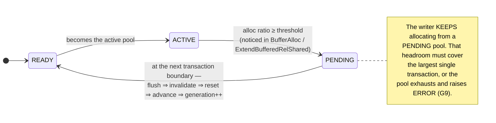

# 17 · The PA2a delta, mapped onto the code

*Every lens in this guide, in one table. Use it as a checklist, not as a design.*

| Code | Where | PA2a |
|---|---|---|
| `BufferManagerShmemSize` | buf_init.c:162 | **Change** — multiply the per-pool arrays by `buffer_pools`; add per-pool metadata and N buffer tables. |
| `BufferManagerShmemInit` | buf_init.c:68 | **Change** — same multiplication; init per-pool state; preserve the `PG_IO_ALIGN_SIZE` over-allocation. |
| `buf_table.c` API | buf_table.c:78–148 | **Change** — thread a `pool_id` through; N hash tables; replicate the partition-lock tranche per pool; add a wholesale `reset_buf_table(pool_id)`. |
| `BufferAlloc` | bufmgr.c:2000 | **Change** — sequential no-evict allocation from the active pool; threshold check; mark `PENDING`, never seal here. |
| `ExtendBufferedRelShared` | bufmgr.c:2605 | **Change** — the same allocator and threshold check, for a *batch* of frames. Easy to forget ([§14](14-relation-extension.md)). |
| `GetVictimBuffer` | bufmgr.c:2345 | **Delete** — replaced by `next_free_slot++`, or `ERROR`. |
| `StrategyGetBuffer`, `ClockSweepTick`, freelist | freelist.c:108, :196 | **Delete** — no eviction (G9), no clock, no freelist, no `StrategyRejectBuffer`. |
| `InvalidateVictimBuffer` | bufmgr.c:2277 | **Study, then replace** — its tag/table ordering is the model for seal-time invalidation. |
| `AtEOXact_Buffers` | bufmgr.c:3991 | **Hook** — the quiescent point where a `PENDING` pool is actually sealed. |
| `BufferSync` gather+sort | bufmgr.c:3344 | **Borrow** — same pattern, one pool, no throttle, no `BM_CHECKPOINT_NEEDED`. |
| `FlushBuffer` | bufmgr.c:4284 | **Keep, unchanged** — call it; it gives you WAL ordering for free. |
| `PinBuffer`, `PrivateRefCount`, `ResourceOwner` | bufmgr.c:3067 | **Keep, unchanged** — one contiguous frame array means these never learn pools exist. |
| bgwriter, checkpointer | — | **Disabled** (G9/G10). Nothing to evict; nobody else may touch the mapping tables. |
| Background flush worker | — | **Not in PA2a.** The seal is synchronous by construction. The worker is PA2b's one idea. |

!!! danger "Trap · the four that actually cost people days"

    1. **Size/init mismatch** ([§02](02-shared-memory.md)) — silent, delayed, catastrophic.
    2. **Sealing inside `BufferAlloc`** ([§07](07-bufferalloc.md)) — you flush and invalidate the
       frame you are pinning.
    3. **Forgetting the extension path** ([§14](14-relation-extension.md)) — passes every read-only
       test.
    4. **Invalidating in the wrong order** ([§09](09-clock-sweep.md)) — a table entry that outlives
       its tag, or vice versa.
